# PTX-ISA
CUDA PTX-ISA Document 中文翻译版

参考官方文档[Parallel Thread Execution ISA](https://docs.nvidia.com/cuda/parallel-thread-execution/index.html)进行的翻译学习

其中PTX版本为`7.8`

记录一下学习过程，部分内容会经过提炼加上一些自己的理解。

# Contents
**第 1 章 引言**
1.1 使用 GPU 的可扩展数据并行计算
1.2 PTX 的目标
1.3 PTX 指令集架构版本 7.8
1.4 文档结构
**第 2 章 编程模型**
2.1 高度多线程的协处理器
2.2 线程层次结构
2.2.1 协作线程数组
2.2.2 协作线程数组的集群
2.2.3 集群网格
2.3 内存层次结构
**第 3 章 PTX 机器模型**
3.1 一组单指令多线程（SIMT）多处理器
3.2 独立线程调度
3.3 片上共享内存
**第 4 章 语法**
4.1 源格式
4.2 注释
4.3 语句
4.3.1 指令语句
4.3.2 指令语句
4.4 标识符
4.5 常量
4.5.1 整数常量
4.5.2 浮点常量
4.5.3 谓词常量
4.5.4 常量表达式
4.5.5 整数常量表达式求值
4.5.6 常量表达式求值规则总结
**第 5 章 状态空间、类型和变量**
5.1 状态空间
5.1.1 寄存器状态空间
5.1.2 特殊寄存器状态空间
5.1.3 常量状态空间
5.1.3.1 分块常量状态空间（已弃用）
5.1.4 全局状态空间
5.1.5 局部状态空间
5.1.6 参数状态空间
5.1.6.1 内核函数参数
5.1.6.2 内核函数参数属性
5.1.6.3 内核参数属性：.ptr
5.1.6.4 设备函数参数
5.1.7 共享状态空间
5.1.8 纹理状态空间（已弃用）
5.2 类型
5.2.1 基本类型
5.2.2 子字大小的受限使用
5.2.3 备用浮点数据格式
5.3 纹理采样器和表面类型
5.3.1 纹理和表面属性
5.3.2 采样器属性
5.3.3 通道数据类型和通道顺序字段
5.4 变量
5.4.1 变量声明
5.4.2 向量
5.4.3 数组声明
5.4.4 初始化器
5.4.5 对齐
5.4.6 参数化变量名
5.4.7 变量属性
5.4.8 变量属性指令：.attribute

**第 6 章 指令操作数**
6.1 操作数类型信息
6.2 源操作数
6.3 目标操作数
6.4 使用地址、数组和向量
6.4.1 作为操作数的地址
6.4.1.1 通用寻址
6.4.2 作为操作数的数组
6.4.3 作为操作数的向量
6.4.4 作为操作数的标签和函数名
6.5 类型转换
6.5.1 标量转换
6.5.2 舍入修饰符
6.6 操作数开销

**第 7 章 应用程序二进制接口（ABI）抽象**
7.1 函数声明与定义
7.1.1 与 PTX 指令集架构版本 1.x 的差异
7.2 可变参数函数
7.3 内存分配（Alloca）

**第 8 章 内存一致性模型**
8.1 模型的范围与适用性
8.1.1 系统范围内原子性的限制
8.2 内存操作
8.2.1 重叠
8.2.2 别名
8.2.3 向量数据类型
8.2.4 压缩数据类型
8.2.5 初始化
8.3 状态空间
8.4 操作类型
8.5 范围
8.6 代理
8.7 强语义操作
8.7.1 冲突与数据竞争
8.7.2 混合大小数据竞争的限制
8.8 释放-获取模式
8.9 内存操作的排序
8.9.1 程序顺序
8.9.2 观察顺序
8.9.3 栅栏-顺序一致性（Fence-SC）顺序
8.9.4 内存同步
8.9.5 因果顺序
8.9.6 一致性顺序
8.9.7 通信顺序
8.10 公理
8.10.1 一致性
8.10.2 栅栏-顺序一致性（Fence-SC）
8.10.3 原子性
8.10.4 无凭空值
8.10.5 每个位置的顺序一致性
8.10.6 因果关系

**第 9 章 指令集**
9.1 指令描述的格式与语义
9.2 PTX 指令
9.3 谓词执行
9.3.1 比较
9.3.1.1 整数和位大小比较
9.3.1.2 浮点比较
9.3.2 谓词操作
9.4 指令和操作数的类型信息
9.4.1 操作数大小超过指令类型大小
9.5 控制结构中的线程分歧
9.6 语义
9.6.1 16 位代码的机器特定语义
9.7 指令
9.7.1 整数算术指令
9.7.1.1 整数算术指令：add（加法）
9.7.1.2 整数算术指令：sub（减法）
9.7.1.3 整数算术指令：mul（乘法）
9.7.1.4 整数算术指令：mad（乘加）
9.7.1.5 整数算术指令：mul24
9.7.1.6 整数算术指令：mad24
9.7.1.7 整数算术指令：sad（绝对差和）
9.7.1.8 整数算术指令：div（除法）
9.7.1.9 整数算术指令：rem（取余）
9.7.1.10 整数算术指令：abs（绝对值）
9.7.1.11 整数算术指令：neg（取反）
9.7.1.12 整数算术指令：min（最小值）
9.7.1.13 整数算术指令：max（最大值）
9.7.1.14 整数算术指令：popc（人口计数）
9.7.1.15 整数算术指令：clz（前导零计数）
9.7.1.16 整数算术指令：bfind（位查找）
9.7.1.17 整数算术指令：fns（？，需结合具体指令集含义，暂作保留）
9.7.1.18 整数算术指令：brev（位反转）
9.7.1.19 整数算术指令：bfi（位域插入）
9.7.1.20 整数算术指令：bfi（位域插入，重复？需结合原文确认，暂按原文）
9.7.1.21 整数算术指令：sext（符号扩展）
9.7.1.22 整数算术指令：bmsk（位掩码）
9.7.1.23 整数算术指令：dp4a（四维点积累加）
9.7.1.24 整数算术指令：dp2a（二维点积累加）
9.7.2 扩展精度整数算术指令
9.7.2.1 扩展精度算术指令：add.cc（带进位加法）
9.7.2.2 扩展精度算术指令：addc（加进位）
9.7.2.3 扩展精度算术指令：sub.cc（带借位减法）
9.7.2.4 扩展精度算术指令：subc（减借位）
9.7.2.5 扩展精度算术指令：mad.cc（带进位乘加）
9.7.2.6 扩展精度算术指令：madc（乘加进位）
9.7.3 浮点指令
9.7.3.1 浮点指令：testp（测试谓词）
9.7.3.2 浮点指令：copysign（复制符号）
9.7.3.3 浮点指令：add（加法）
9.7.3.4 浮点指令：sub（减法）
9.7.3.5 浮点指令：mul（乘法）
9.7.3.6 浮点指令：fma（ fused - multiply - add，融合乘加）
9.7.3.7 浮点指令：mad（乘加）
9.7.3.8 浮点指令：div（除法）
9.7.3.9 浮点指令：abs（绝对值）
9.7.3.10 浮点指令：neg（取反）
9.7.3.11 浮点指令：min（最小值）
9.7.3.12 浮点指令：max（最大值）
9.7.3.13 浮点指令：rcp（倒数）
9.7.3.14 浮点指令：rcp.approx.ftz.f64（双精度、舍入到零、近似倒数）
9.7.3.15 浮点指令：sqrt（平方根）
9.7.3.16 浮点指令：rsqrt（平方根倒数）
9.7.3.17 浮点指令：rsqrt.approx.ftz.f64（双精度、舍入到零、近似平方根倒数）
9.7.3.18 浮点指令：sin（正弦）
9.7.3.19 浮点指令：cos（余弦）
9.7.3.20 浮点指令：lg2（以 2 为底的对数）
9.7.3.21 浮点指令：ex2（以 2 为底的指数）
9.7.3.22 浮点指令：tanh（双曲正切）
9.7.4 半精度浮点指令
9.7.4.1 半精度浮点指令：add（加法）
9.7.4.2 半精度浮点指令：sub（减法）
9.7.4.3 半精度浮点指令：mul（乘法）
9.7.4.4 半精度浮点指令：fma（融合乘加）
9.7.4.5 半精度浮点指令：neg（取反）
9.7.4.6 半精度浮点指令：abs（绝对值）
9.7.4.7 半精度浮点指令：min（最小值）
9.7.4.8 半精度浮点指令：max（最大值）
9.7.4.9 半精度浮点指令：tanh（双曲正切）
9.7.4.10 半精度浮点指令：ex2（以2为底的指数）
9.7.5 比较与选择指令
9.7.5.1 比较与选择指令：set（设置）
9.7.5.2 比较与选择指令：setp（谓词设置）
9.7.5.3 比较与选择指令：selp（谓词选择）
9.7.5.4 比较与选择指令：slct（选择）
9.7.6 半精度比较指令
9.7.6.1 半精度比较指令：set（设置）
9.7.6.2 半精度比较指令：setp（谓词设置）
9.7.7 逻辑与移位指令
9.7.7.1 逻辑与移位指令：and（与）
9.7.7.2 逻辑与移位指令：or（或）
9.7.7.3 逻辑与移位指令：xor（异或）
9.7.7.4 逻辑与移位指令：not（非）
9.7.7.5 逻辑与移位指令：cnot（按位非）
9.7.7.6 逻辑与移位指令：lop3（三操作数逻辑运算）
9.7.7.7 逻辑与移位指令：shf（移位）
9.7.7.8 逻辑与移位指令：shl（左移）
9.7.7.9 逻辑与移位指令：shr（右移）
9.7.8 数据移动与转换指令
9.7.8.1 缓存操作符
9.7.8.2 缓存淘汰优先级提示
9.7.8.3 数据移动与转换指令：mov（移动）
9.7.8.4 数据移动与转换指令：mov（移动）
9.7.8.5 数据移动与转换指令：shfl（已弃用）
9.7.8.6 数据移动与转换指令：shfl.sync（同步移位）
9.7.8.7 数据移动与转换指令：prmt（排列）
9.7.8.8 数据移动与转换指令：ld（加载）
9.7.8.9 数据移动与转换指令：ld.global.nc（非一致全局加载）
9.7.8.10 数据移动与转换指令：ldu（未缓存加载）
9.7.8.11 数据移动与转换指令：st（存储）
9.7.8.12 数据移动与转换指令：prefetch、prefetchu（预取）
9.7.8.13 数据移动与转换指令：applypriority（应用优先级）
9.7.8.14 数据移动与转换指令：discard（丢弃）
9.7.8.15 数据移动与转换指令：createpolicy（创建策略）
9.7.8.16 数据移动与转换指令：isspacep（是否空间谓词）
9.7.8.17 数据移动与转换指令：cvta（转换地址）
9.7.8.18 数据移动与转换指令：cvt（转换）
9.7.8.19 数据移动与转换指令：cvt.pack（打包转换）
9.7.8.20 数据移动与转换指令：mapa（映射地址）
9.7.8.21 数据移动与转换指令：getctarank（获取CTA等级）
9.7.8.22 数据移动与转换指令：Asynchronous copy（异步复制）
9.7.9 纹理指令
9.7.9.1 Texturing Modes（纹理模式）
9.7.9.2 Mipmaps（多级渐远纹理）
9.7.9.3 纹理指令：tex（纹理）
9.7.9.4 纹理指令：tld4（四维纹理加载）
9.7.9.5 纹理指令：txq（查询纹理）
9.7.9.6 纹理指令：istypep（是否类型谓词）
9.7.10 表面指令
9.7.10.1 表面指令：suld（表面加载）
9.7.10.2 表面指令：sust（表面存储）
9.7.10.3 表面指令：sured（表面读取）
9.7.10.4 表面指令：suq（表面查询）
9.7.11 控制流指令
9.7.11.1 控制流指令：{ }（块开始/结束）
9.7.11.2 控制流指令：@（谓词执行）
9.7.11.3 控制流指令：bra（分支）
9.7.11.4 控制流指令：brx.idx（索引分支）
9.7.11.5 控制流指令：call（调用）
9.7.11.6 控制流指令：ret（返回）
9.7.11.7 控制流指令：exit（退出）
9.7.12 并行同步与通信指令
9.7.12.1 并行同步与通信指令：bar, barrier（屏障）
9.7.12.2 并行同步与通信指令：bar.warp.sync（线程束同步屏障）
9.7.12.3 并行同步与通信指令：barrier.cluster（集群屏障）
9.7.12.4 并行同步与通信指令：membar/fence（内存屏障/栅栏）
9.7.12.5 并行同步与通信指令：atom（原子操作）
9.7.12.6 并行同步与通信指令：red（归约）
9.7.12.7 并行同步与通信指令：vote（已弃用）
9.7.12.8 并行同步与通信指令：vote.sync（同步投票）
9.7.8.14 数据移动与转换指令：discard（丢弃）
9.7.8.15 数据移动与转换指令：createpolicy（创建策略）
9.7.8.16 数据移动与转换指令：isspacep（是否空间谓词）
9.7.8.17 数据移动与转换指令：cvta（转换地址）
9.7.8.18 数据移动与转换指令：cvt（转换）
9.7.8.19 数据移动与转换指令：cvt.pack（打包转换）
9.7.8.20 数据移动与转换指令：mapa（映射地址）
9.7.8.21 数据移动与转换指令：getctarank（获取CTA等级）
9.7.8.22 数据移动与转换指令：Asynchronous copy（异步复制）
9.7.9 纹理指令
9.7.9.1 Texturing Modes（纹理模式）
9.7.9.2 Mipmaps（多级渐远纹理）
9.7.9.3 纹理指令：tex（纹理）
9.7.9.4 纹理指令：tld4（四维纹理加载）
9.7.9.5 纹理指令：txq（查询纹理）
9.7.9.6 纹理指令：istypep（是否类型谓词）
9.7.10 表面指令
9.7.10.1 表面指令：suld（表面加载）
9.7.10.2 表面指令：sust（表面存储）
9.7.10.3 表面指令：sured（表面读取）
9.7.10.4 表面指令：suq（表面查询）
9.7.11 控制流指令
9.7.11.1 控制流指令：{ }（块开始/结束）
9.7.11.2 控制流指令：@（谓词执行）
9.7.11.3 控制流指令：bra（分支）
9.7.11.4 控制流指令：brx.idx（索引分支）
9.7.11.5 控制流指令：call（调用）
9.7.11.6 控制流指令：ret（返回）
9.7.11.7 控制流指令：exit（退出）
9.7.12 并行同步与通信指令
9.7.12.1 并行同步与通信指令：bar, barrier（屏障）
9.7.12.2 并行同步与通信指令：bar.warp.sync（线程束同步屏障）
9.7.12.3 并行同步与通信指令：barrier.cluster（集群屏障）
9.7.12.4 并行同步与通信指令：membar/fence（内存屏障/栅栏）
9.7.12.5 并行同步与通信指令：atom（原子操作）
9.7.12.6 并行同步与通信指令：red（归约）
9.7.12.7 并行同步与通信指令：vote（已弃用）
9.7.12.8 并行同步与通信指令：vote.sync（同步投票）
9.7.12.9 并行同步与通信指令：match.sync
9.7.12.10 并行同步与通信指令：activemask
9.7.12.11 并行同步与通信指令：redux.sync
9.7.12.12 并行同步与通信指令：griddepcontrol
9.7.12.13 并行同步与通信指令：mbarrier
9.7.13 线程束级矩阵乘加指令
9.7.13.1 矩阵形状
9.7.13.2 矩阵数据类型
9.7.13.3 使用 wmma 指令的矩阵乘加操作
9.7.13.4 使用 mma 指令的矩阵乘加操作
9.7.13.5 使用带稀疏矩阵 A 的 mma.sp 指令的矩阵乘加操作
9.7.14 栈操作指令
9.7.14.1 栈操作指令：stacksave
9.7.14.2 栈操作指令：stackrestore
9.7.14.3 栈操作指令：alloca
9.7.15 视频指令
9.7.16 标量视频指令
9.7.16.1 标量视频指令：vadd、vsub、vabsdiff、vmin、vmax
9.7.16.2 标量视频指令：vshl、vshr
9.7.16.3 标量视频指令：vmad
9.7.16.4 标量视频指令：vset
9.7.17 SIMD 视频指令
9.7.17.1 SIMD 视频指令：vadd2、vsub2、vavrg2、vabsdiff2、vmin2、vmax2
9.7.17.2 SIMD 视频指令：vset2
9.7.17.3 SIMD 视频指令：vadd4、vsub4、vavrg4、vabsdiff4、vmin4、vmax4
9.7.17.4 SIMD 视频指令：vset4
9.7.18 杂项指令
9.7.18.1 杂项指令：brkpt
9.7.18.2 杂项指令：nanosleep
9.7.18.3 杂项指令：pmevent
9.7.18.4 杂项指令：trap

**第 10 章 特殊寄存器**
10.1 特殊寄存器：%tid
10.2 特殊寄存器：%ntid
10.3 特殊寄存器：%laneid
10.4 特殊寄存器：%warpid
10.5 特殊寄存器：%nwarpid
10.6 特殊寄存器：%octaid
10.7 特殊寄存器：%nctaid
10.8 特殊寄存器：%smid
10.9 特殊寄存器：%nsmid
10.10 特殊寄存器：%gridid
10.11 特殊寄存器：%is_explicit_cluster
10.12 特殊寄存器：%clusterid
10.13 特殊寄存器：%nclusterid
10.14 特殊寄存器：%cluster_ctaid
10.15 特殊寄存器：%cluster_nctaid
10.16 特殊寄存器：%cluster_ctarank
10.17 特殊寄存器：%cluster_nctarank
10.18 特殊寄存器：%lanemask_eq
10.19 特殊寄存器：%lanemask_le
10.20 特殊寄存器：%lanemask_lt
10.21 特殊寄存器：%lanemask_ge
10.22 特殊寄存器：%lanemask_gt
10.23 特殊寄存器：%clock、%clock_hi
10.24 特殊寄存器：%clock64
10.25 特殊寄存器：%pm0..%pm7
10.26 特殊寄存器：%pm0_64..%pm7_64
10.27 特殊寄存器：%envreg<32>
10.28 特殊寄存器：%globaltimer、%globaltimer_lo、%globaltimer_hi
10.29 特殊寄存器：%reserved_smem_offset_cap、%reserved_smem_offset_begin、%reserved_smem_offset_end、%reserved_smem_offset_reserved、%reserved_smem_offset_<2>
10.30 特殊寄存器：%total_smem_size
10.31 特殊寄存器：%dynamic_smem_size

**第 11 章 指令**
11.1 PTX 模块指令
11.1.1 PTX 模块指令：.version
11.1.2 PTX 模块指令：.target
11.1.3 PTX 模块指令：.address_size
11.2 指定内核入口点和函数
11.2.1 内核和函数指令：.entry
11.2.2 内核和函数指令：.func
11.2.3 内核和函数指令：.alias
11.3 控制流指令
11.3.1 控制流指令：.branchtargets
11.3.2 控制流指令：.calltargets
11.3.3 控制流指令：.callprototype
11.4 性能调优指令
11.4.1 性能调优指令：.maxnreg
11.4.2 性能调优指令：.maxtid
11.4.3 性能调优指令：.reqntid
11.4.4 性能调优指令：.minnctapersm
11.4.5 性能调优指令：.maxnctapersm（已弃用）
11.4.6 性能调优指令：.noreturn
11.4.7 性能调优指令：.pragma
11.5 调试指令
11.5.1 调试指令：.@dwarf
11.5.2 调试指令：.section
11.5.3 调试指令：.file
11.5.4 调试指令：.loc
11.6 链接指令
11.6.1 链接指令：.extern
11.6.2 链接指令：.visible
11.6.3 链接指令：.weak
11.6.4 链接指令：.common
11.7 集群维度指令
11.7.1 集群维度指令：.reqnctapercluster
11.7.2 集群维度指令：.explicitcluster
11.7.3 集群维度指令：.maxclusterrank

**第 12 章 发行说明**
12.1 PTX 指令集架构版本 7.8 的变化
12.2 PTX 指令集架构版本 7.7 的变化
12.3 PTX 指令集架构版本 7.6 的变化
12.4 PTX 指令集架构版本 7.5 的变化
12.5 PTX 指令集架构版本 7.4 的变化
12.6 PTX 指令集架构版本 7.3 的变化
12.7 PTX 指令集架构版本 7.2 的变化
12.8 PTX 指令集架构版本 7.1 的变化
12.9 PTX 指令集架构版本 7.0 的变化
12.10 PTX 指令集架构版本 6.5 的变化
12.11 PTX 指令集架构版本 6.4 的变化
12.12 PTX 指令集架构版本 6.3 的变化
12.13 PTX 指令集架构版本 6.2 的变化
12.14 PTX 指令集架构版本 6.1 的变化
12.15 PTX 指令集架构版本 6.0 的变化
12.16 PTX 指令集架构版本 5.0 的变化
12.17 PTX 指令集架构版本 4.3 的变化
12.18 PTX 指令集架构版本 4.2 的变化
12.19 PTX 指令集架构版本 4.1 的变化
12.20 PTX 指令集架构版本 4.0 的变化
12.21 PTX 指令集架构版本 3.2 的变化
12.22 PTX 指令集架构版本 3.1 的变化
12.23 PTX 指令集架构版本 3.0 的变化
12.24 PTX 指令集架构版本 2.3 的变化
12.25 PTX 指令集架构版本 2.2 的变化
12.26 PTX 指令集架构版本 2.1 的变化
12.27 PTX 指令集架构版本 2.0 的变化
# Chapter 1. Intruduction
## 1.1 Scalable Data-Parallel Computing using GPUS
PTX定义了一套抽象设备层面的ISA用于通用的并行编程指令。让开发人员可以忽略掉具体的目标设备指令集差异，进行通用的开发。

[ps: 和LLVM IR的设计定位相似]

## 1.2 Goals of PTX
 - 提供了一套覆盖多各种GPU架构的稳定ISA。
 - 可以提供近似native的性能（个人理解基本约等于汇编指令，写的逻辑基本就是机器执行逻辑）。
 - 为C/C++和其他编译器提供与目标设备架构无关的ISA。
 - 为应用和中间件开发人员提供了易用的ISA。
 - 为优化代码的生成器和转换器提供了通用ISA。
 - 简化库、性能内核和体系结构测试的手工编码。
 - 提供了可扩展的编程模型，涵盖多种架构的GPU。

## 1.3 PTX ISA Version 7.8
__`7.8`版本有如下新特性__：

1. 新增支持`sm_90`和`sm_89_`架构的支持；
2. 扩展`bar`和`barrier`指令以支持可选的范围限定符`.cta`；
3. 扩展空间限定符`.shared`支持可选的子限定符`::cta`;
4. 新增`movmatrix`指令，支持warp内寄存器进行矩阵转置；
5. 新增`stmatrix`指令，支持将一个或多个矩阵存入共享内存中；
6. 扩展`.f64`浮点类型`mma`操作，支持形状`.m16n8k4`、`.m16n8k8`和`.m16n8k16`。
7. 扩展`bf16`数据类型的`add`,`sub`, `mul`, `set`, `setp`, `cvt`, `tanh`, `ex2`, `atom`, `red`指令
8. 新增可选浮点格式`.e4m3`和`.e5m2`；（应该是用与8bit浮点）
9. 扩展`cvt`指令以支持`.e4m3`和`.e5m2`浮点格式的转换；
10. 新增`griddepcontrol`指令，作为交流空间以控制存在依赖的线程网格的执行；
11. 新增`mbarrier`指令，可允许在一个新的阶段完成`try_wait`检查操作；
12. 新增对新线程组`cluster`的支持，cluster是由多个CTA(Cooperative Thread Array)组成；
13. 为`cluster`新增`fence`,`membar`, `ld`, `st`, `atom`, `red` 指令；
14. 为`cluster`额外所需的共享空间状态添加支持；
15. 为`.shared`添加加`::cluster`子限定符，表明cluster-level可见的共享内存，并为其提供相应的`isspacep`, `cvta`, `ld`, `st`, `atom`,`red`指令；
16. 新增`mapa`指令，用于将共享内存中的地址映射到相应的地址，地址位于cluster中不同的cta中。
17. 新增`getctarank`指令，以查询包含所给地址的CTA的位置；
18. 新增`barrier.cluster`同步指令；
19. 扩展内存一致性模型以覆盖cluster域；
20. 新增cluster相关的特殊寄存器，包括：`%is_explicit_cluster`,
`%clusterid`, `%nclusterid`, `%cluster_ctaid`, `%cluster_nctaid`, `%cluster_ctarank`,
`%cluster_nctarank`;
21. 新增了cluster维度相关指令，包括：`.reqnctapercluster`, `.explicitcluster`,
`.maxclusterrank`。

# Chapter 2. Programming Model
## 2.1 A Highly Multithreaded Coprocessor
GPU是可以并行执行打量线程的设备，可协助CPU分担大数据量的计算工作。
## 2.2 Thread Hierarchy
执行GPU内核函数的线程被划分为**线程网格(Grid)**，而Grid又可以再向下划分为Cluster和CTA。
### 2.2.1 Cooperative Thread Arrays
在PTX的概念中，CTA是一组可以相互通信的线程所组成的线程块，对应CUDA中的Thread Block。

在CTA中同样有warp的概念，warp是CTA的最小执行线程集合，这个概念就不多赘述了。

如下图所示：

### 2.2.2 Cluster of Coopperative Thread Arrarys
Cluster是由多个CTA组成，设置Cluster大小是可选的，默认是1x1x1的大小。

其中也有特定的符号可以查询CTA的id等。存放在特殊寄存器中。

需要注意的是目前只在`sm_90`或以上的硬件架构中才支持这一概念。

如下图所示：


### 2.2.3 Grid of Cluster
Grid是最高的线程等级，包含了多个Cluster。

其中也有特定的符号可以查询Cluster的id等。存放在特殊寄存器中。
## 2.3 Memory Hierarchy
以`sm_90`架构为例，因为引入了Cluster的概念，其中的内存分类如下图所示：


主要分为以下几种：
 - global memory，可读可写，线程共享；
 - constant memory，只读，cached，线程共享；
 - texture，只读，cached；
 - surface，可读可写，cached；
 - shared memory，CTA中线程共享；
 - local memory，线程独占；

# Chapter 3. PTX Machine Model
## 3.1 A Set of SIMT Multiprocessors 
GPU硬件模型如下图所示：


## 3.2 Independent Thread Scheduling
在`Volta`架构之前，一个warp内的32个线程因为共用一个程序计数器，通过active mask来区别active thread。

但是从`Volta`架构开始，支持了warp内的线程独立调度，每个线程都有自己独立的程序计数器，也就是当出现一个warp内的线程分化的时候，允许不同的线程做不同的事情，不再阻塞。

开发者在编写`Volta`及以上架构的PTX代码时，需要特别留意因为独立线程调度操作引起的**向下兼容性问题**。

## 3.3 On-chip Shared Memory
根据Figure4中的信息显示，每个Multiprocessor可以利用的片上内存主要分为以下四种：

1. 每个processor都有一组32-bit的本地寄存器；
2. 每个processor共享的`shared memory`，其拥有并行数据缓存；
3. 每个processor可通过共享的只读cache，加速读取设备的指定常量存储区域`constant memory`，内存有限；
4. 每个processor可通过共享的只读cache，加速读取设备指定的存储区域`texutre`，支持多种寻址模式和数据滤波器；

需要注意的是，`local memory`和`global memory`没有专用cache加速。 

# Chapter 4. Syntax
PTX源程序模块带有汇编语法风格的指令操作符和操作数。通过ptxas后端编译优化器对PTX源模块进行优化、编译并生成对应的二进制对象文件。

## 4.1 Source Format
源模块是以ASCII文本形式，以`\n`进行换行。

所有空格将被忽略，除非在语言中被用于分格标记。

接受C风格的预处理标记，通过`#`标记，如：`#include, #define, #if, #ifdef, #else, #endif, #line, #file`

PTX区分大小写，关键字用小写。

每个PTX模块必须以指定PTX语言版本的`.version`指令开始，
接着是一个`.target`指令，指定假设的目标体系结构。

## 4.2 Comments
PTX的注释服从C\C++风格，使用/* 注释内容 */或`//`均可。

## 4.3 Statements
PTX中的陈述语句既包含预处理(directive)也包含指令(instruction)，以可选的指令标记开头并以分号结尾。

例子：
```
        .reg .b32 r1, r2;
        .global .f32 array[N];

start:  mov.b32 r1, %tid.x;
        shl.b32 r1, r1, 2; // shift thread id by 2 bits
        ld.global.b32 r2, array[r1]; // thread[tid] gets array[tid]
        add.f32 r2, r2, 0.5; // add 1/2
```
【PS】文档原话：“A PTX statement is either a directive or an instruction”。这里directive和instruction的区别理解了半天，最后可以理解为，directive近似预处理的东西或者说特殊字符处理，起到编译器指示作用。而instruction是指令，可以理解为发生在机器上的“动词”。

### 4.3.1 Directive Statements
PTX中支持的编译器指示如下表所示：


【PS】可以看到如`.reg`、`pragma`等常用的编译指示关键字。

### 4.3.2 Instruction Statements
指令由一个指令操作码和由逗号分隔的零个或多个操作数组成，并以分号结束。操作数可以是寄存器变量，常量表达式、地址表达式或指令标签名称。

指令有一个可选的判断条件作控制流的跳转。判断条件在可选的指令标记后面，在操作码前面，并被写成`@p`，其中`p`是一个条件寄存器。判断条件可以取非，写成`@!p`。

指令标记之后的字段，首先是目标操作数，后续是源操作数。

指令关键字如下表所示：


## 4.4 Identifiers
用户定义的标识符，服从C++的规则，字母或者下划线开头，或者以`$`开头。

PTX没有指定标识符的最大长度，并表示所有实现至少支持1024个字符。

PTX支持以`%`为前缀的变量，用于避免命名冲突，如：用户定义的变量和编译器生成的变量名。

PTX以`%`为前缀预定义了一个常量和一小部分特殊寄存器，如下表所示：


其中`WARP_SZ`表明了目标设备的warp大小，默认值都是32。

## 4.5 Constants
PTX支持整型和浮点常量和常量表达式。这些常数可用于数据初始化和作为指令的操作数。对于整型、浮点和位大小类型检查规则是相同的。

对于判断类型的数据和指令，允许使用整型常量，即`0`为`False`和`!0`为`True`。

### 4.5.1 Integer Constants
整型常量的大小为64位，有符号或无符号，即每个整数常量的类型为`.s64`或`.u64`。

而在指令或数据初始化中使用时，每个整整型常量会根据使用时的数据或指令类型转换为适当的大小。


整型常量可以写作十六进制、十进制、八进制、二进制，写法同C语言一直，最后加`U`表示unsigned:

```
十六进制：    0[xX]{hexdigit}+(U)
十进制：      {nonzero-digit}{digit}+(U)
八进制：      0{octal digit}+(U)
二进制：      0[bB]{bit}+(U)
```

### 4.5.2 Floating-Point Constants
浮点常量表示为64位双精度值，所有浮点常量表达式都使用64位双精度算术求值。

需要注意的是如果用十六进制表示，是表示32位单精度浮点。并且可能不会被用在常量表达式中。

浮点数的值的第一种表示，可以用一个可选的小数点和带符号的指数进行表达(应该是指：1.34e-2)。但和C\C++不同的是，在PTX里面不能通过后缀来区分浮点数的的类型，比如：1.0f。

浮点数的值的第二种表示，可以使用十六进制进行表示，如下：

```
0[fF]{hexdigit}{8} // single-precision floating point
0[dD]{hexdigit}{16} // double-precision floating point
```

举个例子：
```
mov.f32 $f3, 0F3f800000; // 1.0, 表示：$f3 = 1.0;
```

### 4.5.3 Predicate Constants
整型常量也可以作为判断数据，`0`表示`False`，`!0`表示`True`。

### 4.5.4 Constant Expressions
在PTX中，常量表达式是使用C中的操作符形成的，并使用与C中类似的规则求值，但通过限制类型和大小、删除大多数强制转换和定义完整语义来简化，以消除C中表达式求值依赖于实现的情况。(减去编译器推导数据类型等的负担)

常量表达不支持从整型到浮点数的类型转换。

常量表达式中的优先级顺序**从上到下**如小表所示，第一行执行优先级最高，同一行的优先级相同，对于多个一元操作求值的话是**从右向左**的顺序，而二元操作是**从左向右**：


### 4.5.5 Integer Constant Expression Evaluation
整型常量表达式，在编译时有一套规则进行推导。这些规则基于C中的规则，但它们已被简化为只适用于64位整数，并且在所有情况下都**完全定义了行为**。（可以理解为不会有二义性的表达式）

- 默认整型常数是`signed`除非需要转换为`unsigned`防止溢出，或者手动添加`U`后缀如：
```
42, 0x1234, 0123 are signed.
0xfabc123400000000, 42U, 0x1234U are unsigned
```  
- 一元加减符保留输入操作数的类型，如： 
```
+123, -1, -(-42) are signed.
-1U, -0xfabc123400000000 are unsigned.
```
- 一元操作中的取非`!`操作会产生带符号的`0`或`1`。
- 位操作中的取反操作`~`默认将源操作数是为`unsigned`，结果也为`unsigned`。
- 一些二元操作需要规范化源操作数，如果其中有一个是`unsigned`，那么需要将两个源操作数都转换为`unsigned`进行计算。**这种被称为常用算数转换**。
- 加减乘除执行计算之后，结果与源操作数的数据类型保持一致，即，有一个为`unsigned`则结果也为`unsigned`，反之则为`signed`。
- 取余`%`的操作会将操作数解释为`unsigned`，与C不同，C允许负除数。但属于**实现定义行为**
- 移位操作的第二个源操作数解释为`unsigned`，结果数据类型与第一个源操作数一致。如果是`signed`右移则为算术右移，`unsigned`为逻辑右移。
- 位与`&`，位或`|`，位异或`^`操作也服从常用数据转换规则。
- 与`&&`，或`||`，等于`==`，不等`!=`操作产生`signed`结果，值为`0`或`1`。
- 大小比较运算符(`<`、`>`、`<=`、`>=`)对于源操作数符服从常用转换规则，产生`signed`结果，值为`0`或`1`。
- 可使用`(.s64)`或`(.u64)`将表达式转换为`signed`或`unsigned`。
- 对于三元判断符`?:`，第一个源操作数必须是整型，但第二个和第三个可以是整型或者浮点型，其结果类型与选择的操作数类型一致。


### 4.5.6  Summary of Constant Expression Evaluation
下表总结了常量表达式的推导规则：


# Chapter 5. State Spaces, Types, and Variables
虽然特殊的资源在不同架构的GPU上可能是不同的，但资源种类是通用的，这些资源通过状态空间和数据类型在PTX中被抽象出来。

## 5.1 State Spaces
状态空间是具有特定特征的存储区域。所有变量都驻留在某个状态空间中。状态空间的特征包括其大小、可寻址性、访问速度、访问权限和线程之间的共享级别。

不同的状态空间如下表所示：


不同状态空间的性质如下表所示：


### 5.1.1 Register State Space
`.reg`寄存器读写速度很快，但是数量有限制，并且不同架构的寄存器数量不一样。当寄存器使用超标时，会溢出到内存中，影响读写速度。

寄存器可以是有类型的，也可以是无类型的，但是寄存器大小是被严格限制的，除了1-bit的判断符(bool)寄存器以外，还有宽度为8-bit\16-bit\32-bit\64-bit的标量寄存器，以及16-bit\32-bit\64-bit\128-bit的矢量寄存器。

8-bit寄存器最常见用途是和`ld`、`st`和`cvt`指令一起使用，或作为向量组的元素。

寄存器与其他状态空间的区别在于，它们不是完全可寻址的，也就是说，不可能引用寄存器的地址。(可以理解为仅在作用域内有效，即寄存器是栈上存储)

寄存器对于多字的读写可能会需要做边界对齐。

### 5.1.2 Special Register State Space
`.sreg`特殊寄存器是预定义的平台特殊寄存器，如grid、cluster等相关参数，所有的特殊寄存器都是预定义的。

### 5.1.3 Constant State Space
`.const`常量状态空间是由host端初始化的只读内存，通常使用`ld.const`进行访问，目前常量内存的限制为64KB。

另外还有一个640KB的常量内存，被划分为10个64KB的区域，驱动程序可以在这些区域上进行初始化数据分配，并通过指针的形式作为kernel参数传入。

但是，因为这十个常量内存区域**并不连续**，所以驱动程序在分配的时候应该保证每一块常量内存不得超过64KB，不得越界。

静态大小的常量变量有一个可选的变量初始化器。默认情况下，没有显式初始化式的常数变量被初始化为零。驱动程序分配的常量缓冲区由host初始化，并将指向这块常量内存的指针作为kernel参数传入。

#### 5.1.3.1.  Banked Constant State Space (deprecated)
被弃用的就不赘述了。

### 5.1.4.  Global State Space
`.global`全局状态空间是能够被kernel中所有线程都访问到的内存空间，使用`ld.global`、`st.global`和`atom.global`指令访问全局内存。

没有显示初始化的全局变量默认初始化为`0`。

### 5.1.5.  Local State Space
`.local`本地状态空间是每个线程私有的内存空间。通常是带缓存的标准内存。其有大小限制，因为必须按每一个线程进行分配。

使用`ld.local`、`st.local`进行本地变量的访问。

在编译的ABI的时候，我们必须将`.local`声明在函数作用域内，并且内存申请在栈上。

在不支持堆栈的实现中，所有本地内存变量都存储在固定地址中，不支持递归函数调用，并且`.local`变量可能在模块(module)作用域声明。

在PTX 3.0及一下，module-scope `.local`将默认被禁用。

### 5.1.6.  Parameter State Space 
`.param`参数状态空间主要用于以下情况：

1. 作为从host传入kernel的输入参数；
2. 在kernel执行过程中，为调用的device函数声明正式的输入和返回参数；
3. 通常可用于声明局部作用域的字节矩阵，主要通过值传递大型的结构体。

kernel函数参数与device函数参数是不同的，一个是内存的访问与共享权限不同(read-only对比read-write，per-kernel对比per-thread)。

PTX 1.x版本只支持kernel函数参数，从2.0开始`.param`才支持device函数参数（需要`sm_20`及以上架构）。

【PS】PTX代码不应该对`.param`空间变量的相对位置或顺序做任何假设。(个人理解应该保持唯一的相对顺序)

#### 5.1.6.1.  Kernel Function Parameters
每个内核函数定义都包含一个可选的参数列表。这些参数是在`.param`状态空间中声明的可寻址只读变量。通过使用`ld.param`指令访问内核参数值。内核参数变量被grid内的所有线程共享。

内核参数的地址可以使用`mov`指令移动到寄存器中。结果地址在`.param`状态空间中，可以使用`ld.param`指令访问。

两个例子：
```
.entry foo ( .param .b32 N, .param .align 8 .b8 buffer[64] )
{
    .reg .u32 %n;
    .reg .f64 %d;
    ld.param.u32 %n, [N];
    ld.param.f64 %d, [buffer];
    ...
```

```
.entry bar ( .param .b32 len )
{
    .reg .u32 %ptr, %n;
    mov.u32 %ptr, len; // 寄存器%ptr指向len变量的地址
    ld.param.u32 %n, [%ptr]; //寄存器%n读取%ptr指针指向的值
```
【PS】:现阶段的应用中，不循序创建一个指向由kernel参数传入的常量内存的通用指针。(没试过，不太确定`cvta.const`指令是什么)

#### 5.1.6.2.  Kernel Function Parameter Attributes
kernel函数参数可以用可选的`.ptr`属性声明，可用来指示参数是指向内存的指针，也可表明指针所指向内存的状态空间和对齐方式。

#### 5.1.6.3.  Kernel Parameter Attribute: .ptr
`.ptr`语法：
```
.param .type .ptr .space .align N varname
.param .type .ptr .align N varname

.space = { .const, .global, .local, .shared };
```

其中`.space`和`.align`是可选的属性，`.space`缺失则默认是`.const, .global, .local, .shared`中的一种（基本属于未定义，所以一般还是不建议省略），`.align`缺失则默认按照4 byte对齐。

【PS】:`.ptr`、`.space`和`.align`之间不能有空格。

举个例子：
```
.entry foo ( .param .u32 param1,
            .param .u32 .ptr.global.align 16 param2,
            .param .u32 .ptr.const.align 8 param3,
            .param .u32 .ptr.align 16 param4 // generic address
            // pointer
) { .. }
```

#### 5.1.6.4.  Device Function Parameters
从PTX2.0开始扩展了device参数空间的使用，最常见的用法是不按照寄存器大小传值，如传入8 bytes大小的结构体参数。

举个例子：
```
// pass object of type struct { double d; int y; };
.func foo ( .reg .b32 N, .param .align 8 .b8 buffer[12] )
{
 .reg .f64 %d;
 .reg .s32 %y;
 ld.param.f64 %d, [buffer];
 ld.param.s32 %y, [buffer+8];
 ...
}

// 下面的片段来自kernel中对于device函数的调用
// struct { double d; int y; } mystruct; is flattened, passed to foo
 ...
 .reg .f64 dbl;
 .reg .s32 x;
 .param .align 8 .b8 mystruct; // 在local内存上声明结构体
 ...
 st.param.f64 [mystruct+0], dbl; // 结构体赋值
 st.param.s32 [mystruct+8], x;   // 结构体赋值
 call foo, (4, mystruct);        // device函数调用，传参
```

函数的输入参数可以使用`ld.param`进行读，返回值可以使用`st.param`进行写。

但是写input参数和读返回值都是不合法的。

除了按值传递结构外，当形式形参的地址在被调用的函数中被取时，还需要`.param`空间标注。

在PTX中，函数输入参数的地址可以使用`mov`指令移动到寄存器中。注意，如果需要，参数将被复制到堆栈中，因此地址将位于`.local`状态空间中，并通过`ld.local`和`st.local`指令进行访问。

不能使用`mov`来获取局部作用域的`.param`空间变量的地址。从PTX ISA 6.0版本开始，可以使用`mov`指令获取设备函数返回参数的地址。

举个例子：
```
// pass array of up to eight floating-point values in buffer
.func foo ( .param .b32 N, .param .b32 buffer[32] )
{
 .reg .u32 %n, %r;
 .reg .f32 %f;
 .reg .pred %p;
 ld.param.u32 %n, [N];
 // 注意此处，如果buffer实在foo的local-scope内部，那么是不能使用mov来获取地址的。
 mov.u32 %r, buffer; // forces buffer to .local state space
Loop:
 setp.eq.u32 %p, %n, 0;
@%p: bra Done;
 ld.local.f32 %f, [%r];
 ...
 add.u32 %r, %r, 4;
 sub.u32 %n, %n, 1;
 bra Loop;
Done:
 ...
}
```

### 5.1.7.  Shared State Space
`.shared`共享内存属于执行运算的CTA并且可以被同属一个cluster中的所有CTA的线程读写。

附加的子限定符`::cta`或`::cluster`可以在使用`.shared`的指令中指定状态空间，指示该地址是否属于正在执行的CTA或cluster中的任何CTA的共享内存。(即cluster共享，还是CTA内部共享)

`.shared::cta`的地址窗口也属于`.shared::cluster`的地址窗口。如果`.shared`状态空间中没有指定子限定符，则默认为`::cta`。例如，`ld.shared`等价于`ld.shared::cta`。

在`.shared`状态空间中声明的变量引用**当前CTA**中的内存地址。指令`mapa`给出了cluster中另一个CTA中**对应变量**的`.shared::cluster`地址。

共享内存通常有一些优化来支持共享。一个例子是广播，所有线程从同一个地址读取。另一种是从顺序线程的顺序访问。

### 5.1.8.  Texture State Space (deprecated)
弃用的纹理状态空间，不多赘述。

## 5.2.  Types
### 5.2.1.  Fundamental Types
在PTX中，基本类型反映了目标架构支持的原生数据类型。基本类型同时指定类型和大小。

寄存器变量总是一种基本类型，指令对这些类型进行操作。

基本类型如下：
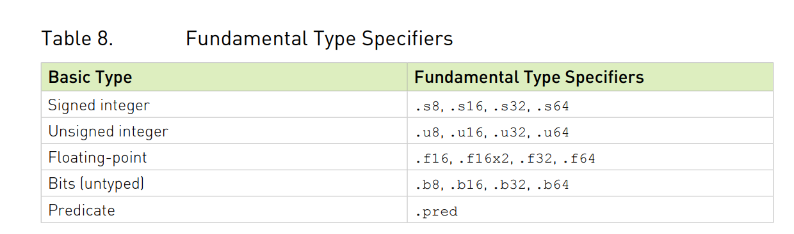

大多数指令都有一个或多个类型说明符，用于完全指定指令的行为。操作数类型和大小将根据指令类型进行检查，以确保兼容性.

位大小相同的任何基本类型之间都是兼容的。

原则上，所有基本类型(除开predicate类型)可以只用位大小进行声明，但标明具体类型，可以提升可读性并且方便做类型检查。

### 5.2.2.  Restricted Use of Sub-Word Sizes
`.u8`、`.s8`和`.b8`被限制在`ld`、`st`和`cvt`指令中使用。

`.fp16`只能被用在与`fp32`和`fp64`的相互转化中，以及半精度浮点指令和纹理获取指令中。

`.fp16x2`只能被用在半精度浮点指令和纹理获取中。

为了方便起见，`ld`、`st`和`cvt`指令允许源操作数和目标数据操作数比指令类型的大小更宽。

例如，在加载、存储或转换为其他类型和大小时，8位或16位的值可能直接保存在32位或64位寄存器中。

### 5.2.3.  Alternate Floating-Point Data Formats
PTX中支持的基本浮点类型具有隐式的位表示，表示用于存储指数和尾数的位数。（也就是说对于浮点来说，有多种不同的位表示方规则）。

比如：IEEE 754的标准fp16的位组合规则是，1个符号位 + 5个指数位 + 10个精度位。简称位s1-e5-m10

在PTX中还额外支持如下特殊的半精度位组合：

- bf16
  - s1-e8-m7，寄存器中的`bf16`必须被声明为`.b16`。
- e4m3
  - s1-e4-m3，e4m3编码不支持infinity和Nan，被限制在0x7f和0xff。e4m3必须以pack的形式`e4m3x2`，并且必须被声明位`.b16`。
- e5m2
  - s1-e5-m2，同e4m3类似，也必须以pack的形式使用`e5m2x2`，并且必须被声明为`.b16`。
- ft32
  - 这是一种特殊的32位浮点，由矩阵乘和累加指令支持，范围与fp32相同，但是精度低一些（>=10bit），具体的内部布局由实现定义。PTX便于从`.fp32`到`.tf32`的转化，`.tf32`寄存器必须声明为`.b32`。

替代数据格式不能用作基本类型。它们被某些指令支持为源格式或目标格式。

## 5.3.  Texture Sampler and Surface Types
PTX中有一些内建的**不透明**类型来定义`texture`、`sampler`、`surface descriptor`变量。

这些类型的命名字段类似于结构体，但所有的信息如：布局、字段顺序、基址和总体大小都隐藏在PTX程序中，因此称为**不透明**。

这些不透明类型的使用有如下限制：

1. 变量定义在全局(module)作用域和内核参数列表中；
2. module-scope变量的静态初始化使用逗号隔开静态赋值表达式；
3. texture\sampler\surface的引用通过texture\surface的load\save指令完成`tex,suld,sust,sured`。
4. 通过查询指令检索指定成员的值；
5. 创建指向不透明变量的指针可以使用`mov`指令，如：`mov.u64 reg, opaque_var`。产生的指针可以从内存中读写，也可以通过参数传递给函数，还可以被texture\surface的读写查询指令所引用。
6. **不透明变量不能出现在初始化中，如：初始化一个指针指向不透明变量。**

【PS】:从PTX ISA 3.1版本开始支持使用指向不透明变量的指针间接访问texture\surface，需要目标架构`sm_20`及以上。

上述的三种内建的不透明类型是`.texref`、`.samplerref`和`.surfref`。

使用texture + sampler的时候，由两种操作模式可以选择:
1. 一种是`unified mode`，这种模式下，texture和sampler都用过单个`.texref`进行访问。
2. 另一种模式是`independent mode`，这种模式下，texture和sampler都有各自的句柄，允许他们分开定义再合并使用，在这种模式下`.texref`中关于sampler的定义将被忽略，因为会在`.samplerref`被定义。

下面两张表列出了在两种模式下面各种成员，这些成员及其值有具体的获取方法，在纹理`HW`类中定义，以及通过API查询。

- Unified Mode
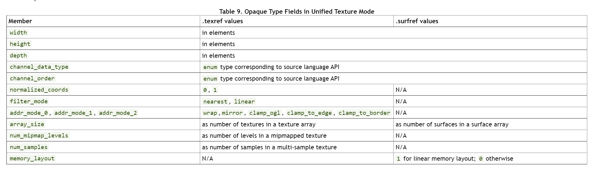

- Independent Mode
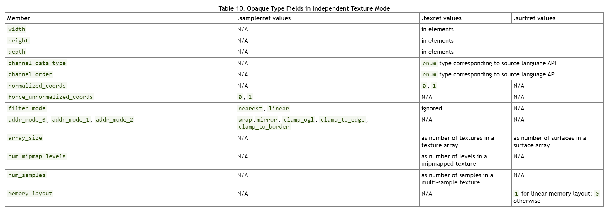

### 5.3.1.  Texture and Surface Properties
上表中的`width`、`height`和`depth`表示texture\surface在每个维度的元素个数(更准确的说可以理解为像素pixel)。

其中每一个像素的属性可以由`channel_data_type`和`channel_order`来表示。、

OpenCL中的定义是被PTX支持的，所以可以参考OpenCL的定义如下：

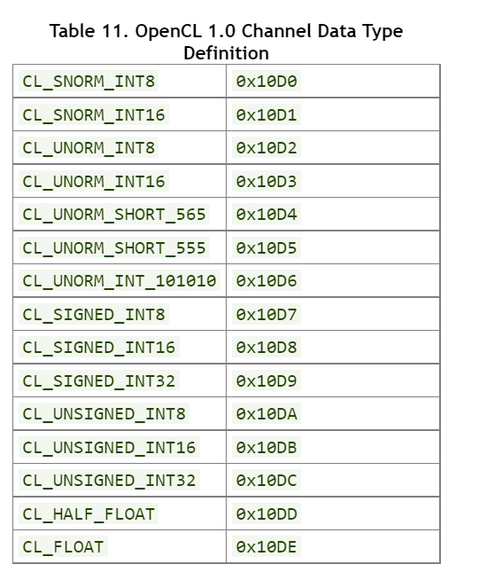
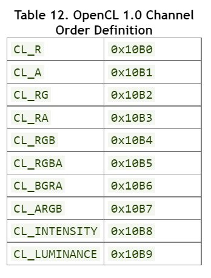

### 5.3.2.  Sampler Properties
关于sampler的属性，代表的意义如下：

- `normalized_coords`：表示坐标是否归一化为[0.0, 1.0f]。如果没有被显式设置，则会在runtime阶段根据源码进行设置(也就是说还有可能默认被设为开启？？没试过，通常是默认非归一化的)
- `filter_mode`：表示如何基于坐标值计算texture读取的像素。
- ` addr_mode_{0,1,2}`： 定义了每个维度的寻址模式，该模式决定了每个维度如何处理out-of-range的坐标。
- `force_unnormalized_coords`: **在Independant Mode**下独有的属性，字面意思很好理解，会去将texture中的`normalized_coords`强行改写为`unnormalized_coords`当其被设置为`True`时，如果是`False`，那么就默认使用texture中的设置。
  - 【PS】:该属性被用在编译OpenCL to PTX的时候。

我们在声明这些不透明类型的时候，如果位于module-scope中，则需要使用`.global`状态空间；而如果位于kernel参数列表中，则需要使用`.param`状态空间。

举个例子：
```
.global .texref my_texture_name;
.global .samplerref my_sampler_name;
.global .surfref my_surface_name;
```

在`,.global`状态空间中，可以使用静态列表进行初始化，如：
```
.global .texref tex1;
.global .samplerref tsamp1 = { addr_mode_0 = clamp_to_border,
                               filter_mode = nearest
                             };
```

### 5.3.3.  Channel Data Type and Channel Order Fields
见5.3.1的表

## 5.4.  Variables
在PTX中，除了基本的数据类型，还支持简单的聚合数据类型，如矢量(vector)和数组(array)。

### 5.4.1.  Variable Declarations
所有的存储数据都是通过变量声明来定义的。

标量声明包含，变量所在状态空间，类型和大小，变量名。以及可选的数组大小，可选的初始化方式，可选的变量固定地址。

如：
```
 .global .u32 loc;
 .reg .s32 i;
 .const .f32 bias[] = {-1.0, 1.0}; //初始化常量内存
 .global .u8 bg[4] = {0, 0, 0, 0}; //初始化全局内存
 .reg .v4 .f32 accel; // 初始化vector float4 寄存器
 .reg .pred p, q, r;  // 初始化predict寄存器p、q、r
```

### 5.4.2.  Vectors
任何长度为2或4的non-predicat基础类型矢量可以通过`.v2`或`.v4`的前缀进行声明。

矢量必须是基础类型，可以被声明为寄存器，长度不能超过128bit，只包含3个元素的矢量也会被创建为`.v4`矢量，剩余一个元素是padding位。

例子：
```
.global .v4 .f32 V; // a length-4 vector of floats
.shared .v2 .u16 uv; // a length-2 vector of unsigned short
.global .v4 .b8 v; // a length-4 vector of bytes
```

默认情况下，矢量的大小是内存对齐的(与长度和类型大小有关)，所以在我们进行矢量读写的时候，应该保证访问的内存大小是对齐到矢量的整数倍的。

### 5.4.3.  Array Declarations
数组的声明和C一样，无论是一维还是多维，并且声明的大小必须是常量表达式。

例子：
```
.local .u16 kernel[19][19];
.shared .u8 mailbox[128];
```

当数组的声明伴随着初始化表达式时，数组的第一维尺寸是可以被省略的，一维的尺寸是由初始化表达式中的元素决定的。

例子：
```
.global .u32 index[] = { 0, 1, 2, 3, 4, 5, 6, 7 }; // index[8]
.global .s32 offset[][2] = { {-1, 0}, {0, -1}, {1, 0}, {0, 1} }; // index[4][2]
```

### 5.4.4.  Initializers
变量的初始化方法在前文也有提到，和C\C++是类似的。并且时支持不完整的初始化，会默认进行补0操作。

例子：
```
.const .f32 vals[8] = { 0.33, 0.25, 0.125 };
等价于：.const .f32 vals[8] = { 0.33, 0.25, 0.125, 0.0, 0.0, 0.0, 0.0, 0.0 };
    
.global .s32 x[3][2] = { {1,2}, {3} };
等价于：.global .s32 x[3][2] = { {1,2}, {3,0}, {0,0} };
```

当前只支持`const`和`global`内存空间的变量初始化操作，如果上述两种空间中的变量没有显式的初始化，则默认初始化位`0`。不允许初始化外部变量。

在初始化式中出现的变量名表示变量的地址;这可用于静态初始化指向变量的指针。

初始化式支持`var`+`offset`的表达式，`offset`表示基于`var`地址的`byte`偏移。

PTX提供了一个操作符`generic()`，用于获取变量的地址。

从PTX ISA 7.1版本开始，提供了一个`mask()`操作符，其中`mask`是一个整型的立即数。

`mask()`操作符中唯一允许的表达式是整数常量表达式和符号表达式，用于表示变量地址。

`mask()`操作符可以**理解为通过通过为`&`操作和移位操作提取出某个byte的数据，并且作为初始化数据**。

支持的mask立即数有：
`0xFF`, `0xFF00`, `0xFF0000`, `0xFF000000`, `0xFF00000000`,
`0xFF0000000000`, `0xFF000000000000`, `0xFF00000000000000`。

```
 .const .u32 foo = 42;
 .global .u32 bar[] = { 2, 3, 5 };
 .global .u32 p1 = foo; // offset of foo in .const space
 .global .u32 p2 = generic(foo); // generic address of foo

 // array of generic-address pointers to elements of bar
 .global .u32 parr[] = { generic(bar), generic(bar)+4, generic(bar)+8 };

 // 为了简洁此处省略掉了mask操作符
 // 提取foo的某一个btye初始化为u8数据。  
 .global .u8 addr[] = {0xff(foo), 0xff00(foo), 0xff0000(foo), ...};
 .global .u8 addr2[] = {0xff(foo+4), 0xff00(foo+4), 0xff0000(foo+4),...}
 .global .u8 addr3[] = {0xff(generic(foo)), 0xff00(generic(foo)),...}
 .global .u8 addr4[] = {0xff(generic(foo)+4), 0xff00(generic(foo)+4),...}
 
 // mask() operator with integer const expression
 .global .u8 addr5[] = { 0xFF(1000 + 546), 0xFF00(131187), ...}; 
```

TODO: 这部分还有关于device function name出现在初始化式里面的情况。因为此处还不太理解，所以后续再展开。

持有变量或函数地址的变量类型只能是`.u8`、`.u32`或`.u64`。

`.u8`类型只能搭配在`mask()`使用（如上文所述，mask操作符取的就是8-bit数据）。

初始化式**不支持**`.fp16`、`.fp16x32`和`.pred`，其余类型都支持。


```
  .global .s32 n = 10;
  .global .f32 blur_kernel[][3]= {{.05,.1,.05},{.1,.4,.1},{.05,.1,.05}};
  .global .u32 foo[] = { 2, 3, 5, 7, 9, 11 };
  .global .u64 ptr = generic(foo);   // generic address of foo[0]
  .global .u64 ptr = generic(foo)+8; // generic address of foo[2]
```

### 5.4.5 Alignment
所有可寻址变量的内存字节对齐数，可以在变量生命的时候被定义，使用可选的`.align`关键字。

变量将对齐到字节数的整数倍地址。对齐值（字节数）必须是 2 的幂。对于数组，对齐方式指定的是整个数组起始地址的对齐方式，而非单个元素的对齐方式。
标量和数组变量的默认对齐方式是其基类型大小的倍数。向量变量的默认对齐方式是其整体向量大小的倍数。
```
// allocate array at 4-byte aligned address. Elements are bytes.
 .const .align 4 .b8 bar[8] = {0,0,0,0,2,0,0,0};
```
注意，所有访问内存的PTX指令都要求地址与访问大小的倍数对齐。内存指令的访问大小是在内存中访问的总字节数。如：`ld.v4.b32`的访问大小是16bytes，而`atom.fp16x2`的访问大小是4bytes。

### 5.4.6.  Parameterized Variable Names(参数化变量名)
由于PTX支持虚拟寄存器，编译器前端生成大量寄存器名是很常见的。寄存器支持像数组一样的批量声明。

例子：
```
// 声明了100个寄存器，按照后缀区别。
.reg .b32 %r<100>; // declare %r0, %r1, ..., %r99
```

这种简写语法可以用于任何基本类型和任何状态空间，并且可以在前面加上一个对齐说明符。数组变量不能以这种方式声明，也不允许初始化式。
注:由于ptx是平台无关的汇编语法，因此其指令中只能使用虚拟寄存器，因此这里讨论变量初始化的时候也在讨论是初始化虚拟寄存器。可以参考https://www.findhao.net/easycoding/2064 中1.4节的内容

### 5.4.7.  Variable Attributes
变量可以用可选的`.attribute`指令来声明，该指令允许指定变量的特殊属性。关键字`.attribute`后面是在括号内的属性说明。多个属性用逗号分隔。

### 5.4.8.  Variable Attribute Directive: .attribute

目前在手册中只说了如下的一种`.attribute`属性：

`.managed`:该属性指定变量将分配到**统一虚拟内存**中，在该内存中，**系统中的host和device可以直接引用该变量**。注意只能用于`.global`状态空间。

该属性在PTX ISA 4.0中首次出现。 在`sm_30`及以上架构被支持。

例子：
```
.global .attribute(.managed) .s32 g;
.global .attribute(.managed) .u64 x;
```

# Chapter 6. Instruction Operands

## 6.1 Operand Type Information

指令中的所有操作数都有其声明中的已知类型。每个操作数类型必须与指令模板和指令类型所确定的类型兼容。**类型之间不存在自动转换**。

类型与指令类型不同但与指令类型兼容的操作数被静默转换为指令类型。

## 6.2.  Source Operands
源操作数在指令描述中用通常用名称`a`、`b`和`c`表示。

ALU的操作指令必须声明在`.reg`寄存器空间，并且大多数情况下，操作数的大小都必须一致。

`cvt`指令接受任何类型和大小的操作数，因为它的任务就是对做转换。

`ld`、`st`、`mov`和`cvt`指令都是将数据从一处拷贝到另一处，需要注意的是：
1. `ld`和`st`指令是将数据在可寻址空间和寄存器空间之前移动。
2. `mov`指令则是在寄存器之间进行移动。

大部分指令有可选的判断变量控制执行逻辑，而有一部分指令需要用到判断变量作为源操作数，这些判断变量通常用`p`，`q`，`r`，`s`表示。

## 6.3.  Destination Operands
结果操作数通常由`d`表示，并且是寄存器状态空间中的标量或向量变量。

## 6.4.  Using Addresses, Arrays, and Vectors
使用**标量变量**作为操作数很简单。地址、数组和向量的使用则相对复杂(手册说的：**有趣**)。

### 6.4.1.  Addresses as Operands
所有内存指令都接受一个地址操作数，该操作数指定被访问的内存位置。这个地址操作数可以是:

- [var]
  - 可寻址变量`var`的名字
- [reg]
  - 一个包含**字节地址**的整型寄存器或者bit-size寄存器。
- [reg + immOff]
  - 寄存器 + 字节偏移(uint32)的地址。
- [var + immOff]
  - 可寻址变量 + 字节偏移(uint32)
- [immAddr]
  - 一个立即数表示的字节地址
- var[immOff]
  - 一个数组元素(会在Arrays as Operands章节介绍)

当寄存器包含地址的时候，通常会被声明为bit-size或者整型类型。

内存指令的访问大小是在内存中访问的总字节数。例如，`ld.v4.b32`的访问大小为16字节，而`atom.fp16x2`是4个字节。

地址必须与访问大小的倍数自然对齐。如果地址没有正确对齐，结果行为是**未定义的**。

地址大小可以是32位或64位。地址会根据需要进行零扩展，扩展到指定的宽度，如果寄存器宽度超过目标架构所支持的地址宽度(如：32-bit架构用64-bit地址)，则截断地址。

地址运算使用**整数运算**和**逻辑运算**来执行。包括**指针算术**和**指针比较**。所有的地址和地址计算都是基于**字节的**。不支持c风格的指针算术（这里我理解为，不支持像C那样可以按照bit位进行计算）。
    
`mov`指令可用于将变量的地址移动到指针中。该地址是该变量在状态空间中的地址偏移量。

举一些例子：
```
    .shared .u16 x;
    .reg .u16 r0;
    .global .v4 .f32 V;
    .reg .v4 .f32 W;
    .const .s32 tbl[256];
    .reg .b32 p;
    .reg .s32 q;
 
    ld.shared.u16 r0,[x];       //从shared memory中读取x到寄存器r0中
    ld.global.v4.f32 W, [V];    //从global memory中读取v4向量到v4寄存器W中
    ld.const.s32 q, [tbl+12];   //从const memory中读取tble[12]的元素到寄存器q中
    mov.u32 p, tbl;             //将常量表tbl的地址拷贝到寄存器p中，注意此处存在隐式转换，但逻辑无误
    // 在 PTX 中，直接引用变量名（如 tbl）时，它表示的是该变量在其状态空间（这里是 .const 常量内存）中的基地址（偏移量），而非数组中的数据。若要引用变量（或数组）中的数据（而非地址），需通过内存加载指令（ld 系列） 并使用地址表达式（如 [变量名] 或 [变量名 + 偏移量]）来访问
```

#### 6.4.1.1.  Generic Addressing
当一条内存指令没有表明状态空间时，这条操作会被认定为使用**泛型地址**

`.const`、`.param`、`.local`和`.shared`都是泛型地址空间中的一段滑窗。

每一个内存空间的滑窗段由滑窗的初始地址以及对应的空间大小来定义。

需要注意的是泛型地址会默认映射到`.global`空间中，除非被表表明是`.const`、`.local`和`.shared`。

`.prama`滑窗是属于`.global`滑窗的一部分。

在每个滑窗内，泛型地址映射的地址是可以理解为滑窗基地址的偏移。（个人理解这个地址是基于滑窗基地址的相对地址，不是绝对地址）

### 6.4.2.  Arrays as Operands
所有类型的数组可以声明，并且在声明数组的空间中成为地址常量。数组的大小在程序中是一个常量。

可以使用显式计算的字节地址访问数组元素，也可以使用方括号表示法索引数组。

举个例子：
```
    ld.global.u32 s, a[0];
    ld.global.u32 s, a[N-1];
    mov.u32 s, a[1]; // move address of a[1] into s
```

### 6.4.3.  Vectors as Operands
矢量操作只被部分受限制的指令所支持，包括`ld`、`st`、`mov`和`tex`。矢量可以被当作参数传给调用函数。

矢量的元素可以通过后缀`.x`、`.y`、`.z`和`.w`进行访问，`r`、`g`、`b`和`a`也是可以的/

可以通过矢量对标量寄存器进行批量赋值，举个例子：
```
    .reg .v4 .f32 V;
    .reg .f32 a, b, c, d;
    mov.v4.f32 {a,b,c,d}, V; //用V一次性对a\b\c\d进行赋值
```

使用矢量读写可以提升读写的性能。矢量读写的目标寄存器可以是矢量寄存器，也可以是组合的标量寄存器，如：
```
    ld.global.v4.f32 {a,b,c,d}, [addr+16];
    ld.global.v2.u32 V2, [addr+8];
    //对于{a,b,c,d}，假设有一个矢量寄存器V，其值与坐标对应关系
    // a = V.x = V.r;
    // b = V.y = V.g;
    // c = V.z = V.b;
    // d = V.w = V.a;
```

### 6.4.4.  Labels and Function Names as Operands
分支标记(Lable)只能用在`bra\brx.idx`指令中，函数名(function name)只能用在`call`指令中。

函数名可以在`mov`指令中使用，目的在于将函数指针地址存放在寄存器中，用于直接的调用。

从PTX ISA 3.1版本开始，`mov`指令可以用来获取kernel的地址，然后传递给系统调用，进行GPU kernel初始化。

## 6.5.  Type Conversion
在算数、逻辑、移动等指令中的所有操作数都必须是相同的数据类型和大小。如果操作数数据类型或大小不相同，那么必须在进行才做之间做数据转换。

### 6.5.1.  Scalar Conversions
下表中表示了各个数据类型之间相互转换会有的操作，如：u16转换到u32是高位直接补0。

其中如果转换到浮点数的时候，源操作数的大小超过了浮点数能表示的最大值，那么会直接被表示为浮点数的最大值。（如IEEE`f32`和`f64`最大值表示为Inf，而`fp16`约为131,000？手册中是`~13100`）

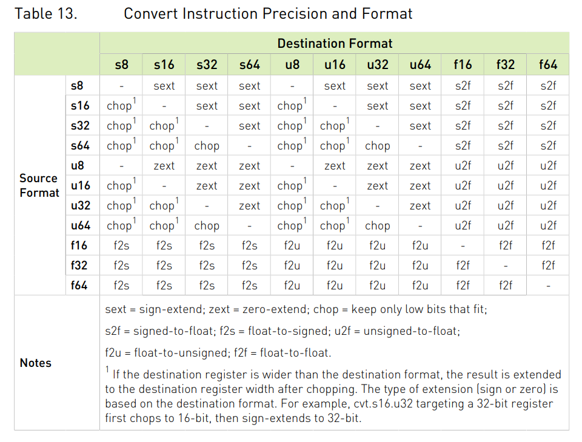

### 6.5.2.  Rounding Modifiers
在转换指令中可能会需要表明**舍入修饰符(rounding modifier)**，其中整型和浮点型都分别有四种和五种rounding modifier。

浮点型如下表所示：
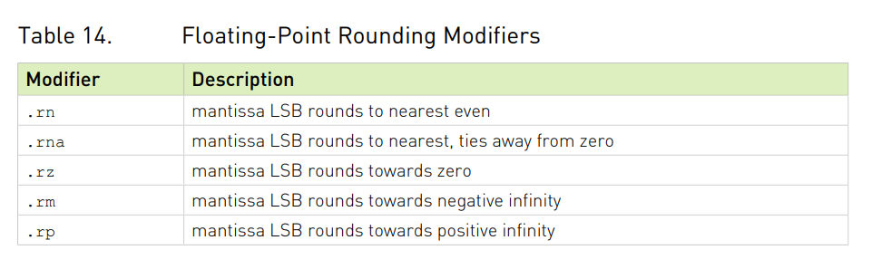

PS: "LSB" -- "least significant bit(最低有效位)"。
"rounds to nearest even"应该是，如：`1.5`这种距离1和2距离相近的情况下，我们会舍入到偶数2。

整型如下表所示：
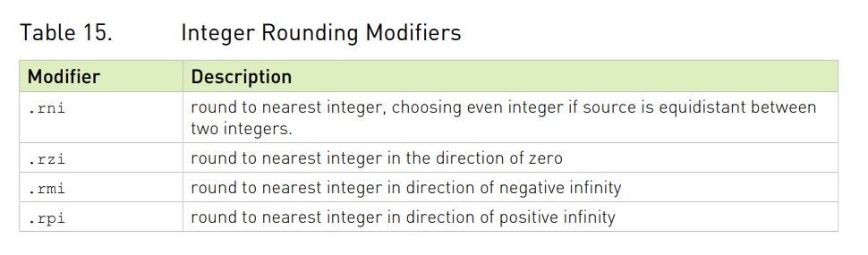

## 6.6.  Operand Costs
不同的状态空间中的操作指令会有着不同的速度，比如寄存器的操作指令是最快的，而全局空间的操作指令是最慢的。

有许多让发可以隐藏指令的操作延迟，如：
1. 多线程执行，这样会硬件在某一线程执行完内存操作之后自动切换到另一个线程，调度隐藏延迟；
2. 尽可能早的分配读取指令，因为在后续的指令使用到读取的结果之前，后续指令并不会被阻塞。
3. ....

下表大致估计了各个状态空间指令的时钟周期：
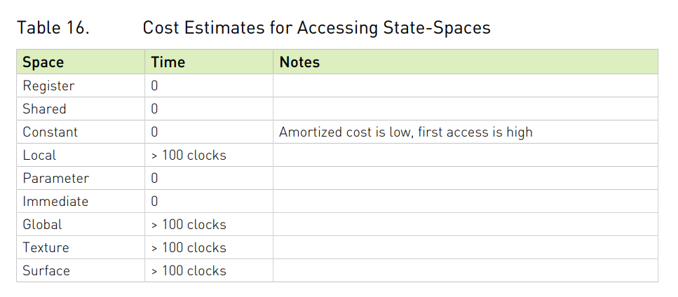

# Chapter 7. Abstracting the ABI

## 7.1.  Function Declarations and Definitions
在PTX中，函数定义使用`.func`进行标注，函数的定义包含可选的返回值列表、可选的输入参数列表以及必须的函数名。

并且必须在函数调用之前定义函数(这个没啥好说的)。

简单例子：
```
.func foo
{
 ...
 ret;
}

 ...
 // call foo;
 ...

```

标量和向量的基础类型的输入参数和返回参数，可以使用寄存器变量。在函数被调用时，实参可以是寄存器变量或常量，返回值可以直接放入寄存器变量中。调用时的实参和返回变量的类型和大小必须与被调用者对应的形式参数相匹配。

举个例子：
```
.func (.reg .u32 %res) inc_ptr ( .reg .u32 %ptr, .reg .u32 %inc ) // func. (返回值) 函数名 （输入参数）
{
 add.u32 %res, %ptr, %inc;
 ret;
}
 ...
 call (%r1), inc_ptr, (%r1,4);
 ...
```

当使用ABI(Application Binary Interface)时，`.reg`状态空间的参数必修至少为32-bit。所以要么在传参之前将小于32-bit的标量数据进行类型转换，要么使用接下来例句的按照结构体封装的`.param`状态空间参数。

像C中的结构体和联合体这样的对象，在PTX中被扁平化成寄存器或字节数组，并使用`.param`空间内存表示。如：
```
struct {
 double dbl;
 char c[4];
};

```

在PTX中，因为内存的访问需要对齐，所以上述的结构体参数总共占的内存为12bytes，并且8bytes对齐因为需要对齐访问`fp64`的数据。

看一个比较完整的例子：
```
.func (.reg .s32 out) bar (.reg .s32 x, .param .align 8 .b8 y[12])
{
    .reg .f64 f1;
    .reg .b32 c1, c2, c3, c4;
    ...
    ld.param.f64 f1, [y+0];
    ld.param.b8 c1, [y+8];
    ld.param.b8 c2, [y+9];
    ld.param.b8 c3, [y+10];
    ld.param.b8 c4, [y+11];
    ...
    ... // computation using x,f1,c1,c2,c3,c4;
}
{
    .param .b8 .align 8 py[12];
    ...
    st.param.b64 [py+ 0], %rd;
    st.param.b8 [py+ 8], %rc1;
    st.param.b8 [py+ 9], %rc2;
    st.param.b8 [py+10], %rc1;
    st.param.b8 [py+11], %rc2;
    // scalar args in .reg space, byte array in .param space
    call (%out), bar, (%x, py);
 ...
}
```

在上述例子中，我们需要注意的`.param`被使用的两种方式：
1. 在函数的定义中`.param`参数`y`表示函数的形式参数；
2. 其次，在调用函数之前声明一个`.param`变量`py`，并用于设置传递给函数的结构体。

接下来是一些概念性的方式来考虑在设备函数中使用`.param`状态空间。
- 对于调用者而言：
  - `.param`状态空间用于设置后续被传入被调函数的参数，或者接受被调函数返回值的变量。
- 对于被调函数而言：
  - 反之，被调函数中`.param`用于表示被传入的参数或者被返回的非参数。

对于**参数传递**则会有如下的一些约束：
- 对于调用者而言：
  - 参数可以是`.param`、`.reg`或者是常数；
  - 当`.param`修饰的函数形参是字节数组的时候，实参也必须是字节数组，并且类型、大小和对齐尺寸都必须匹配。并且实参必须声明在与调用者相同的作用域内。
  - 当`.patam`修饰的函数形参是基础类型的标量或矢量时，实参必须是在`.param`或`.reg`空间，且大小和类型要匹配。或者说是类型匹配的常数；
  - 当`.reg`修饰函数形参时，约束与上一条相同；
  - 当`.reg`修饰函数形参时，其大小至少为32-bit；
  - 使用`st.param`进行参数传递必须立即跟在函数调用之前，使用`ld.param`进行返回值收集必须立即跟在函数调用之后，不支持任何控制流操作，**主要时为了方便编译器进行优化**(自己写的时候记住就行)。
- 对于被调函数而言：
  - 输入值和返回值可以是`.param`和`.reg`状态空间修饰的；
  - 在`.param`状态空间的内存，必须按照1\2\4\8\16字节进行对齐；
  - 在`.reg`状态空间的参数，大小至少为32-bit;
  - `.reg`可以被用于接收和返回基础类型的标量或者矢量，**在non-ABI模式下也包括sub-word size(不太理解non-ABI模式，但是sub-word size应该是只小于32-bit的大小)**。

注意，参数传递的状态空间是`.reg`还是`.param`对参数最终是在物理寄存器中还是在堆栈中传递没有影响。参数到物理寄存器和堆栈位置的映射取决于ABI定义和参数的顺序、大小和对齐方式。

### 7.1.1.  Changes from PTX ISA Version 1.x
PS: 看的时候直接跳过了这一小结，因为感觉稍微有点久远了。

## 7.2.  Variadic Functions
PTX 6.0版本支持将无大小的数组形参传递给一个函数，该函数可用于实现可变变量函数。

具体的一些参考在后续章节会接着说。(后续的11章)

## 7.3.  Alloca
PTX提供了`alloca`指令用于在runtime在每个线程的local stack上申请内存。被`alloca`返回的内存指针内存可以被`ld.local`和`st.local`指令进行访问。

为了促进用alloca分配的内存的回收，PTX提供了两个附加指令:
1. `stacksave`允许读取本地变量中堆栈指针的值；
2. `stackrestore`可以用保存的值恢复堆栈指针。
PS: 上述两个指令是PTX ISA 7.3预览版所加入的特性，后续可能还会有改变，所以并不能保证向后兼容。


# Chapter 8. Memory Consistency Model
在多线程执行的过程中，因为不同的两个线程，他们各自的两个操作可能并没有按照顺序进行。在这种时候可能就会导致内存上的一些问题。内存一致性模型则可以更好的约束这些潜在的问题。

## 8.1.  Scope and applicability of the model
在此模型下指定的约束适用于任何PTX ISA版本，运行在`sm_70`或更高的架构上。

内存一致性模型，不适用与`texture`（包括`ld.global.nc`）和`surface`内存的访问。

### 8.1.1.  Limitations on atomicity at system scope
当与主机CPU通信时，具有系统作用域的64位强操作可能不会在某些系统上原子地执行。

原子操作的保证性在这里不多展开。CUDA Programming Guide里面有详细说明

## 8.2.  Memory operations
PTX内存模型中的基本存储单元是1个字节。PTX程序可用的每个状态空间都是内存中连续字节的序列。并且每个字节的地址都是唯一的。

内存一致性模型规范使用术语“address”或“memory address”来表示虚拟地址，使用术语“memory location”来表示物理内存位置。

### 8.2.1.  Overlap
当两端内存段存在交集是，称之为Overlap，当两个内存指令指定的虚拟地址相同但物理内存存在交集时，二者也是Overlap的。

### 8.2.2.  Aliases
如果两个不同的虚拟地址映射到相同的物理内存位置，则称它们为别名。

### 8.2.3.  Vector Data-types
内存一致性模型将在物理地址上执行的操作与**标量数据**类型联系起来，这些数据类型的最大大小和对齐方式为64-bit。

向量数据类型的内存操作被建模为一组标量数据的等效内存操作，以未知的顺序在向量中的元素上进行。(我理解如果时v4.u8这种加法，位置顺序是指具体先计算那哪一个u8是未知的，通常我们也并不关心)

### 8.2.4.  Packed Data-types
Packed数据如`.fp16x2`，访问的是物理内存上连续的两个`fp16`数据。其内存操作指令也是等效为一组标量的指令，以未知的顺序在packed data上进行。

### 8.2.5.  Initialization
内存值的初始化，如果没有任何显式的赋值操作，那么字节会被初始化为未知但不变的值。（随机值但一定是所有字节都是一样的随机值）

## 8.3.  State spaces
在内存一致性模型中定义的关系独立于状态空间。

例如，PTX指令`ld.relax .shared.sys`的同步效果与`ld.relax .shared.cluster`的同步效果相同。因为非同一cluster之内的线程不能执行访问同一shared内存位置的操作。

## 8.4.  Operation types
操作类型大致可以分为下表所示的一些类：

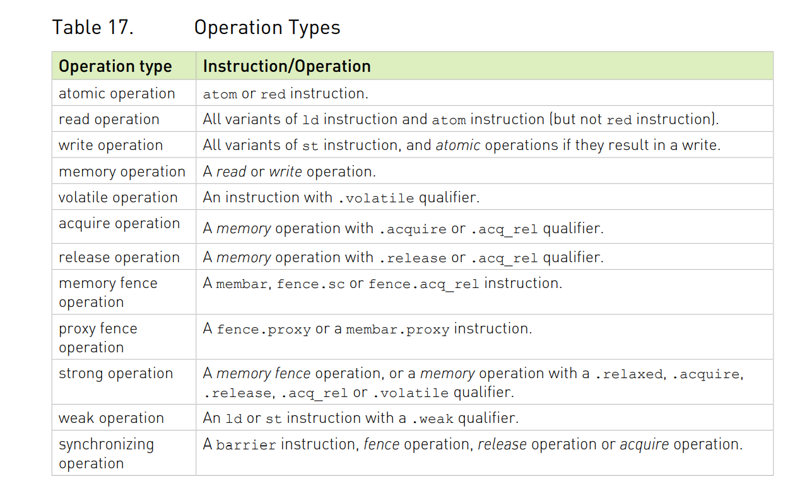

## 8.5.  Scope
每一条**强操作**都必须表明作用域，这些作用域有：

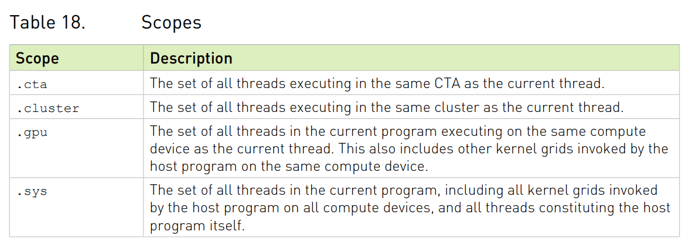

需要注意的是`warp`并不是作用域，`CTA`则是内存一致性模型中的拥有最小线程集合的作用域。


## 8.6.  Proxies
内存代理是应用于内存访问方法的抽象标签。当两个内存操作使用不同的内存访问方法时，它们被称为不同的代理。

在Table17中定义的内存操作使用通用的内存访问方法，即通用代理。其他操作，如`texture`和`surfasce`都使用不同的内存访问方法，也不同于通用方法。

需要使用`proxy fence`来同步不同代理之间的内存操作。尽管虚拟别名使用通用的内存访问方法，但由于使用不同的虚拟地址就像使用不同的代理一样，因此它们需要一个`proxy fence`来维护内存顺序。

## 8.7.  Morally strong operations
满足如下所有条件的两条操作，我们说他们互为**morally strong operations**:

1. 操作按程序顺序相关(即，它们都由相同的线程执行)，或者每个操作都是强操作，并指定包含线程的作用域执行另一个操作。
2. 两个操作都通过同一个代理执行。
3. 如果两者都是内存操作，那么它们完全重叠(overlap completely)。

### 8.7.1.  Conflict and Data-races
当两个内存重叠的操作至少有一个是写的时候，我们称之为`conflict`。

如果两个存在`conflict`的内存操作在因果顺序上不相关，且它们不是`morally strong`，则它们被称为`data-races`。

### 8.7.2.  Limitations on Mixed-size Data-races
在完全overlap情况下出现的`data-race`称之为`uniform-size data-race`，在不完全overlap的情况下称之为`mixed-size data-race`。

如果PTX程序包含一个或多个`mixed-size data-race`，则内存一致性模型中的公理不适用。但对于`uniform-size data-race`是适用的。

注意原子操作能够保证在任何情况下都可以保证执行无误。

## 8.8.  Release and Acquire Patterns
一些指令序列会产生参与内存同步的模式。`release`使得来自当前线程t的先前操作对来自其他线程的某些操作可见。`acquire`模式使来自其他线程的一些操作对当前线程t的后续操作可见。

在内存位置M上的`release`包含如下一些操作：
1. 在M上的`release`操作：
```
st.release [M]; 
atom.acq_rel [M];
```
2. 一个`release`操作之后紧跟着一个`strong write`(见上文Table17):
```
st.release [M]; 
st.relaxed [M];
```
3. 一个内存栅栏操作之后紧跟着一个`strong write`操作：
```
fence; 
st.relaxed [M];
```

任何由`release`模式建立的内存同步只影响在该模式中按程序顺序发生的**第一个指令操作**之前的操作。

在内存位置M上的`acquire`包含如下一些操作：
1. 在M上的`acquire`操作：
```
ld.acquire [M];
atom.acq_rel [M];
```
2. 一个`acquire`操作之后紧跟着一个`strong write`(见上文Table17):
```
ld.relaxed [M]; 
ld.acquire [M];
```
3. 一个`strong read`指令后紧跟这内存栅栏操作：
```
ld.relaxed [M]; 
fence;
```
由`acquire`模式建立的任何内存同步，只影响该模式中按程序顺序发生的**最后一条指令操作**之后的操作。

## 8.9.  Ordering of memory operations
内存一致性模型定义了通信顺序、因果顺序、程序顺序之间不允许存在的矛盾。

### 8.9.1.  Program Order
Program order是一个传递关系，在线程执行的操作上形成一个总顺序，但不关联来自不同线程的操作。

### 8.9.2.  Observation Order
Observation order通过可选的原子read-modify-write操作序列将写操作W与读操作R联系起来。

当出现如下两种情况之一是，Observation order中的写操作W会**先于**读操作R：
1. R和W是`morally strong`并且R 读取由W写入的值；
2. 对于一些原子操作Z，在Observation order中W先于Z并且Z先于R。

### 8.9.3.  Fence-SC Order
Fence-SC order是一个非循环的部分顺序，在运行时确定，与每一对`morally strong fence.sc`操作相关。

### 8.9.4.  Memory synchronization
同步操作实在运行时不同的线程之间进行的操作。这种同步操作在线程之间建立了因果关系(Causality order)

不同线程之间的同步操作包括如下几种：
1. 一个`fence.sc`操作X与一个`fence.sc`操作Y同步，且在Fence-SC order中X位于Y之前；
2. `bar{.cta}.sync`或`bar{.cta}.red`或`bar{.cta}.arrive`与`bar{.cta}.red`或`bar{.cta}.sync`在同一个barrier上进行同步；
3. 一个`barrier.cluster.arrive`与`barrier.cluster.wait`进行同步；
4. release模式的X与acquire模式的Y同步，如果X中的写操作按照Observation Order先于Y中的读操作，并且X中的第一个操作和Y中的最后一个操作是`morally strong`。

一些同步操作也可以通过相关的CUDA API来实现，如：cuda stream的同步等。

### 8.9.5.  Causality Order
不想翻译这一部分了，后面如果有新体会再翻译吧，因果关系可以直接按照字面理解，就是两条操作之间如果存在依赖，那就存在因果关系。

### 8.9.6.  Coherence Order
存在一种部分传递顺序，将重叠写操作联系起来，在运行时确定，称为一致性顺序(Coherence Order)。

当两个写操作是`morally strong`或者他们存在因果关系时，他们是满足一致性顺序的。

但当两个写操作存在`data-race`的时候，他们不满足一致性顺序。

### 8.9.7.  Communication Order
通信顺序是在运行时确定的**非传递顺序**，它将写操作与其他overlapping的内存操作联系起来。

## 8.10.  Axioms

### 8.10.1.  Coherence
"If a write W precedes an overlapping write W’ in causality order, then W must precede W’ in
coherence order." (公理就不用翻译了)

### 8.10.2.  Fence-SC
"Fence-SC order cannot contradict causality order. For a pair of morally strong fence.sc
operations F1 and F2, if F1 precedes F2 in causality order, then F1 must precede F2 in FenceSC order."
(也就是如果两个操作存在因果关系，那么他们一定符合Fence-SC order)

### 8.10.3.  Atomicity
关于原子性，直接看下图所示的对比，就可以略知一二。

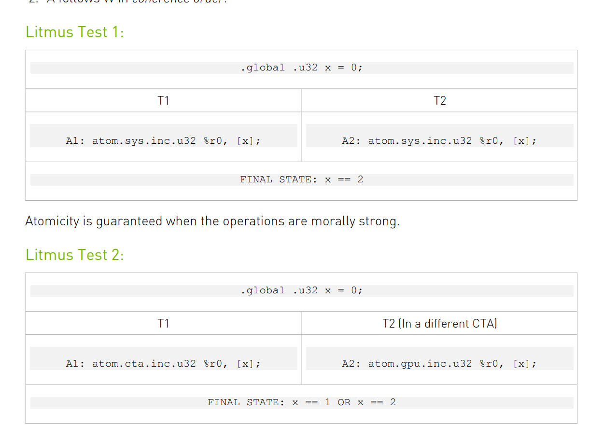

### 8.10.4.  No Thin Air
没太理解这部分，上个图先：

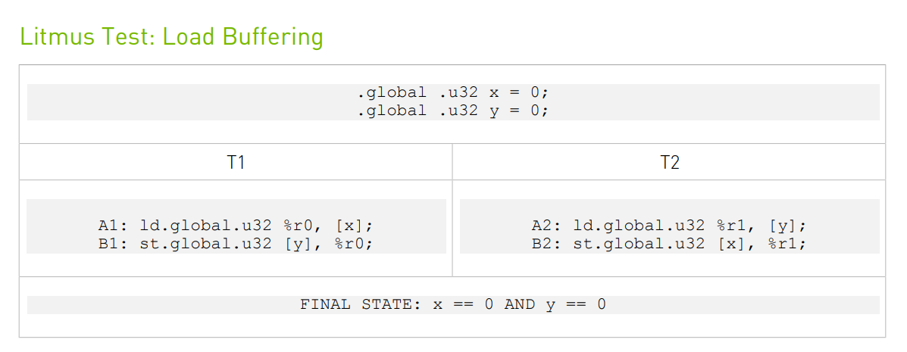

文档中有一句话说的是：" Only the values x == 0 and y == 0 are allowed to satisfy this cycle."

### 8.10.5.  Sequential Consistency Per Location 
直接上图，可能更直观：

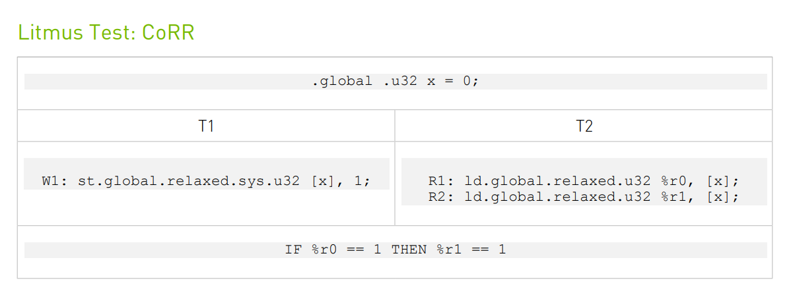

上图的意思我理解就是，无论T2执行顺序再T1前还是T1之后，T2中R2读取的值始终与R1是保持一致的。

### 8.10.6.  Causality
通信顺序中的关系不能与因果顺序相矛盾。

对应的描述暂时不翻译了，只能意会不能言传：


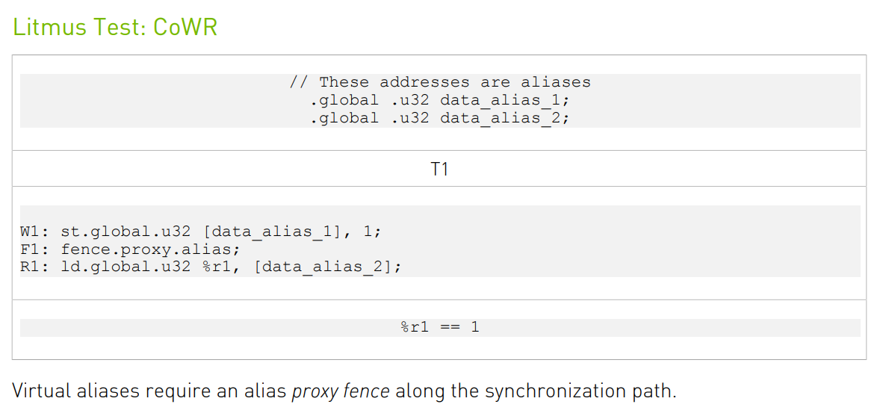

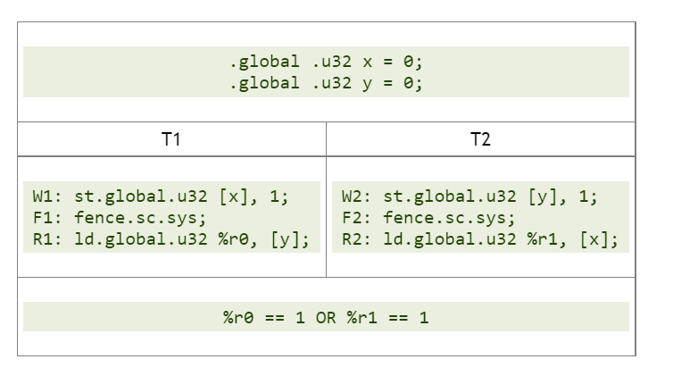

# Chapter 9. Instruction Set
本章就是整个手册的大头了，介绍各种指令的格式、语法以及作用等。

## 9.2.  PTX Instructions
通常来说，PTX指令有0-4个操作数，并且有一个可选的条件判断符在操作符的左边，并且用`@`前缀表示：

```
@p opcode;
@p opcode a;
@p opcode d, a;
@p opcode d, a, b;
@p opcode d, a, b, c;
```
上述指令中，位于操作符右边最近的操作数`d`为目标操作数，其余为源操作数。

当`setp`操作修改两个目标操作数时，我们通过`|`符号进行多个操作数的分隔：
```
setp.lt.s32 p|q, a, b; // p = (a < b); q = !(a < b);
```

对于某些指令，目标操作数是可选的。用下划线(_)表示的`bit bucket`操作数可以用来代替目标寄存器。

## 9.3.  Predicated Execution
在PTX中，条件寄存器时虚拟的(个人理解就是在物理资源上没有对应的寄存器)，通过`.pred`作为类型标注，所以条件寄存器可以按照如下方式声明：
```
.reg .pred p, q, r;
```

**所有的指令**都可以增加条件操作数来控制执行，使用`@{!}p`来进行条件标注。`@!p`表示条件p取非，注意任何时候表示条件前缀`@`必不可少

举个例子：
```
// c代码中的判断
if (i < n)
 j = j + 1;

// 对应的ptx代码
setp.lt.s32 p, i, n; // p = (i < n)
@p add.s32 j, j, 1; // if i < n, add 1 to j
```
如果上述例子有额外的分支，ptx代码如下：
```
 setp.lt.s32 p, i, n; // compare i to n
@!p bra L1; // if p==False, jump to L1
 add.s32 j, j, 1;
L1: ...
```

### 9.3.1.  Comparisons

#### 9.3.1.1.  Integer and Bit-Size Comparisons

直接上图：


#### 9.3.1.2.  Floating Point Comparisons
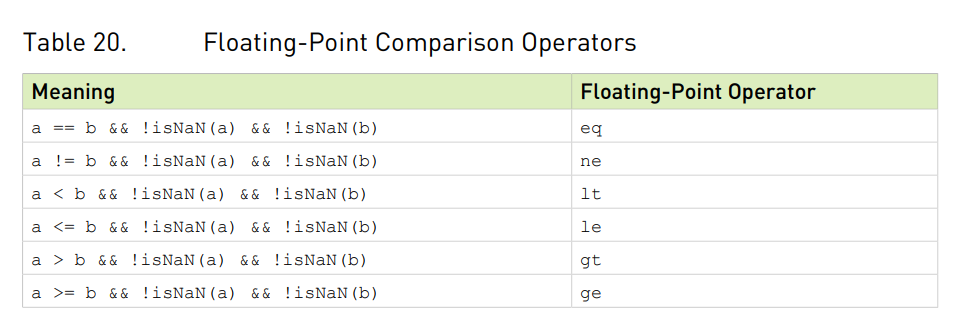

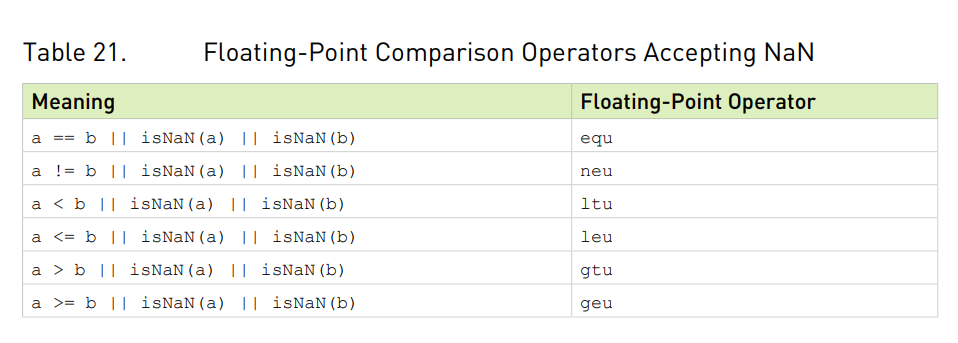

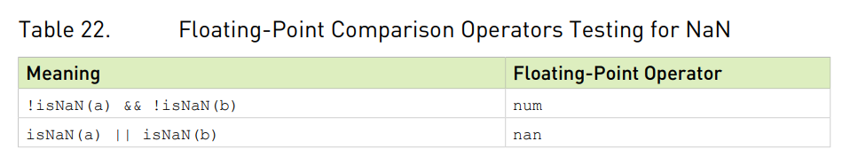

### 9.3.2.  Manipulating Predicates
条件判断值可以由如下的指令计算和操作，如：`and`, `or`, `xor`, `not`, `mov`。

PTX中没有直接的办法可以将条件值和整型值之间做转换，也没有直接的办法去读写条件寄存器的值。

不过，`setp`指令可以根据整型值生成条件值，`selp`指令可以根据条件值生成整型值。

举个例子：
```
selp.u32 %r1,1,0,%p; // selp其实就是实现的 ?: 三目运算操作符
```

## 9.4.  Type Information for Instructions and Operands
类型指令一定会有显式的类型大小标注。举个例子：
```
.reg .u16 d, a, b;
 add.u16 d, a, b; // perform a 16-bit unsigned add
```

有些指令甚至需要多个类型标注，大部分情况出现在`cvt`类型转换指令中。如：
```
.reg .u16 a;
.reg .f32 d;
cvt.f32.u16 d, a; // convert 16-bit unsigned to 32-bit float
```

指令和操作数的类型一致性服从如下原则：
1. Bit-size类型与其他任意的同size类型一致；
2. 有符号整型和无符号整型在大小相同的情况下是一致的，并且整型操作数可能会被默认转换为指令类型。例如，在有符号整数指令中使用的无符号整数操作数将被该指令视为有符号整数；
3. 浮点类型只有在大小相同的情况下才一致。也就是说，它们必须完全匹配（完全匹配的意思应该是指，符号位-指数位-精度位的大小均一致）。

关于类型检测规则如下表所示：
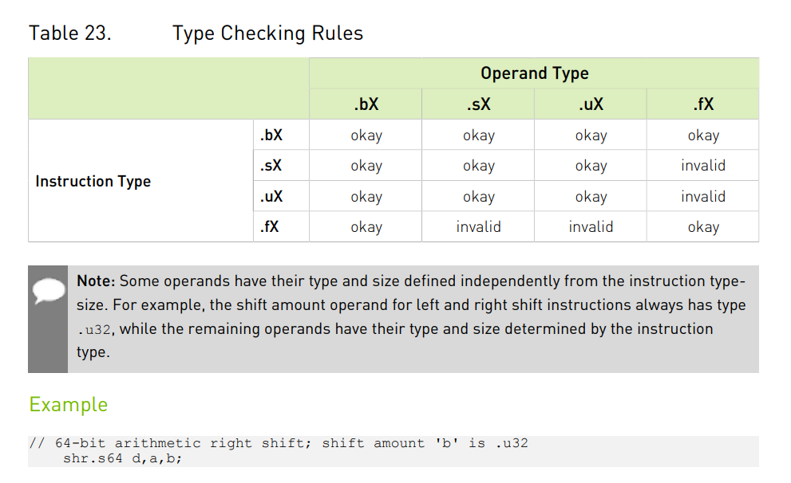

### 9.4.1.  Operand Size Exceeding Instruction-Type Size
为了方便起见，`ld`、`st`和`cvt`指令允许源操作数和目标操作数比指令类型更宽，这样就可以使用常规宽度寄存器加载、存储和转换较窄的值。

当源操作数的位数超过了指令大小，源数据会被截断处理(chopped)。

数据之间转换的情况如下表所示，需要注意的是某些指令对于某些类型是不支持的，如：`cvt`指令不支持`bX`类型的指令。
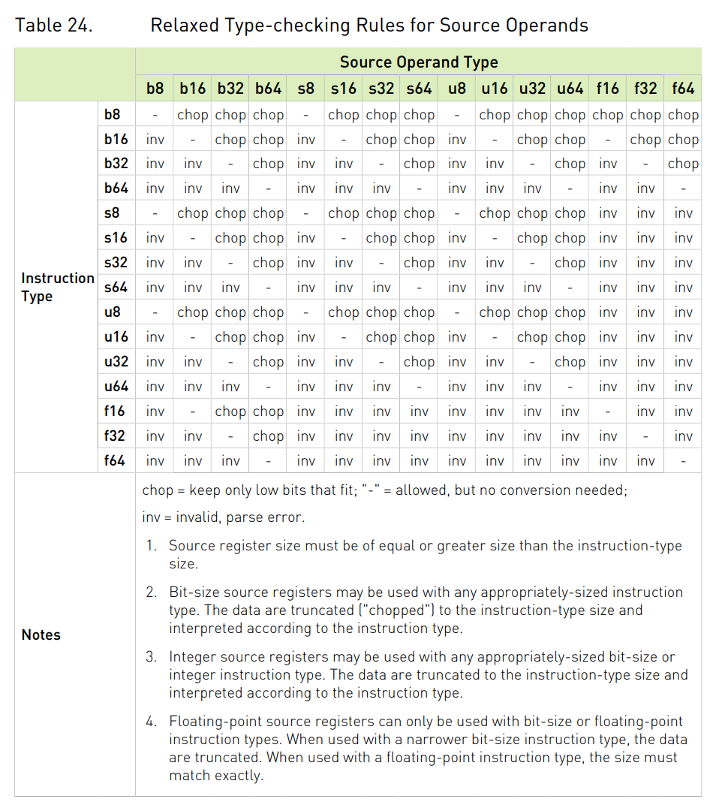

上表中的注意事项总结如下：
1. 源寄存器大小必须大于或等于指令类型大小；
2. Bit-size源寄存器可以与任何类型搭配使用，只不过可能会出现数据截断的情况；
3. 整型源寄存器可以与任何Bit-size或整型类型搭配使用，不过也存在数据截断的情况；
4. 浮点只能与Bit-size或完全匹配的浮点类型搭配使用。

对于目标寄存器，当目标操作数的大小超过指令类型的大小时，目标数据将被零扩展(zero-extend)或符号扩展(sign-extend)到目标寄存器的大小。如果对应的指令类型是带符号整数，则数据是带**符号扩展**;否则，数据为**零扩展**。

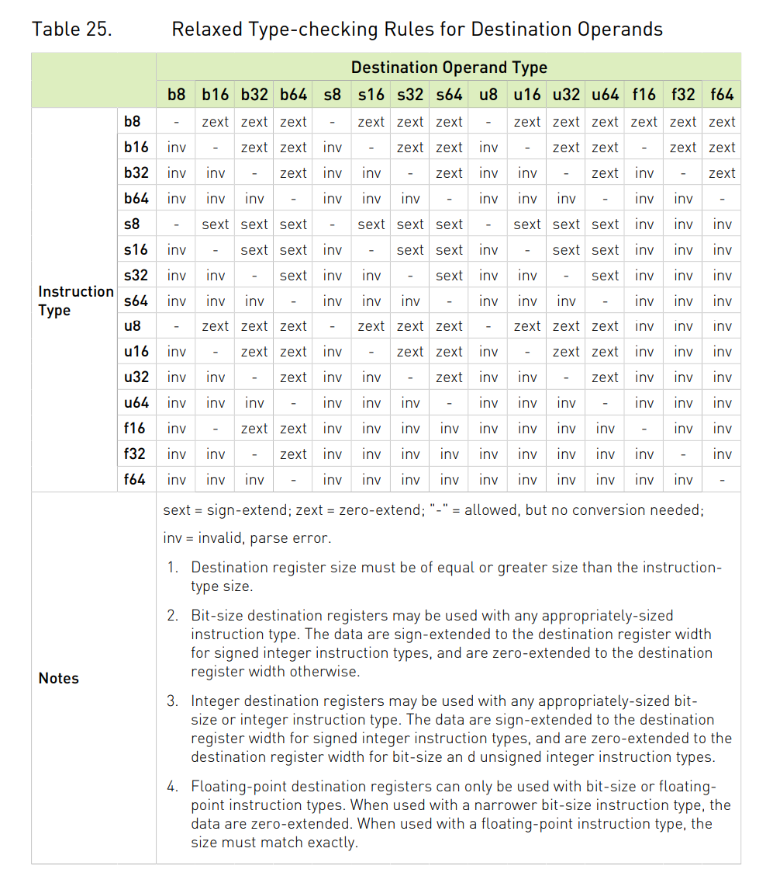

上表中的注意事项基本与源操作数类型转换中的一样，不再赘述。

## 9.5.  Divergence of Threads in Control Constructs
在同一个CTA中执行的线程，如果不同的线程进入了不同的控制流分支中，那么我们说这是线程分化(divergent)。反之，如果所有线程都执行同样的控制流分支，那么我们说是线程统一(uniform)。

线程分化的性能会比线程统一差，不过编译器会尽可能帮我们优化线程分化代码，但是理想状态下，如果程序员能够在PTX程序中尽可能约束线程统一逻辑，自然是最好。(这是基础了。。。会写ptx大的程序员不可能不清楚这人一点)

## 9.6.  Semantics
指令语义描述的目标是用尽可能简单的语言描述所有情况下的结果。语义是用C语言描述的，除非C语言表达能力不够。

### 9.6.1.  Machine-Specific Semantics of 16-bit Code
这一小节说的不是特别多，个人觉得总结起来就一句话，如果说是追求更好的性能，那么针对16bit的机器，尽量使用16-bit代码，不然虽然在PTX层面可以统一代码，但是到了实际的机器平台上面，可能会引入额外的转换操作或者执行差异等等。

## 9.7.  Instructions
接下来基本就是本手册的干货部分了，逐个讲解了PTX中的所有指令的作用即用法。

### 9.7.1.  Integer Arithmetic Instructions

#### 9.7.1.1.  Integer Arithmetic Instructions: add
#### 9.7.1.2.  Integer Arithmetic Instructions: sub
#### 9.7.1.3.  Integer Arithmetic Instructions: mul
add\sub\mul指令，没有除法。

用法：
```
// 加法指令
add.type d, a, b;
add{.sat}.s32 d, a, b; // .sat applies only to .s32
.type = { .u16, .u32, .u64, .s16, .s32, .s64 };

// 减法指令
sub.type d, a, b;
sub{.sat}.s32 d, a, b; // .sat applies only to .s32
.type = { .u16, .u32, .u64, .s16, .s32, .s64 };

// 乘法指令
mul.mode.type d, a, b;
.mode = { .hi, .lo, .wide };
.type = { .u16, .u32, .u64, .s16, .s32, .s64 };
// 举个例子
mul.wide.s16 fa,fxs,fys; // 16*16 bits yields 32 bits
mul.lo.s16 fa,fxs,fys; // 16*16 bits, save only the low 16 bits
mul.wide.s32 z,x,y; // 32*32 bits, creates 64 bit result
```

注意事项：
1. 上述的`.sat`标识符是指Saturation，即将结果限制在[MinInt, MaxInt]防止溢出，`sub\add`只能用于s32的数据类型，而`mul`指令只能用于`hi.sat.s32`的情况。
2. 乘法指令中的`.wide`模式只支持16-bit和32-bit的整型类型，并且默认会双倍扩展源操作数的位数。

#### 9.7.1.4.  Integer Arithmetic Instructions: mad
乘加指令

用法如下：
```
mad.mode.type d, a, b, c;
mad.hi.sat.s32 d, a, b, c;
.mode = { .hi, .lo, .wide };
.type = { .u16, .u32, .u64, .s16, .s32, .s64 };
```
注意事项：
`.mode`与乘法相同，只限制乘法的结果。`.sat`使用限制与乘法相同

#### 9.7.1.5.  Integer Arithmetic Instructions: mul24
#### 9.7.1.6.  Integer Arithmetic Instructions: mad24
24-bit的快速乘法与24-bit快速乘加

用法如下：
```
// 快速乘法
mul24.mode.type d, a, b;
.mode = { .hi, .lo };
.type = { .u32, .s32 };

// 快速乘加
mad24.mode.type d, a, b, c;
mad24.hi.sat.s32 d, a, b, c;
.mode = { .hi, .lo };
.type = { .u32, .s32 };
```

注意事项：
1. 源操作数是由32-bit寄存器搭载，计算结果也保存在32-bit寄存器中；
2. `.lo`模式下，获取24bit x 24bit = 48bit中的低32-bit数据存储，`.hi`则是取高32-bit数据存储。
3. 如果没有硬件的支持，`mul24.hi`、`mad24.hi`可能是无效的。（不过一般也不太会有人用这个）

#### 9.7.1.7.  Integer Arithmetic Instructions: sad
绝对值差求和，表达式如下：
```
// d = c + ((a<b) ? b-a : a-b);
sad.type d, a, b, c;
.type = { .u16, .u32, .u64, .s16, .s32, .s64 };
```

#### 9.7.1.8.  Integer Arithmetic Instructions: div
除法单说，用法和其余四则运算是一样的：
```
div.type d, a, b;
.type = { .u16, .u32, .u64, .s16, .s32, .s64 };
```

注意事项：
**除0所得结果是未定义的**。

#### 9.7.1.9.  Integer Arithmetic Instructions: rem
整型除法求余数，等价于C语言中的`%`运算符。
```
rem.type d, a, b;
.type = { .u16, .u32, .u64, .s16, .s32, .s64 };
```

#### 9.7.1.10.  Integer Arithmetic Instructions: abs
#### 9.7.1.11.  Integer Arithmetic Instructions: neg
取绝对值和相反数
```
abs.type d, a;
.type = { .s16, .s32, .s64 };

neg.type d, a;
.type = { .s16, .s32, .s64 };
```

注意事项：
只支持有符号整型。

#### 9.7.1.12.  Integer Arithmetic Instructions: min
#### 9.7.1.13.  Integer Arithmetic Instructions: max
在两者中间选取min\max值
```
min.type d, a, b;
.type = { .u16, .u32, .u64, .s16, .s32, .s64 };

max.type d, a, b;
.type = { .u16, .u32, .u64, .s16, .s32, .s64 };
```

注意事项：
有无符号是不同的，这里应该是想说，比较的两个数应该同为有符号或者无符号。

#### 9.7.1.14.  Integer Arithmetic Instructions: popc
统计源操作数中有多少bit位是1。
```
popc.type d, a;
.type = { .b32, .b64 };

popc.b32 d, a;
popc.b64 cnt, X; // cnt is .u32

// 对应的C语言逻辑
.u32 d = 0;
while (a != 0) {
 if (a & 0x1) d++;
 a = a >> 1;
} 
```

注意事项：
1. 目标操作数总是32-bit的寄存器；
2. 在`sm_20`及以上的架构才支持。

#### 9.7.1.15.  Integer Arithmetic Instructions: clz
从高位往低位统计bit位为0的个数。
```
clz.type d, a;
.type = { .b32, .b64 };

// C语言表示
// 注意这里是默认从符号位的后一位开始统计的，所以mask为0x80000000.
.u32 d = 0;
if (.type == .b32) { max = 32; mask = 0x80000000; }
else { max = 64; mask = 0x8000000000000000; }
while (d < max && (a&mask == 0) ) {
 d++;
 a = a << 1;
}
```

注意事项：
1. 在`sm_20`以及往上的架构才支持
2. 指令的目标操作数均为`.u32`

#### 9.7.1.16.  Integer Arithmetic Instructions: bfind
找到整型数中**非符号位**中最高有效bit位的位置。
```
bfind.type d, a;
bfind.shiftamt.type d, a;
.type = { .u32, .u64, .s32, .s64 };
```

指令说明：
1. 如果是unsigned int，则返回为1的最高bit位，如果是signed int，负数返回为0的最高bit位，正数则返回为1的最高bit位；
2. 如果`.shiftamt`被标注，可以理解为当前的bit位离最高有效位还需要左移多少位。
3. 如果没有非符号有效位被找到，指令会返回` 0xffffffff`.

注意事项：
1. 在`sm_20`以及往上的架构才支持
2. 指令的目标操作数均为`.u32`


#### 9.7.1.17.  Integer Arithmetic Instructions: fns
找到被设为`1`的第n个bit位。
```
fns.b32 d, mask, base, offset;
```

说明：
1. `mask`是被选择的32-bit数，有`.b32`，`.u32`，`.s32`的数据类型
2. `offset`是基于`base`的位数选择，需要注意的是offset = 1表示第一个bit位即：base + 0, 是`.s32`类型
3. `d`是dst，数据类型为`.b32`
4. 如果找不到被设为1的bit位，则d = 0xffffffff

注意事项：
1. 在`sm_30`以及往上的架构才支持
2. PTX 6.0版本引入该指令

#### 9.7.1.18.  Integer Arithmetic Instructions: brev
bit位反转指令
```
brev.type d, a;
.type = { .b32, .b64 };
```

说明：
1. 这里所说的反转Bit位，不是按位取反，而是进行轴对称反转，如：b[0] = a[31], b[1] = a[30]以此类推。

注意事项：
1. 在`sm_20`以及往上的架构才支持
2. 在PTX 2.0版本引入

#### 9.7.1.19.  Integer Arithmetic Instructions: bfe
截取对应的bit段
```
bfe.type d, a, b, c;
.type = { .u32, .u64, .s32, .s64 };
```

说明：
1. bit段从`a`中选取，差的Bit位补0或着**超出的**部分按照符号位补齐
2. `b`表示截取bit段的开始bit位
3. `c`表示截取bit段的长度，其中`b`和`c`的取值都在0~255的范围内
4. 如果截取的结果`d`的位数大于`a`，那么缺失的部分则按照`a`的符号位进行补齐。

注意事项：
1. 在`sm_20`以及往上的架构才支持
2. PTX 2.0版本引入该指令

#### 9.7.1.20.  Integer Arithmetic Instructions: bfi
插入bit段
```
bfi.type f, a, b, c, d;
.type = { .b32, .b64 };

// example
bfi.b32 d,a,b,start,len;
```

说明：
1. 从a中的截取Bit段放入b中，最终结果存储在f中，c表示bit插入的开始位置，d表示bit插入的长度
2. a\b\f拥有相同的数据类型，c\d为`u32`类型但是数值只能在0~255之间
3. 如果插入长度为0，则结果f=b
4. 如果插入开始位置超过了最高位，结果f=b

注意事项：
1. 在`sm_20`以及往上的架构才支持
2. PTX 2.0版本引入该指令

#### 9.7.1.21.  Integer Arithmetic Instructions: szext
符号扩展或零扩展
```
szext.mode.type d, a, b;
.mode = { .clamp, .wrap };
.type = { .u32, .s32 };

// example
 szext.clamp.s32 rd, ra, rb;
 szext.wrap.u32 rd, 0xffffffff, 0; // Result is 0.
```

说明：
1. 符号扩展或零扩展从a扩展N个Bit位，其中N在操作数b中指定。结果值存储在d中
2. 如果a是`s32`则默认为符号扩展，`u32`则默认为零扩展。b为`u32`
3. 如果N是0，那么`szext`的结果也是0，如果N>=32，那么`szext`的结果取决于`.mode`的选择
4. 如果选择`clamp`模式，输出直接为a
5. 如果选择`wrap`模式，则使用N的包装值进行计算(没太看懂，但是可能也用不上。。。)

注意事项：
1. 在`sm_70`以及往上的架构才支持
2. PTX 7.6版本引入该指令

#### 9.7.1.22.  Integer Arithmetic Instructions: bmsk
生成Bit段掩码（注意这里生成掩码是指激活bit位为1）
```
bmsk.mode.b32 d, a, b;
.mode = { .clamp, .wrap };

// example
 bmsk.clamp.b32 rd, ra, rb;
 bmsk.wrap.b32 rd, 1, 2; // Creates a bitmask of 0x00000006. 即 0b0110
```

说明：
1. 生成一个32-bit的Bit掩码，开始位置为a，设为1的bit段长度为b，结果存放在d中
2. 在以下两种情况下生成的掩码为0：
- a >= 32
- b == 0
3. 在`.clamp`模式下，b的取值在[0,32]，在`.wrap`模式下，b的取值在[0,31]

注意事项：
1. 在`sm_70`以及往上的架构才支持
2. PTX 7.6版本引入该指令

#### 9.7.1.23. Integer Arithmetic Instructions: dp4a
对32-bit中的4个byte进行dot-product
```
dp4a.atype.btype  d, a, b, c;
.atype = .btype = { .u32, .s32 };

// example
dp4a.u32.u32           d0, a0, b0, c0;
dp4a.u32.s32           d1, a1, b1, c1;
```

说明：
1. `a`和`b`是32-bit的输入
2. 如果`a`和`b`均为`u32`则`c`为`u32`，否则`c`为`s32`
3. 其中对`a`和`b`按字节提取的时候，需要进行sign-extend或者zero-extend之后进行计算

对应的c代码：
```
// d = dot(a, b) + c

d = c;
// Extract 4 bytes from a 32bit input and sign or zero extend
// based on input type.
Va = extractAndSignOrZeroExt_4(a, .atype);
Vb = extractAndSignOrZeroExt_4(b, .btype);

for (i = 0; i < 4; ++i) {
    d += Va[i] * Vb[i]; 
}
```

注意事项：
1. 在`sm_61`以及往上的架构才支持
2. PTX 5.0版本引入该指令

#### 9.7.1.24. Integer Arithmetic Instructions: dp2a
类似于`dp4a`指令，两个16-bit和和两个8-bit的乘累加操作
```
dp2a.mode.atype.btype  d, a, b, c;
.atype = .btype = { .u32, .s32 };
.mode = { .lo, .hi };

// example
dp2a.lo.u32.u32           d0, a0, b0, c0;
dp2a.hi.u32.s32           d1, a1, b1, c1;
```

说明：
直接看c代码逻辑比较好理解
```
d = c;
// Extract two 16-bit values from a 32-bit input and sign or zero extend
// based on input type.
Va = extractAndSignOrZeroExt_2(a, .atype); 

// Extract four 8-bit values from a 32-bit input and sign or zer extend
// based on input type.
Vb = extractAndSignOrZeroExt_4(b, .btype);

b_select = (.mode == .lo) ? 0 : 2;

for (i = 0; i < 2; ++i) {
    d += Va[i] * Vb[b_select + i];
}
```

注意事项：
1. 在`sm_61`以及往上的架构才支持
2. PTX 5.0版本引入该指令

### 9.7.2. Extended-Precision Integer Arithmetic Instructions
主要用于扩展精度的整型计算，主要可以支持：
`add.cc, addc`
`sub.cc, subc`
`mad.cc, madc`

#### 9.7.2.1. Extended-Precision Arithmetic Instructions: add.cc
`add.cc`指令的作用是对两个整数进行加法并保留出进位(carry-out)信息到条件码寄存器`CC.CF`中。

```
add.cc.type  d, a, b;
.type = { .u32, .s32, .u64, .s64 };

// example
@p  add.cc.u32   x1,y1,z1;   // extended-precision addition of
@p  addc.cc.u32  x2,y2,z2;   // two 128-bit values
@p  addc.cc.u32  x3,y3,z3;
@p  addc.u32     x4,y4,z4;
```

注意事项：
1. 32-bit `add.cc`在PTX 1.2中引入，所有架构都支持
2. 64-bit `add.cc`在PTX 4.3中引入，`sm_20`以上架构才支持
3. 没有四舍五入，也没有饱和截断，signed\unsigned行为相同。

#### 9.7.2.2. Extended-Precision Arithmetic Instructions: addc
`addc`指令的作用是带入进位(carry-in)的加法，该指令可生成可选的出进位(carry_out)。

```
addc{.cc}.type  d, a, b;
.type = { .u32, .s32, .u64, .s64 };

// 等价为
c = a + b + CC.CF

// example
@p  add.cc.u32   x1,y1,z1;   // extended-precision addition of
@p  addc.cc.u32  x2,y2,z2;   // two 128-bit values
@p  addc.cc.u32  x3,y3,z3;
@p  addc.u32     x4,y4,z4;
```

如果指令有`.cc`后缀，则默认的carry-out存储在`CC.CF`中


注意事项：
1. 与`add.cc`一致

#### 9.7.2.3. Extended-Precision Arithmetic Instructions: sub.cc
与`add.cc`同理，不再展开

#### 9.7.2.4. Extended-Precision Arithmetic Instructions: subc
与`addc`同理，不再展开

#### 9.7.2.5. Extended-Precision Arithmetic Instructions: mad.cc
该指令的作用在于计算前两者的乘积，再提取结果的high\low部与第三个元素进行加法运算保留carry-out。

```
mad{.hi,.lo}.cc.type  d, a, b, c;
.type = { .u32, .s32, .u64, .s64 };

// 等价为
t = a * b;
d = t<63..32> + c;    // for .hi variant
d = t<31..0> + c;     // for .lo variant

// example
@p  mad.lo.cc.u32 d,a,b,c;
    mad.lo.cc.u32 r,p,q,r;
```

同理，carry-out被存放在`CC.CF`中

注意事项：
1. 32-bit的指令在PTX 3.0中引入
2. 64-bit的指令在PTX 4.3中引入
3. `sm_20`以上架构可用

#### 9.7.2.6. Extended-Precision Arithmetic Instructions: madc
同理可知，该指令带入进位(carry-in)的加法，该指令可生成可选的出进位(carry_out)。

直接上例子:
```
// extended-precision multiply:  [r3,r2,r1,r0] = [r5,r4] * [r7,r6]
mul.lo.u32     r0,r4,r6;      // r0=(r4*r6).[31:0], no carry-out
mul.hi.u32     r1,r4,r6;      // r1=(r4*r6).[63:32], no carry-out
mad.lo.cc.u32  r1,r5,r6,r1;   // r1+=(r5*r6).[31:0], may carry-out
madc.hi.u32    r2,r5,r6,0;    // r2 =(r5*r6).[63:32]+carry-in,
                              // no carry-out
mad.lo.cc.u32   r1,r4,r7,r1;  // r1+=(r4*r7).[31:0], may carry-out
madc.hi.cc.u32  r2,r4,r7,r2;  // r2+=(r4*r7).[63:32]+carry-in,
                              // may carry-out
addc.u32        r3,0,0;       // r3 = carry-in, no carry-out
mad.lo.cc.u32   r2,r5,r7,r2;  // r2+=(r5*r7).[31:0], may carry-out
madc.hi.u32     r3,r5,r7,r3;  // r3+=(r5*r7).[63:32]+carry-in
```

### 9.7.3. Floating-Point Instructions
对于浮点指令支持的一些情况，先上如下一个表格：

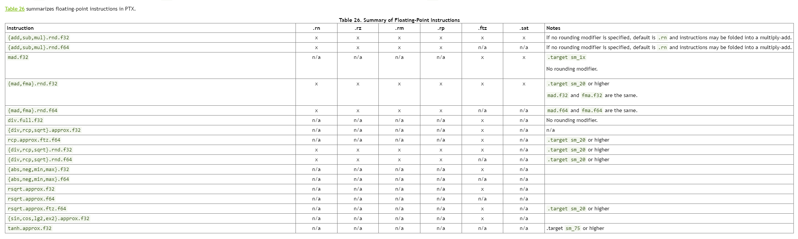

#### 9.7.3.1. Floating Point Instructions: testp
该指令了用于测试浮点数的性质。

```
testp.op.type  p, a;  // result is .pred
.op   = { .finite, .infinite,
          .number, .notanumber,
          .normal, .subnormal };
.type = { .f32, .f64 };

// example
testp.notanumber.f32  isnan, f0;
testp.infinite.f64    p, X;
```

可选的参数：
1. `testp.finite`，当浮点数不为无穷数或Nan的时候返回true.
2. `testp.infinite`，当浮点数为正无穷或负无穷的时候返回true.
3. `testp.number`，当浮点数不为Nan的时候返回true.
4. `testp.notanumber`，为Nan则返回true.
5. `testp.normal`，规格化浮点数(IEEE-745)不为无穷数也不为Nan时返回true.
6. `testp.subnormal`，为非规格化浮点数且非无穷数非Nan时返回true.
7. 注意`0.0f`为特殊情况，+0.0f与-0.0f均为normal number.

注意事项：
1. 该指令在PTX 2.0引入
2. `sm_20`以上架构才支持

#### 9.7.3.2. Floating Point Instructions: copysign
顾名思义，拷贝符号位

```
// 将a的符号位拷贝到b,返回结果d
copysign.type  d, a, b;
.type = { .f32, .f64 };

// example
    copysign.f32  x, y, z;
    copysign.f64  A, B, C;
```

注意事项：
1. 同上

#### 9.7.3.3. Floating Point Instructions: add
浮点数相加指令。

```
add{.rnd}{.ftz}{.sat}.f32  d, a, b;
add{.rnd}.f64              d, a, b;

.rnd = { .rn, .rz, .rm, .rp };

// example
@p  add.rz.ftz.f32  f1,f2,f3;
```

存在如下四种rounding mode：
1. `.rn`小数部分的最低有效位(LSB，the least significant bit)舍入到最近的偶数(nearest even)
2. `.rz`小数部分的最低有效位向0舍入
3. `.rm`小数部分最低有效位向负无穷舍入
4. `.rp`小数部分最低有效位向正无穷舍入

默认的舍入模式是`.rn`，注意当显式设置rounding mode的时候，编译器会保守的进行优化，而使用默认rounding mode的时候，编译器会进行相对激进的优化。
比如，当`add` `mul`指令没有使用显式rounding mode的时候，可能会被优化为融合的mad乘加指令。

过小的浮点数：
1. 在sm_20+的架构上，默认过小的浮点数是支持的
2. 对应的`add.ftz.f32`则会将过小的浮点数刷新为保持符号的0
3. 在sm_1x的架构上，`add.fp64`支持过小的浮点数，`add.f32`则直接刷新为保持符号的0.

截断模式：
`add.sat.f32`会将结果截断在[0.0f, 1.0f]之间。且`NaN`的结果会被刷新为+0.0f.

注意事项：
1. `add.f32`所有架构都支持
2. `add.f64`在sm_13架构上才支持
3. `.rn` `.rz`所有架构都支持
4. `.rm` `.rp`对f64需要sm_13+，对f32需要sm_20+

#### 9.7.3.4. Floating Point Instructions: sub
浮点相减指令。

```
sub{.rnd}{.ftz}{.sat}.f32  d, a, b;
sub{.rnd}.f64              d, a, b;

.rnd = { .rn, .rz, .rm, .rp };

// example
sub.f32 c,a,b;
sub.rn.ftz.f32  f1,f2,f3;
```

模型与注意事项同float add

#### 9.7.3.5. Floating Point Instructions: mul
浮现相乘指令。

```
mul{.rnd}{.ftz}{.sat}.f32  d, a, b;
mul{.rnd}.f64              d, a, b;

.rnd = { .rn, .rz, .rm, .rp };

// example
mul.ftz.f32 circumf,radius,pi  // a single-precision multiply
```

模式和注意事项同上

#### 9.7.3.6. Floating Point Instructions: fma
融合的浮点乘加指令。

该融合指令不存在精度的损失，也可以理解为，中间的乘加操作没做优化，等价于add + mul。

```
fma.rnd{.ftz}{.sat}.f32  d, a, b, c;
fma.rnd.f64              d, a, b, c;

.rnd = { .rn, .rz, .rm, .rp };

// example
    fma.rn.ftz.f32  w,x,y,z;
@p  fma.rn.f64      d,a,b,c;
```

`fma.f32` `fma.f64`都是在无穷精度上做a + b = c，然后在无穷精度上做 c * d = e，最后在使用`.rnd`舍入模式将无穷数舍入到对应的浮点数。
NOTE: `fma.f64`和`mad.f64`是等价的。

模式：
1. 各种模式和前面一样，不同的地方在于，没有默认的rounding mode

注意事项：
1. f64需要 PTX 1.4+，sm_20+
2. f32需要 PTX 2.0+，sm_13+

#### 9.7.3.7. Floating Point Instructions: mad
融合的浮点乘加指令。


```
mad{.ftz}{.sat}.f32      d, a, b, c;    // .target sm_1x
mad.rnd{.ftz}{.sat}.f32  d, a, b, c;    // .target sm_20
mad.rnd.f64              d, a, b, c;    // .target sm_13 and higher

.rnd = { .rn, .rz, .rm, .rp };

// example
@p  mad.f32  d,a,b,c
```

模式：
1. 在`sm_20+`的架构上fp32\64都是在无穷精度上做a + b = c
2. 在`sm_1x`架构上f32会按照double精度进行中间计算，尾数截断为23bit，保留指数位。`mad.f32`指令与分开的乘加指令结果相同，在JIT编译sm2.0设备的时候，该指令会被融合为一条乘加指令，精度上和分开的两条指令有一丢丢差别。
3. 在`sm_1x`架构上fp64同样以double进度进行中间计算，但是没有单条指令的优化。
4. 各种模式和前面一样，不同的地方在于，没有默认的rounding mode.

注意事项：
1. `mad.f32`指令使用与全架构
2. `mad.f64`指令需要`sm_13+`

#### 9.7.3.8. Floating Point Instructions: div
浮点除法指令。

```
div.approx{.ftz}.f32  d, a, b;  // fast, approximate divide
div.full{.ftz}.f32    d, a, b;  // full-range approximate divide
div.rnd{.ftz}.f32     d, a, b;  // IEEE 754 compliant rounding
div.rnd.f64           d, a, b;  // IEEE 754 compliant rounding

.rnd = { .rn, .rz, .rm, .rp };

// example
div.approx.ftz.f32  diam,circum,3.14159;
div.full.ftz.f32    x, y, z;
div.rn.f64          xd, yd, zd;  
```

模式：
1. 各种模式和前面一样，不同的地方在于，没有默认的rounding mode.

参数解释:
1. `div.approx.f32`是一种快速的近似除法实现，按照`d = a * (1/b)`来实现，max ulp = 2.
2. `div.full.f32`是一种快速的全范围近似除法实现，这个相比approx的精度更高一些，但是与数学计算还是有精度损失，max ulp = 2/

注意事项：
1. 从PTX 1.4开始，需要显式设置`.approx`、`.full`、`.ftz`
2. 在PTX 1.0 ~ 1.3，默认模式`div.approx.ftz.f32`和`div.rn.f64`
3. `div.approx.f32`和`div.full.f32`是全架构支持

#### 9.7.3.9. Floating Point Instructions: abs
浮点取绝对值。

```
abs{.ftz}.f32  d, a;
abs.f64        d, a;

// example
abs.ftz.f32  x,f0;
```

注意事项同上，不多赘述。

#### 9.7.3.10. Floating Point Instructions: neg
取相反数。

```
neg{.ftz}.f32  d, a;
neg.f64        d, a;

// example
neg.ftz.f32  x,f0;
```

注意事项同上，不多赘述。

#### 9.7.3.11. Floating Point Instructions: min
取两个浮点数中的较小数。

```
min{.ftz}{.NaN}{.xorsign.abs}.f32  d, a, b;
min.f64                            d, a, b;

// example
@p  min.ftz.f32  z,z,x;
    min.f64      a,b,c;
    // fp32 min with .NaN
    min.NaN.f32  f0,f1,f2;
    // fp32 min with .xorsign.abs 
    min.xorsign.abs.f32 Rd, Ra, Rb;
```

描述：
1. 当`.NaN`被使用，则当任一输入是NaN的时候，结果返回NaN
2. 当`.abs`被使用，输出为两个输入绝对值相比较的结果
3. 当`.xorsign`被使用，输出的符号位是两个输入的符号位会尽心XOR异或操作后的结果
4. `.abs`和`.xorsign`必须一起使用

注意事项：
1. `min.NaN`在PTX 7.0被引入,需要`sm_80+`
2. `min.xorsign.abs`在PTX 7.2被引入，需要`sm_86+`

#### 9.7.3.12. Floating Point Instructions: max
取两个浮点数中的较大数。

```
max{.ftz}{.NaN}{.xorsign.abs}.f32  d, a, b;
max.f64                            d, a, b;

// example
max.ftz.f32  f0,f1,f2;
max.f64      a,b,c;
// fp32 max with .NaN
max.NaN.f32  f0,f1,f2;
// fp32 max with .xorsign.abs
max.xorsign.abs.f32 Rd, Ra, Rb;
```

和`min`指令的参数和注意事项相同，不多赘述

#### 9.7.3.13. Floating Point Instructions: rcp
取浮点数的倒数。

```
rcp.approx{.ftz}.f32  d, a;  // fast, approximate reciprocal
rcp.rnd{.ftz}.f32     d, a;  // IEEE 754 compliant rounding
rcp.rnd.f64           d, a;  // IEEE 754 compliant rounding

.rnd = { .rn, .rz, .rm, .rp };

// example
rcp.approx.ftz.f32  ri,r;
rcp.rn.ftz.f32      xi,x;
rcp.rn.f64          xi,x;
```

看作除法，和`div`的要求是基本一致的，不多赘述

#### 9.7.3.14. Floating Point Instructions: rcp.approx.ftz.f64
计算浮点倒数的快速粗略近似值。

```
rcp.approx.ftz.f64  d, a;

// example
rcp.ftz.f64  xi,x;
```

#### 9.7.3.15. Floating Point Instructions: sqrt
浮点数平方根。

```
sqrt.approx{.ftz}.f32  d, a; // fast, approximate square root
sqrt.rnd{.ftz}.f32     d, a; // IEEE 754 compliant rounding
sqrt.rnd.f64           d, a; // IEEE 754 compliant rounding

.rnd = { .rn, .rz, .rm, .rp };

// example
sqrt.approx.ftz.f32  r,x;
sqrt.rn.ftz.f32      r,x;
sqrt.rn.f64          r,x;
```

#### 9.7.3.16. Floating Point Instructions: rsqrt
浮点数平方根的倒数。

```
rsqrt.approx{.ftz}.f32  d, a;
rsqrt.approx.f64        d, a;

// example
rsqrt.approx.ftz.f32  isr, x;
rsqrt.approx.f64      ISR, X;
```

#### 9.7.3.17. Floating Point Instructions: rsqrt.approx.ftz.f64
f64的平方根倒数，没啥多说的，真的需要再来补充

#### 9.7.3.18. Floating Point Instructions: sin
浮点正弦函数。

```
sin.approx{.ftz}.f32  d, a;

// example
sin.approx.ftz.f32  sa, a;
```

#### 9.7.3.19. Floating Point Instructions: cos
浮点余弦函数。

```
cos.approx{.ftz}.f32  d, a;

// example
cos.approx.ftz.f32  ca, a;
```

#### 9.7.3.20. Floating Point Instructions: lg2
以2为底的浮点对数。

```
lg2.approx{.ftz}.f32  d, a;

// example
lg2.approx.ftz.f32  la, a;
```

#### 9.7.3.21. Floating Point Instructions: ex2
以2为底的浮点指数。

```
ex2.approx{.ftz}.f32  d, a;

// example
ex2.approx.ftz.f32  xa, a;
```
输入、输出都为浮点，这个好，在CUDA built-in里面的pow函数，好像是只支持正整数

#### 9.7.3.22. Floating Point Instructions: tanh
浮点双曲正切

```
tanh.approx.f32 d, a;

// example
tanh.approx.f32 sa, a;
```

### 9.7.4. Half Precision Floating-Point Instructions
半精度浮点指令可以操作`.f16`和`.f16x2`的寄存器。

#### 9.7.4.1. Half Precision Floating Point Instructions: add
半精度加法。

```
add{.rnd}{.ftz}{.sat}.f16   d, a, b;
add{.rnd}{.ftz}{.sat}.f16x2 d, a, b;

add{.rnd}.bf16   d, a, b;
add{.rnd}.bf16x2 d, a, b;

.rnd = { .rn };

// example
// scalar f16 additions
add.f16        d0, a0, b0;
add.rn.f16     d1, a1, b1;
add.bf16       bd0, ba0, bb0;
add.rn.bf16    bd1, ba1, bb1;
     
// SIMD f16 addition
cvt.rn.f16.f32 h0, f0;
cvt.rn.f16.f32 h1, f1;
cvt.rn.f16.f32 h2, f2;
cvt.rn.f16.f32 h3, f3;
mov.b32  p1, {h0, h1};   // pack two f16 to 32bit f16x2
mov.b32  p2, {h2, h3};   // pack two f16 to 32bit f16x2
add.f16x2  p3, p1, p2;   // SIMD f16x2 addition

// SIMD bf16 addition
cvt.rn.bf16x2.f32 p4, f4, f5; // Convert two f32 into packed bf16x2 
cvt.rn.bf16x2.f32 p5, f6, f7; // Convert two f32 into packed bf16x2
add.bf16x2  p6, p4, p5;       // SIMD bf16x2 addition

// SIMD fp16 addition
ld.global.b32   f0, [addr];     // load 32 bit which hold packed f16x2
ld.global.b32   f1, [addr + 4]; // load 32 bit which hold packed f16x2
add.f16x2       f2, f0, f1;     // SIMD f16x2 addition

ld.global.b32   f3, [addr + 8];  // load 32 bit which hold packed bf16x2
ld.global.b32   f4, [addr + 12]; // load 32 bit which hold packed bf16x2
add.bf16x2      f5, f3, f4;      // SIMD bf16x2 addition 
```

上述的示例已经说的比较清楚了，`.f16x2`和`.bf16x2`实际上就是一种SIMD的操作。

注意事项：
1. 半精度加法在PTX 4.2被引入
2. `add{.rnd}.bf16`和`add{.rnd}.bf16x2`在PTX 7.8被引入
3. 半精度指令要求`sm_53`以上的架构
4. `add{.rnd}.bf16`和`add{.rnd}.bf16x2`要求`sm_90`以上的架构

#### 9.7.4.2. Half Precision Floating Point Instructions: sub
半精度减法。

```
sub{.rnd}{.ftz}{.sat}.f16   d, a, b;
sub{.rnd}{.ftz}{.sat}.f16x2 d, a, b;

sub{.rnd}.bf16   d, a, b;
sub{.rnd}.bf16x2 d, a, b;

.rnd = { .rn };

// example
// scalar f16 subtractions
sub.f16        d0, a0, b0;
sub.rn.f16     d1, a1, b1;
sub.bf16       bd0, ba0, bb0;     
sub.rn.bf16    bd1, ba1, bb1;
     
// SIMD f16 subtraction
cvt.rn.f16.f32 h0, f0;
cvt.rn.f16.f32 h1, f1;
cvt.rn.f16.f32 h2, f2;
cvt.rn.f16.f32 h3, f3;
mov.b32  p1, {h0, h1};   // pack two f16 to 32bit f16x2
mov.b32  p2, {h2, h3};   // pack two f16 to 32bit f16x2
sub.f16x2  p3, p1, p2;   // SIMD f16x2 subtraction

// SIMD bf16 subtraction
cvt.rn.bf16x2.f32 p4, f4, f5; // Convert two f32 into packed bf16x2 
cvt.rn.bf16x2.f32 p5, f6, f7; // Convert two f32 into packed bf16x2
sub.bf16x2  p6, p4, p5;       // SIMD bf16x2 subtraction
     
// SIMD fp16 subtraction
ld.global.b32   f0, [addr];     // load 32 bit which hold packed f16x2
ld.global.b32   f1, [addr + 4]; // load 32 bit which hold packed f16x2
sub.f16x2       f2, f0, f1;     // SIMD f16x2 subtraction

// SIMD bf16 subtraction
ld.global.b32   f3, [addr + 8];  // load 32 bit which hold packed bf16x2
ld.global.b32   f4, [addr + 12]; // load 32 bit which hold packed bf16x2
sub.bf16x2      f5, f3, f4;      // SIMD bf16x2 subtraction
```

注意事项同上，不多赘述。

#### 9.7.4.3. Half Precision Floating Point Instructions: mul
半精度乘法。

```
mul{.rnd}{.ftz}{.sat}.f16   d, a, b;
mul{.rnd}{.ftz}{.sat}.f16x2 d, a, b;

mul{.rnd}.bf16   d, a, b;
mul{.rnd}.bf16x2 d, a, b;

.rnd = { .rn };

// example
同上
```

#### 9.7.4.4. Half Precision Floating Point Instructions: fma
半精度乘加。

```
fma.rnd{.ftz}{.sat}.f16     d, a, b, c;
fma.rnd{.ftz}{.sat}.f16x2   d, a, b, c;
fma.rnd{.ftz}.relu.f16      d, a, b, c;
fma.rnd{.ftz}.relu.f16x2    d, a, b, c;
fma.rnd{.relu}.bf16         d, a, b, c;
fma.rnd{.relu}.bf16x2       d, a, b, c;

.rnd = { .rn };

// example
// scalar f16 fused multiply-add
fma.rn.f16         d0, a0, b0, c0;
fma.rn.f16         d1, a1, b1, c1;
fma.rn.relu.f16    d1, a1, b1, c1;

// scalar bf16 fused multiply-add
fma.rn.bf16        d1, a1, b1, c1;
fma.rn.relu.bf16   d1, a1, b1, c1;
     
// SIMD f16 fused multiply-add
cvt.rn.f16.f32 h0, f0;
cvt.rn.f16.f32 h1, f1;
cvt.rn.f16.f32 h2, f2;
cvt.rn.f16.f32 h3, f3;
mov.b32  p1, {h0, h1}; // pack two f16 to 32bit f16x2
mov.b32  p2, {h2, h3}; // pack two f16 to 32bit f16x2
fma.rn.f16x2  p3, p1, p2, p2;   // SIMD f16x2 fused multiply-add
fma.rn.relu.f16x2  p3, p1, p2, p2; // SIMD f16x2 fused multiply-add with relu saturation mode
// SIMD fp16 fused multiply-add
ld.global.b32   f0, [addr];     // load 32 bit which hold packed f16x2
ld.global.b32   f1, [addr + 4]; // load 32 bit which hold packed f16x2
fma.rn.f16x2    f2, f0, f1, f1; // SIMD f16x2 fused multiply-add
     
// SIMD bf16 fused multiply-add
fma.rn.bf16x2       f2, f0, f1, f1; // SIMD bf16x2 fused multiply-add
fma.rn.relu.bf16x2  f2, f0, f1, f1; // SIMD bf16x2 fused multiply-add with relu saturation mode
```

注意模式上多了个`relu`，这个在深度学习中是很常见的激活函数，即：d = max(a*b+c, 0.0f);


#### 9.7.4.5. Half Precision Floating Point Instructions: neg
半精度浮点相反数。

```
neg{.ftz}.f16    d, a;
neg{.ftz}.f16x2  d, a;
neg.bf16         d, a;
neg.bf16x2       d, a;

// example
neg.ftz.f16  x,f0;
neg.bf16     x,b0;
neg.bf16x2   x1,b1;
```

#### 9.7.4.6. Half Precision Floating Point Instructions: abs
半精度浮点绝对值。

```
abs{.ftz}.f16    d, a;
abs{.ftz}.f16x2  d, a; 
abs.bf16         d, a;
abs.bf16x2       d, a;

// example
abs.ftz.f16  x,f0;
abs.bf16     x,b0;
abs.bf16x2   x1,b1;
```


#### 9.7.4.7. Half Precision Floating Point Instructions: min
两个半精度取较小值。

```
min{.ftz}{.NaN}{.xorsign.abs}.f16      d, a, b;
min{.ftz}{.NaN}{.xorsign.abs}.f16x2    d, a, b;
min{.NaN}{.xorsign.abs}.bf16           d, a, b;
min{.NaN}{.xorsign.abs}.bf16x2         d, a, b;

// example
min.ftz.f16       h0,h1,h2;
min.f16x2         b0,b1,b2;
// SIMD fp16 min with .NaN
min.NaN.f16x2     b0,b1,b2;
min.bf16          h0, h1, h2;
// SIMD bf16 min with NaN
min.NaN.bf16x2    b0, b1, b2;
// scalar bf16 min with xorsign.abs
min.xorsign.abs.bf16 Rd, Ra, Rb
```

#### 9.7.4.8. Half Precision Floating Point Instructions: max
两个半精度取较大值。

```
max{.ftz}{.NaN}{.xorsign.abs}.f16      d, a, b;
max{.ftz}{.NaN}{.xorsign.abs}.f16x2    d, a, b;
max{.NaN}{.xorsign.abs}.bf16           d, a, b;
max{.NaN}{.xorsign.abs}.bf16x2         d, a, b;

// example
max.ftz.f16       h0,h1,h2;
max.f16x2         b0,b1,b2;
// SIMD fp16 max with NaN
max.NaN.f16x2     b0,b1,b2;
// scalar f16 max with xorsign.abs
max.xorsign.abs.f16 Rd, Ra, Rb;
max.bf16          h0, h1, h2;
// scalar bf16 max and NaN
max.NaN.bf16x2    b0, b1, b2;
// SIMD bf16 max with xorsign.abs
max.xorsign.abs.bf16x2 Rd, Ra, Rb;
```

#### 9.7.4.9. Half Precision Floating Point Instructions: tanh
半精度双曲正切。

```
tanh.approx.type d, a;

.type = {.f16, .f16x2, .bf16, .bf16x2}

// example
tanh.approx.f16    h1, h0;
tanh.approx.f16x2  hd1, hd0;
tanh.approx.bf16   b1, b0;
tanh.approx.bf16x2 hb1, hb0;
```

#### 9.7.4.10. Half Precision Floating Point Instructions: ex2
以2为底的半精度指数。

```
ex2.approx.atype     d, a;
ex2.approx.ftz.btype d, a;

.atype = { .f16,  .f16x2}
.btype = { .bf16, .bf16x2}

// example
ex2.approx.f16         h1, h0;
ex2.approx.f16x2       hd1, hd0;
ex2.approx.ftz.bf16    b1, b2;
ex2.approx.ftz.bf16x2  hb1, hb2;
```

### 9.7.5. Comparison and Selection Instructions
包含`set`\`setp`\`selp`\`slct`四条指令

#### 9.7.5.1. Comparison and Selection Instructions: set
通过比较两个源操作数的关系，返回一个bool值，或者进一步将这个bool值进一步用于bool操作得到最终结果

```
set.CmpOp{.ftz}.dtype.stype         d, a, b;
set.CmpOp.BoolOp{.ftz}.dtype.stype  d, a, b, {!}c;

.CmpOp  = { eq, ne, lt, le, gt, ge, lo, ls, hi, hs,
            equ, neu, ltu, leu, gtu, geu, num, nan };
.BoolOp = { and, or, xor };
.dtype  = { .u32, .s32, .f32 };
.stype  = { .b16, .b32, .b64,
            .u16, .u32, .u64,
            .s16, .s32, .s64,
                  .f32, .f64 };

// example
@p  set.lt.and.f32.s32  d,a,b,r; //d对应f32，a\b对应s.32，r对应@p也就是.pred类型
    set.eq.u32.u32      d,i,n;

// 对应的c逻辑示例
t = (a CmpOp b) ? 1 : 0;
if (isFloat(dtype))
    d = BoolOp(t, c) ? 1.0f : 0x00000000;
else
    d = BoolOp(t, c) ? 0xffffffff : 0x00000000;
// 当返回值为整形类型时，通过bool操作返回的true使用的时0xffffffff而不是0x01
```

注意事项：
1. `num`CmpOp用于检测两个数是否都是有效值(非Nan)
2. `nan`CmpOp用于检测两个数是否**非全为有效值**

#### 9.7.5.2. Comparison and Selection Instructions: setp
和`set`指令类似，但该指令可以存在两个目标操作数

```
setp.CmpOp{.ftz}.type         p[|q], a, b;
setp.CmpOp.BoolOp{.ftz}.type  p[|q], a, b, {!}c;

.CmpOp  = { eq, ne, lt, le, gt, ge, lo, ls, hi, hs,
            equ, neu, ltu, leu, gtu, geu, num, nan };
.BoolOp = { and, or, xor };
.type   = { .b16, .b32, .b64,
            .u16, .u32, .u64,
            .s16, .s32, .s64,
                  .f32, .f64 };

// example
    setp.lt.and.s32  p|q,a,b,r;
@q  setp.eq.u32      p,i,n;

// c语言示例
t = (a CmpOp b) ? 1 : 0;
p = BoolOp(t, c);
q = BoolOp(!t, c);
```

#### 9.7.5.3. Comparison and Selection Instructions: selp
选择操作，与三元操作符?:同理

```
selp.type d, a, b, c;

.type = { .b16, .b32, .b64,
          .u16, .u32, .u64,
          .s16, .s32, .s64,
                .f32, .f64 };

// example
    selp.s32  r0,r,g,p;  //条件应该就是p本身？
@q  selp.f32  f0,t,x,xp; //条件应该是xp == q？

// c语言示例
d = (c == 1) ? a : b;
```

#### 9.7.5.4. Comparison and Selection Instructions: slct
基于第三个操作数的符号进行选择

```
slct.dtype.s32        d, a, b, c; // dtype是a\b\d的数据类型， s32\f32是c的数据类型
slct{.ftz}.dtype.f32  d, a, b, c;

.dtype = { .b16, .b32, .b64,
           .u16, .u32, .u64,
           .s16, .s32, .s64,
                 .f32, .f64 };

// example
slct.u32.s32  x, y, z, val;
slct.ftz.u64.f32  A, B, C, fval;

// c语言示例
d = (c >= 0) ? a : b;
```

### 9.7.6. Half Precision Comparison Instructions
只有`set`和`setp`两条指令支持

#### 9.7.6.1. Half Precision Comparison Instructions: set
指令的用法和上文提到的`set`指令是大同小异的，区别的地方是half有对应的f16\bf16\f16x2的不同类型

```
set.CmpOp{.ftz}.f16.stype            d, a, b;
set.CmpOp.BoolOp{.ftz}.f16.stype     d, a, b, {!}c;

set.CmpOp.bf16.stype                 d, a, b;
set.CmpOp.BoolOp.bf16.stype          d, a, b, {!}c;

set.CmpOp{.ftz}.dtype.f16            d, a, b;
set.CmpOp.BoolOp{.ftz}.dtype.f16     d, a, b, {!}c;
.dtype  = { .u16, .s16, .u32, .s32}

set.CmpOp.dtype.bf16                 d, a, b;
set.CmpOp.BoolOp.dtype.bf16          d, a, b, {!}c;
.dtype  = { .u16, .s16, .u32, .s32}

set.CmpOp{.ftz}.dtype.f16x2          d, a, b;
set.CmpOp.BoolOp{.ftz}.dtype.f16x2   d, a, b, {!}c;
.dtype  = { .f16x2, .u32, .s32}

set.CmpOp.dtype.bf16x2               d, a, b;
set.CmpOp.BoolOp.dtype.bf16x2        d, a, b, {!}c;
.dtype  = { .bf16x2, .u32, .s32}

.CmpOp  = { eq, ne, lt, le, gt, ge,
            equ, neu, ltu, leu, gtu, geu, num, nan };
.BoolOp = { and, or, xor };
.stype  = { .b16, .b32, .b64,
            .u16, .u32, .u64,
            .s16, .s32, .s64,
            .f16, .f32, .f64};

// example
set.lt.and.f16.f16  d,a,b,r;
set.eq.f16x2.f16x2  d,i,n;
set.eq.u32.f16x2    d,i,n;
set.lt.and.u16.f16  d,a,b,r;
set.ltu.or.bf16.f16    d,u,v,s;
set.equ.bf16x2.bf16x2  d,j,m;
set.geu.s32.bf16x2     d,j,m;
set.num.xor.s32.bf16   d,u,v,s;

// c语言示例
// 主要就是f16x2需要做unpack-->cmp-->pack的操作
if (stype == .f16x2 || stype == .bf16x2) {
    fA[0] = a[0:15];
    fA[1] = a[16:31];
    fB[0] = b[0:15];
    fB[1] = b[16:31];
    t[0]   = (fA[0] CmpOp fB[0]) ? 1 : 0;
    t[1]   = (fA[1] CmpOp fB[1]) ? 1 : 0;
    if (dtype == .f16x2 || stype == .bf16x2) {
        for (i = 0; i < 2; i++) {
            d[i] = BoolOp(t[i], c) ? 1.0 : 0.0;
        }
    } else {
        for (i = 0; i < 2; i++) {
            d[i] = BoolOp(t[i], c) ? 0xffff : 0;
        }
    }
} else if (dtype == .f16 || stype == .bf16) {
    t = (a CmpOp b) ? 1 : 0;
    d = BoolOp(t, c) ? 1.0 : 0.0;
} else  { // Integer destination type
    trueVal = (isU16(dtype) || isS16(dtype)) ?  0xffff : 0xffffffff;
    t = (a CmpOp b) ? 1 : 0;
    d = BoolOp(t, c) ? trueVal : 0;
}
```

注意事项：
1. 该指令再PTX 4.2版本才引入，目标架构要求`sm_53`往上
2. `set.{u16,u32,s16,s32}.f16`和`set.{u32,s32}.f16x2`在PTX 6.5版本引入
3. `set.{u16, u32, s16, s32}.bf16`, `set.{u32, s32, bf16x2}.bf16x2`, `set.bf16.{s16,u16,f16,b16,s32,u32,f32,b32,s64,u64,f64,b64}`在PTX 7.8才引入，目标架构需要`sm_90`往上，最新的feature了

#### 9.7.6.2. Half Precision Comparison Instructions: setp
同样与之前的类似，只不过多了更多的数据类型

```
setp.CmpOp{.ftz}.f16           p, a, b;
setp.CmpOp.BoolOp{.ftz}.f16    p, a, b, {!}c;

setp.CmpOp{.ftz}.f16x2         p|q, a, b;
setp.CmpOp.BoolOp{.ftz}.f16x2  p|q, a, b, {!}c;

setp.CmpOp.bf16                p, a, b;
setp.CmpOp.BoolOp.bf16         p, a, b, {!}c;

setp.CmpOp.bf16x2              p|q, a, b;
setp.CmpOp.BoolOp.bf16x2       p|q, a, b, {!}c;

.CmpOp  = { eq, ne, lt, le, gt, ge,
            equ, neu, ltu, leu, gtu, geu, num, nan };
.BoolOp = { and, or, xor };

// example
setp.lt.and.f16x2  p|q,a,b,r;
@q  setp.eq.f16    p,i,n;

setp.gt.or.bf16x2  u|v,c,d,s;
@q  setp.eq.bf16   u,j,m;

// c语言示例
if (type == .f16 || type == .bf16) {
     t = (a CmpOp b) ? 1 : 0;
     p = BoolOp(t, c);
} else if (type == .f16x2 || type == .bf16x2) {
    fA[0] = a[0:15];
    fA[1] = a[16:31];
    fB[0] = b[0:15];
    fB[1] = b[16:31];
    t[0] = (fA[0] CmpOp fB[0]) ? 1 : 0;
    t[1] = (fA[1] CmpOp fB[1]) ? 1 : 0;
    p = BoolOp(t[0], c);
    q = BoolOp(t[1], c);
}
```

注意事项：
1. `setp.{bf16/bf16x2}`在PTX 7.8引入，目标设备`sm_90`往上

### 9.7.7 Logic and Shift Instructions
逻辑和移位指令，没有数据类型的区分。

#### 9.7.7.1. Logic and Shift Instructions: and
位与指令，同：&

```
and.type d, a, b;
.type = { .pred, .b16, .b32, .b64 };

// 等效C代码
d = a & b;

// example
and.b32  x,q,r;    
and.b32  sign,fpvalue,0x80000000;
```

注意事项：
1. 支持包含predicate register的所有数据类型
2. 所有架构均支持
3. PTX 1.0被引入

#### 9.7.7.2. Logic and Shift Instructions: or
位或指令，同：|

```
or.type d, a, b;
.type = { .pred, .b16, .b32, .b64 };

// 等效C代码
d = a | b;

// example
or.b32  mask mask,0x00010001
or.pred  p,q,r;
```

注意事项：
同上

#### 9.7.7.3. Logic and Shift Instructions: xor
位异或，同：^

```
xor.type d, a, b;
.type = { .pred, .b16, .b32, .b64 };

// 等效C代码
d = a ^ b;

// example
xor.b32  d,q,r;
xor.b16  d,x,0x0001;
```

注意事项：
同上

#### 9.7.7.4. Logic and Shift Instructions: not
位取反，同:!

```
not.type d, a;
.type = { .pred, .b16, .b32, .b64 };

// 等效C代码
d = ~a;

// example
not.b32  mask,mask;
not.pred  p,q;
```

注意事项：
同上

#### 9.7.7.5. Logic and Shift Instructions: cnot
C\C++风格中的取反，主要用于生成0、1布尔值来判断非空

```
cnot.type d, a;
.type = { .b16, .b32, .b64 };

// 等效C代码
d = (a==0) ? 1 : 0; 

// example
cnot.b32 d,a;
```

注意事项：
同上

#### 9.7.7.6. Logic and Shift Instructions: lop3
对三个输入进行任意逻辑运算

```
lop3.b32 d, a, b, c, immLut;

// 等效C代码
ta = 0xF0; // predefined constant
tb = 0xCC; // predefined constant
tc = 0xAA; // predefined constant
    
immLut = F(ta, tb, tc);

If F = (a & b & c);
immLut = 0xF0 & 0xCC & 0xAA = 0x80

If F = (a | b | c);
immLut = 0xF0 | 0xCC | 0xAA = 0xFE

If F = (a & b & ~c);
immLut = 0xF0 & 0xCC & (~0xAA) = 0x40

If F = ((a & b | c) ^ a);
immLut = (0xF0 & 0xCC | 0xAA) ^ 0xF0 = 0x1A

// example
lop3.b32  d, a, b, c, 0x40;
```

这里immLut是一个经过查找表之后的结果，ta\tb\tc是一个常数，
将ta\tb\tc三个数进行你所需要的组合位操作而得出的结果便是immLut的值。

注意事项：
1. 需要`sm_50`以上架构
2. 在PTX 4.3中引入

#### 9.7.7.7. Logic and Shift Instructions: shf
直译过来是漏斗移位，我理解实际就是旋转移位，即左移抹掉的高位往低位顺补，右移抹掉的低位往高位顺补

```
shf.l.mode.b32  d, a, b, c;  // left shift
shf.r.mode.b32  d, a, b, c;  // right shift
.mode = { .clamp, .wrap };

// 等效C代码
u32  n = (.mode == .clamp) ? min(c, 32) : c & 0x1f;
switch (shf.dir) {  // shift concatenation of [b, a]
    case shf.l:     // extract 32 msbs
           u32  d = (b << n)      | (a >> (32-n));
    case shf.r:     // extract 32 lsbs
           u32  d = (b << (32-n)) | (a >> n);
}

// example
shf.l.clamp.b32  r3,r1,r0,16;

// 128-bit left shift; n < 32
// [r7,r6,r5,r4] = [r3,r2,r1,r0] << n
shf.l.clamp.b32  r7,r2,r3,n;
shf.l.clamp.b32  r6,r1,r2,n;
shf.l.clamp.b32  r5,r0,r1,n;
shl.b32          r4,r0,n;

// 128-bit right shift, arithmetic; n < 32
// [r7,r6,r5,r4] = [r3,r2,r1,r0] >> n
shf.r.clamp.b32  r4,r0,r1,n;
shf.r.clamp.b32  r5,r1,r2,n;
shf.r.clamp.b32  r6,r2,r3,n;
shr.s32          r7,r3,n;     // result is sign-extended

shf.r.clamp.b32  r1,r0,r0,n;  // rotate right by n; n < 32
shf.l.clamp.b32  r1,r0,r0,n;  // rotate left by n; n < 32

// extract 32-bits from [r1,r0] starting at position n < 32
shf.r.clamp.b32  r0,r0,r1,n;
```

上面个的例子已经说的比较明白了

注意事项：
1. 需要`sm_32`或更高的架构
2. PTX 3.1b被引入

#### 9.7.7.8. Logic and Shift Instructions: shl
左移，在右边补零

```
shl.type d, a, b;
.type = { .b16, .b32, .b64 };

// 等效C代码
d = a << b;

// example
shl.b32  q,a,2;
```

指令中，b必须是一个和32-bit的数，或者是立即数，并且移位N个bit位如果超过寄存器的位宽，则自动clamp到对应位宽

注意事项：
同9.7.7.1

#### 9.7.7.9. Logic and Shift Instructions: shr
右移，包含算数右移和逻辑右移

```
shr.type d, a, b;
.type = { .b16, .b32, .b64,
          .u16, .u32, .u64,
          .s16, .s32, .s64 };

// 等效C代码
d = a >> b;

// example
shr.u16  c,a,2;
shr.s32  i,i,1;
shr.b16  k,i,j;
```

有符号类型会在左边补符号位，无符号类型会在左边补0， b依然需要32-bit数，与指令类型无关，bit-size类型处理也是补0

注意事项：
同上

### 9.7.8. Data Movement and Conversion Instructions
**接下来到了很重要的一章，关于数据转换和读写的指令，这个不单单操作寄存器了，相对更负责且可玩性更广。
I\Od的优化也是HPC中很重要的一环，所以这章应该是划重点的章节。**

#### 9.7.8.1. Cache Operators
缓存的读写操作仅被视为性能提示，并不会改变内存一致性。

从`sm_20`及以上，缓存操作具有如下的定义和行为

缓存读取指令：
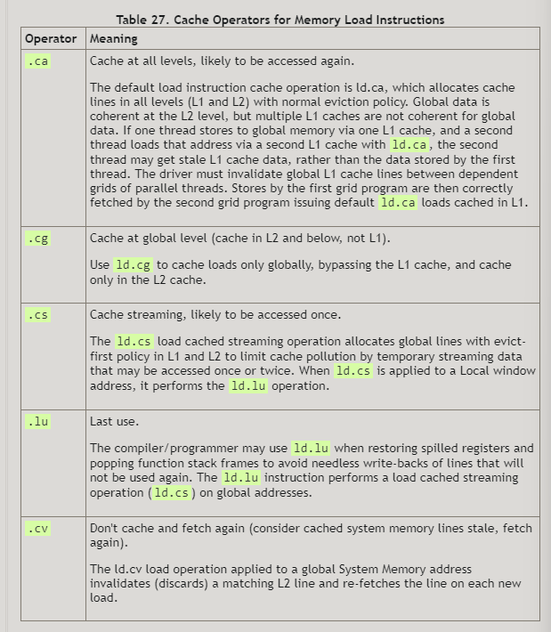

缓存写回指令：
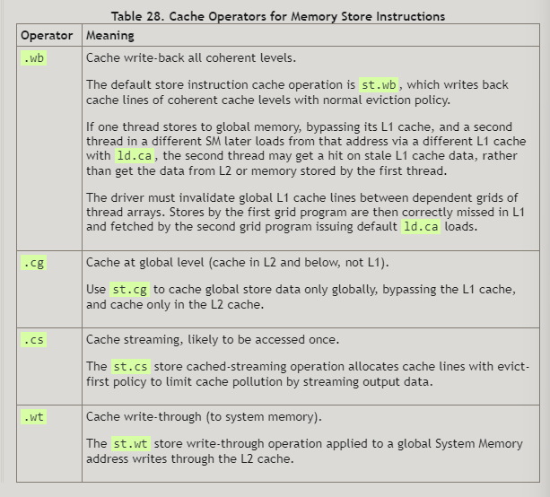

#### 9.7.8.2. Cache Eviction Priority Hints
从PTX 7.4开始，加入了可选的缓存退出优先级提示，用于缓存读写，需要`sm_70`以上架构。

该提示只用于`.global`内存空间的地址。

缓存读写的退出有优先级提示指令如下：
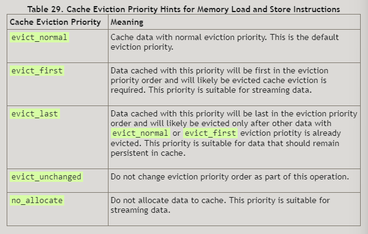

#### 9.7.8.3. Data Movement and Conversion Instructions: mov
设置寄存器的值，源操作数可以是：寄存器变量、立即数、global\local\shared内存空间中的non-generic地址

```
mov.type  d, a;
mov.type  d, sreg;
mov.type  d, avar;       // get address of variable
mov.type  d, avar+imm;   // get address of variable with offset
mov.u32   d, fname;      // get address of device function
mov.u64   d, fname;      // get address of device function
mov.u32   d, kernel;     // get address of entry function
mov.u64   d, kernel;     // get address of entry function

.type = { .pred,
          .b16, .b32, .b64,
          .u16, .u32, .u64,
          .s16, .s32, .s64,
                .f32, .f64 };

// 等效C代码
d = a;
d = sreg;
d = &avar;  // address is non-generic; i.e., within the variable's declared state space
d = &avar+imm;

// example
    mov.f32  d,a;
    mov.u16  u,v;
    mov.f32  k,0.1;
    mov.u32  ptr, A;        // move address of A into ptr
    mov.u32  ptr, A[5];     // move address of A[5] into ptr
    mov.u32  ptr, A+20;     // move address with offset into ptr
    mov.u32  addr, myFunc;  // get address of device function 'myFunc'
    mov.u64  kptr, main;    // get address of entry function 'main'
```

注意上面提到了non-generic，当需要获取对应内存空间generic地址时，首先通过`mov`指令获取non-generic，然后通过`cvta`可以转换出generic。
**总之想要获取generic便可以通过`cvta`指令来获取。**

**到底什么时generic和non-generic？？**
这个问题可以参考[NVVM IR](https://docs.nvidia.com/cuda/nvvm-ir-spec/index.html#generic-pointers-and-non-generic-pointers)中给出的解释。
简单来说，generic pointer是指向任意地址空间的指针，而non-generic point是指向特定地址空间的指针。

比如：函数指针就是non-generic pointer，有特性的地址空间关键字，而global\local\shared这种就是通用的地址空间。

注意事项：
1. mov指令增加了通用的数据类型(原本其实只需要bit-wise和predicate type便足够了)，是为了更好的可读性以及允许数据类型转换。
2. 当mov一个kernel或者device函数时，只允许使用`.u32`和`.u64`指令类型。当使用signed type时并不会报编译错误，但会有warning，建议是不要这么搞
3. 获取kernel地址的功能需要PTX 3.1以上，并且只能用于CUDA Dynamic Parallelism system calls
4. `mov.f64`需要`sm_13`以上，获取kernel地址需要`sm_35`以上

#### 9.7.8.4. Data Movement and Conversion Instructions: mov
用于标量和矢量间的相互移动，也就是俗称的pack\unpack。是的，指令一样的，但是源操作数和目标操作数的形式不同。

```
mov.type  d, a;
.type = { .b16, .b32, .b64 };

// 等效C代码
// pack two 8-bit elements into .b16
d = a.x | (a.y << 8)
// pack four 8-bit elements into .b32
d = a.x | (a.y << 8)  | (a.z << 16) | (a.w << 24)
// pack two 16-bit elements into .b32
d = a.x | (a.y << 16)
// pack four 16-bit elements into .b64
d = a.x | (a.y << 16)  | (a.z << 32) | (a.w << 48)
// pack two 32-bit elements into .b64
d = a.x | (a.y << 32)

// unpack 8-bit elements from .b16
{ d.x, d.y } = { a[0..7], a[8..15] }
// unpack 8-bit elements from .b32
{ d.x, d.y, d.z, d.w } 
    { a[0..7], a[8..15], a[16..23], a[24..31] }

// unpack 16-bit elements from .b32
{ d.x, d.y }  = { a[0..15], a[16..31] }
// unpack 16-bit elements from .b64
{ d.x, d.y, d.z, d.w } =
    { a[0..15], a[16..31], a[32..47], a[48..63] }
 
// unpack 32-bit elements from .b64
{ d.x, d.y } = { a[0..31], a[32..63] }

// example
// 源操作数和目标操作数的形式不一样
mov.b32 %r1,{a,b};      // a,b have type .u16
mov.b64 {lo,hi}, %x;    // %x is a double; lo,hi are .u32
mov.b32 %r1,{x,y,z,w};  // x,y,z,w have type .b8
mov.b32 {r,g,b,a},%r1;  // r,g,b,a have type .u8
// 当存在"_"可以理解为一个占位符，实际后续代码可能只需要用到%r1这个矢量寄存器
mov.b64 {%r1, _}, %x;   // %x is.b64, %r1 is .b32
```

指令的type位宽对应的是最大位宽。

注意事项：
1. PTX 1.0引入
2. 适用于所有架构

#### 9.7.8.5. Data Movement and Conversion Instructions: shfl (deprecated)
warp中的线程交换寄存器数据。

注意事项：
1. 该指令在PTX6.0被弃用，PTX 6.4以及`sm_70`以上便不再支持
2. 从PTX 6.0开始引入了`shfl.sync`指令替代


#### 【WIP】9.7.8.6. Data Movement and Conversion Instructions: shfl.sync
warp中的线程交换寄存器数据。

```
shfl.sync.mode.b32  d[|p], a, b, c, membermask;
.mode = { .up, .down, .bfly, .idx };

// 等效C代码
// wait for all threads in membermask to arrive
wait_for_specified_threads(membermask);

lane[4:0]  = [Thread].laneid;  // position of thread in warp
bval[4:0] = b[4:0];            // source lane or lane offset (0..31)
cval[4:0] = c[4:0];            // clamp value
segmask[4:0] = c[12:8];

// get value of source register a if thread is active and
// guard predicate true, else unpredictable
if (isActive(Thread) && isGuardPredicateTrue(Thread)) {
    SourceA[lane] = a;
} else {
    // Value of SourceA[lane] is unpredictable for
    // inactive/predicated-off threads in warp
}
maxLane = (lane[4:0] & segmask[4:0]) | (cval[4:0] & ~segmask[4:0]);
minLane = (lane[4:0] & segmask[4:0]);

switch (.mode) {
    case .up:    j = lane - bval; pval = (j >= maxLane); break;
    case .down:  j = lane + bval; pval = (j <= maxLane); break;
    case .bfly:  j = lane ^ bval; pval = (j <= maxLane); break;
    case .idx:   j = minLane  | (bval[4:0] & ~segmask[4:0]);
                                 pval = (j <= maxLane); break;
}
if (!pval) j = lane;  // copy from own lane
d = SourceA[j];       // copy input a from lane j
if (dest predicate selected)
    p = pval;

// example
shfl.sync.up.b32  Ry|p, Rx, 0x1,  0x0, 0xffffffff;
```

其中：
1. membermask是一个32-bit的数，每个bit位对应32个lane-id, bit位为1则表示该lane-id是参与shlf的，为0的线程不参与并且行为是未定义。
2. **细节没太看懂，后续再回头填坑**

注意事项:
1. 在PTX 6.0被引入
2. 需要`sm_30`以上架构

#### 9.7.8.7. Data Movement and Conversion Instructions: prmt
改变寄存器pair中的Byte位置。两个b32的源操作数中提取出一个b32目标操作数

```
prmt.b32{.mode}  d, a, b, c;
.mode = { .f4e, .b4e, .rc8, .ecl, .ecr, .rc16 };

// 等效C代码
tmp64 = (b<<32) | a;  // create 8 byte source

if ( ! mode ) {
   ctl[0] = (c >>  0) & 0xf;
   ctl[1] = (c >>  4) & 0xf;
   ctl[2] = (c >>  8) & 0xf;
   ctl[3] = (c >> 12) & 0xf;
} else {
   ctl[0] = ctl[1] = ctl[2] = ctl[3] = (c >>  0) & 0x3;
}

tmp[07:00] = ReadByte( mode, ctl[0], tmp64 );
tmp[15:08] = ReadByte( mode, ctl[1], tmp64 );
tmp[23:16] = ReadByte( mode, ctl[2], tmp64 );
tmp[31:24] = ReadByte( mode, ctl[3], tmp64 );

// example
prmt.b32      r1, r2, r3, r4;
prmt.b32.f4e  r1, r2, r3, r4;
```

源操作数c是一个16bit的选择器，每4-bit控制目标操作数的一个字节的选择。
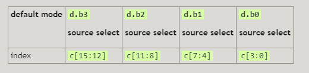

拥有的模式如下：
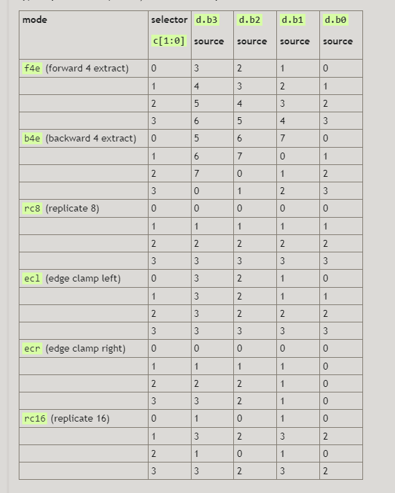

注意事项：
1. PTX 2.0中被引入
2. 需要`sm_20`架构以上

#### 9.7.8.8. Data Movement and Conversion Instructions: ld
从可寻址空间读取变量放入寄存器。
**很重要的指令**

```
// 指令用法：
ld{.weak}{.ss}{.cop}{.level::cache_hint}{.level::prefetch_size}{.vec}.type  d, [a]{, cache-policy};
ld{.weak}{.ss}{.level::eviction_priority}{.level::cache_hint}{.level::prefetch_size}{.vec}.type
                                                                            d, [a]{, cache-policy};

ld.volatile{.ss}{.level::prefetch_size}{.vec}.type                          d, [a];
ld.relaxed.scope{.ss}{.level::eviction_priority}{.level::cache_hint}{.level::prefetch_size}{.vec}.type
                                                                            d, [a]{, cache-policy};

ld.acquire.scope{.ss}{.level::eviction_priority}{.level::cache_hint}{.level::prefetch_size}{.vec}.type
                                                                            d, [a]{, cache-policy};

.ss =                       { .const, .global, .local, .param, .shared{::cta, ::cluster} };
.cop =                      { .ca, .cg, .cs, .lu, .cv };
.level::eviction_priority = { .L1::evict_normal, .L1::evict_unchanged,
                              .L1::evict_first, .L1::evict_last, .L1::no_allocate };
.level::cache_hint =        { .L2::cache_hint };
.level::prefetch_size =     { .L2::64B, .L2::128B, .L2::256B }
.scope =                    { .cta, .cluster, .gpu, .sys };
.vec =                      { .v2, .v4 };
.type =                     { .b8, .b16, .b32, .b64,
                              .u8, .u16, .u32, .u64,
                              .s8, .s16, .s32, .s64,
                              .f32, .f64 };
```

指令描述：
1. d为目标操作数，a为标注地址空间的源操作数，如果地址空间没标注，则默认按照generic addressing进行寻址
2. 如果`.shared`没有明确的子描述符，那么默认使用`::cta`子描述符
3. 支持的寻址方式以及需要的对齐大小参考6.4.1章节
4. `ld.param`用于读取device function的返回值，具体参考5.6和7.1章节
5. `.relax`和`.acquir`修饰符表示内存的同步性，参考第8章的内存一致性模型，`.scope`描述符表示使用`ld.relax`或`ld.acquire`的线程集合可以直接进行同步
6. `.weak`描述符表示这是一条没有同步的内存指令，这条指令只有同步之后，其产生的影响才能对其他线程可见。
7. `.weak`，`.volatile`，`.relaxed`，`.acquire`是互斥的描述符，如果没有标注，默认使用`.weak`
8. `ld.volatile`操作总是会被执行，并且有访问同一地址的其他volatile操作时，不会被重排。volatile和non-volatile操作同一块内存时，可能会被重拍。`ld.volatile`和`ld.relax.sys`有着相同的同步语义。
9. `.volatile`、`.relaxed`、`.acquire`关键字只能用于global和shared空间的generic address，cache不行。
10. `.level::eviction_priority`用于指定在内存访问期间使用的退出策略。
11. `.level::prefetch_size`用于提示将指定的数据获取到对应的cache-level，可以选在64\128\256B，B for byte.
12. `.level::prefetch_size`只能用于global内存，如果prefetch的地址不在全局内存窗口内，则该行为未定义。
13. `.level::prefetch_size`指挥被视为一种性能提示，performance hint
14. 当使用可选的参数`cache-policy`时，关键字`.level::cache_hint`是必须的，一个64-bit操作数作为`cache-policy`表明在内存访问时的缓存退出策略。
15. `.level::cache_hint`只支持global内存空间的访问。
16. `cache-policy`也是一个性能提示，并不能保证被执行，并且不会盖面内存一致性。

```
// example
ld.global.f32    d,[a];
ld.shared.v4.b32 Q,[p];
ld.const.s32     d,[p+4];
ld.local.b32     x,[p+-8]; // negative offset
ld.local.b64     x,[240];  // immediate address

ld.global.b16    %r,[fs];  // load .f16 data into 32-bit reg
cvt.f32.f16      %r,%r;    // up-convert f16 data to f32

ld.global.b32    %r0, [fs];     // load .f16x2 data in 32-bit reg
ld.global.b32    %r1, [fs + 4]; // load .f16x2 data in 32-bit reg
add.rn.f16x2     %d0, %r0, %r1; // addition of f16x2 data
ld.global.relaxed.gpu.u32 %r0, [gbl];
ld.shared.acquire.gpu.u32 %r1, [sh];
ld.global.relaxed.cluster.u32 %r2, [gbl];
ld.shared::cta.acquire.gpu.u32 %r2, [sh + 4];
ld.shared::cluster.u32 %r3, [sh + 8];

ld.global.L1::evict_last.u32  d, [p];

ld.global.L2::64B.b32   %r0, [gbl]; // Prefetch 64B to L2
ld.L2::128B.f64         %r1, [gbl]; // Prefetch 128B to L2
ld.global.L2::256B.f64  %r2, [gbl]; // Prefetch 256B to L2

createpolicy.fractional.L2::evict_last.L2::evict_unchanged.b64 cache-policy, 1;
ld.global.L2::cache_hint.b64  x, [p], cache-policy;
```

注意事项：
1. 目标操作数必须是寄存器，在`.reg`内存空间
2. 当目标寄存器的位宽大于被标注的位宽时时可用的，默认会对有符号类型进行高位补符号位，无符号类型和bit类型高位补0。
3. `.f16`类型不能直接标注，可以先用`ld.b16`进行读取，在使用`cvt`指令转换为fp32或者fp64。
4. `.f16x2`可以使用`ld.b32`指令进行读取。

PTX版本特性：
1. ld指令在PTX1.0引入，`ld.volatile`在1.1引入
2. generic address和cache操作在2.0引入
3. 作用域限定符`.relax`，`.acquire`、`.weak`在6.0引入
4. const空间的generic address寻址在3.1引入
5. `.level::eviction_priority`、`.level::prefetch_size`、`.level::cache_hint`在7.4被引入
6. `.cluster`作用域限定符在7.8被引入
7. `::cta`和`::cluster`子限定符在7.8被引入。

目标架构特性：
1. `ld.f64`需要`sm_13`以上
2. `.relax`，`.acquire`、`.weak`需要`sm_70`以上
3. generic address和cache操作需要`sm_20`以上
4. `.level::eviction_priority`需要70以上
5. `.level::prefetch_size`需要75以上
6. `.L2::256B`和`.L2::cache_hint`需要80以上
7. `.cluster`需要90以上
8. `::cta`需要30以上
9. `::cluster`需要90以上

#### 9.7.8.9. Data Movement and Conversion Instructions: ld.global.nc
通过非相干(non-coherent)缓存从全局内存空间读取数据到寄存器。

```
ld.global{.cop}.nc{.level::cache_hint}.type                 d, [a]{, cache-policy};
ld.global{.cop}.nc{.level::cache_hint}.vec.type             d, [a]{, cache-policy};

ld.global.nc{.level::eviction_priority}{.level::cache_hint}.type      d, [a]{, cache-policy};
ld.global.nc{.level::eviction_priority}{.level::cache_hint}.vec.type  d, [a]{, cache-policy};

.cop  =                     { .ca, .cg, .cs };     // cache operation
.level::eviction_priority = { .L1::evict_normal, .L1::evict_unchanged,
                              .L1::evict_first, .L1::evict_last, .L1::no_allocate};
.level::cache_hint =        { .L2::cache_hint };
.vec  =                     { .v2, .v4 };
.type =                     { .b8, .b16, .b32, .b64,
                              .u8, .u16, .u32, .u64,
                              .s8, .s16, .s32, .s64,
                              .f32, .f64 };

// example
ld.global.nc.f32           d, [a];
ld.gloal.nc.L1::evict_last.u32 d, [a];        

createpolicy.fractional.L2::evict_last.b64 cache-policy, 0.5;
ld.global.nc.L2::cache_hint.f32  d, [a], cache-policy;
```

上述example中出现的`createpolicy`指令在后面章节。

什么是non-coherent cache？
通常是只不想管的texture cache，因为这部分cache是non-coherent cache，所以这部分是只读的cache。
注意：通常texture cache更大，并且有更大的带宽，但是相比于global memory cache有更大的延迟。`ld.global.nc`通常比`ld.global`性能更好。

指令中涉及的`.level::eviction_priority`、`.level::cache_hint`等限定符和ld指令相同，不赘述。

注意事项：
1. 该指令在PTX 3.1被引入。
2. 限定符支持同ld指令。

#### 9.7.8.10. Data Movement and Conversion Instructions: ldu
从一个warpz中的共同地址进行read-only数据读取

```
ldu{.ss}.type      d, [a];       // load from address
ldu{.ss}.vec.type  d, [a];       // vec load from address

.ss   = { .global };             // state space
.vec  = { .v2, .v4 };
.type = { .b8, .b16, .b32, .b64,
           .u8, .u16, .u32, .u64,
           .s8, .s16, .s32, .s64,
                      .f32, .f64 };

// example
ldu.global.f32    d,[a];
ldu.global.b32    d,[p+4];
ldu.global.v4.f32 Q,[p];
```

从源操作地址进行global内存空间的read-only数据读取，源操作地址必须保证对warp中的所有线程都是一样的。
`.f16`数据读取需要使用`ldu.b16`然后使用`cvt`指令转换到`.f32`或`.f64`或者用于其他半精度浮点指令中。

注意事项：
1. PTX 2.0被引入
2. `ldu.f64`需要`sm_13`以上

#### 9.7.8.11. Data Movement and Conversion Instructions: st
存储寄存器变量到一个可寻址的内存空间中

```
st{.weak}{.ss}{.cop}{.level::cache_hint}{.vec}.type   [a], b{, cache-policy};
st{.weak}{.ss}{.level::eviction_priority}{.level::cache_hint}{.vec}.type
                                                      [a], b{, cache-policy};
st.volatile{.ss}{.vec}.type                           [a], b;
st.relaxed.scope{.ss}{.level::eviction_priority}{.level::cache_hint}{.vec}.type
                                                      [a], b{, cache-policy};
st.release.scope{.ss}{.level::eviction_priority}{.level::cache_hint}{.vec}.type
                                                      [a], b{, cache-policy};

.ss =                       { .global, .local, .param, .shared{::cta, ::cluster} };
.level::eviction_priority = { .L1::evict_normal, .L1::evict_unchanged,
                              .L1::evict_first, .L1::evict_last, .L1::no_allocate };
.level::cache_hint =        { .L2::cache_hint };
.cop =                      { .wb, .cg, .cs, .wt };
.sem =                      { .relaxed, .release };
.scope =                    { .cta, .cluster, .gpu, .sys };
.vec =                      { .v2, .v4 };
.type =                     { .b8, .b16, .b32, .b64,
                              .u8, .u16, .u32, .u64,
                              .s8, .s16, .s32, .s64,
                              .f32, .f64 };

// example
st.global.f32    [a],b;
st.local.b32     [q+4],a;
st.global.v4.s32 [p],Q;
st.local.b32     [q+-8],a; // negative offset
st.local.s32     [100],r7; // immediate address

cvt.f16.f32      %r,%r;    // %r is 32-bit register
st.b16           [fs],%r;  // store lower
st.global.relaxed.sys.u32 [gbl], %r0;
st.shared.release.cta.u32 [sh], %r1;
st.global.relaxed.cluster.u32 [gbl], %r2;
st.shared::cta.release.cta.u32 [sh + 4], %r1;
st.shared::cluster.u32 [sh + 8], %r1;

st.global.L1::no_allocate.f32 [p], a;

createpolicy.fractional.L2::evict_last.b64 cache-policy, 0.25;
st.global.L2::cache_hint.b32  [a], b, cache-policy;
```

指令描述：
1. 基本和`ld`指令是一样的，反过来看就行。

注意事项：
1. 同`ld`指令

#### 9.7.8.12. Data Movement and Conversion Instructions: prefetch, prefetchu
在指定的内存空间中，对指定的内存层次中的generic address进行预取

```
prefetch{.space}.level                    [a];   // prefetch to data cache
prefetch.global.level::eviction_priority  [a];   // prefetch to data cache

prefetchu.L1  [a];             // prefetch to uniform cache

.space =                    { .global, .local };
.level =                    { .L1, .L2 };
.level::eviction_priority = { .L2::evict_last, .L2::evict_normal };

// example
prefetch.global.L1             [ptr];
prefetch.global.L2::evict_last [ptr];          
prefetchu.L1  [addr];
```

指令描述：
1. 预取指令将从global\local内存空间中取cache-line宽的数据放到指定的cache level中
2. 对于shared memory的预取指令不执行任何操作
3. 放入统一缓存的prefetchzhi零需要一个generic address，并且对于映射到`const`、`local`和`shared`空间的地址，不会执行任何操作

注意事项：
1. PTX 2.0被引入
2. `prefetch`指令需要`sm_20`以上
3. 其余的一些描述符需求同上

#### 9.7.8.13. Data Movement and Conversion Instructions: applypriority
在对应的cache level和对应的address，应用对应的缓存退出优先级

```
appplypriority{.global}.level::eviction_priority  [a], size;

.level::eviction_priority = { .L2::evict_normal };

// example
applypriority.global.L2::evict_normal [ptr], 128;
```

指令描述：
1. 当前可支持的size数是128
2. 源操作数a必须是128Bytes对齐的
3. 如果地址a所指向的数据还没有出现在指定的缓存级别中，那么在应用指定的优先级之前，数据将被预取。

注意事项：
1. PTX 7.4引入
2. 需要`sm_80`以上的架构

#### 9.7.8.14. Data Movement and Conversion Instructions: discard
在指定的地址和缓存级别使缓存中的数据无效。

```
discard{.global}.level  [a], size;

.level = { .L2 };

// example
discard.global.L2 [ptr], 128;
```

指令描述：
1. 将缓存中[a, a+size)段的数据无效，但并不会将数据写回内存，也就是缓存擦除
2. size只支持128
3. 源操作数a需要128Byte对齐

注意事项：
1. PTX 7.4引入
2. 需要`sm_80`以上架构

#### 9.7.8.15. Data Movement and Conversion Instructions: createpolicy
对指定的缓存等级创建缓存退出优先级

```
// Range-based policy
createpolicy.range{.global}.level::primary_priority{.level::secondary_priority}.b64
                                   cache-policy, [a], primary-size, total-size;

// Fraction-based policy
createpolicy.fractional.level::primary_priority{.level::secondary_priority}.b64
                                   cache-policy{, fraction};

// Converting the access property from CUDA APIs
createpolicy.cvt.L2.b64            cache-policy, access-property;

.level::primary_priority =   { .L2::evict_last, .L2::evict_normal,
                               .L2::evict_first, .L2::evict_unchanged };
.level::secondary_priority = { .L2::evict_first, .L2::evict_unchanged };

// example
createpolicy.fractional.L2::evict_last.b64                      policy, 1.0;
createpolicy.fractional.L2::evict_last.L2::evict_unchanged.b64  policy, 0.5;

createpolicy.range.L2::evict_last.L2::evict_first.b64
                                            policy, [ptr], 0x100000, 0x200000;

// access-prop is created by CUDA APIs.
createpolicy.cvt.L2.b64 policy, access-prop;
```

指令描述：
1. 该指令创建一个缓存推出优先级的值放在一个64-bit的寄存器中，这个寄存器搭配前文的`ld`、`st`等指令一起使用，所以暂时不用关心这个64bit到底怎么表示
2. 有两种缓存退出的策略：
- Range-based policy: 
    - [a, a + primary_size)称为primary range
    - [a + primary_size, a + total_size)称为trailing secondary range
    - [a - (total_size - primary_size), a)称为preceding secondary range
    - 当内存地址落在primary range中，退出优先级被标注为`.L2::primary_priority`
    - 当内存地址落在任意的secondary range中，退出优先级被标注为`.L2::secondary_priority`
    - `primary-size`和`total-size`都是32-bit的数，并且前者必须小于等于后者，最大的`total-size`是4GB，默认模式为`.L12::evict_unchanged`
- Fraction-base policy
    - [软件直译的]带有`.level::cache_hint`限定符的内存操作可以使用基于分数的缓存清除策略来请求由`.L2:primary_priority`指定的缓存清除优先级应用于由32-bit浮点操作数分数指定的缓存访问的分数。剩余的缓存访问获得`.L2::secondary_priority`指定的退出优先级。这意味着，在使用基于分数的缓存策略的内存操作中，内存访问具有获得`.L2::primary_priority`指定的缓存退出优先级的操作数分数指定的概率。操作数分数的有效取值范围是(0.0，…, 1.0]。如果未指定操作数分数，则默认为1.0。如果未指定`.L2::secondary_priority`，则默认为`.L2::evict_unchanged`

注意事项：
1. PTX 7.4引入
2. 需要`sm_80`架构及以上

#### 9.7.8.16. Data Movement and Conversion Instructions: isspacep
查询是否一个generic address在指定的内存空间窗口中

```
isspacep.space  p, a;    // result is .pred

.space = { const, .global, .local, .shared{::cta, ::cluster}, .param };

// example 
isspacep.const           iscnst, cptr;
isspacep.global          isglbl, gptr;
isspacep.local           islcl,  lptr;
isspacep.shared          isshrd, sptr;
isspacep.param           isparam, pptr;
isspacep.shared::cta     isshrdcta, sptr;
isspacep.shared::cluster ishrdany sptr;
```

指令描述：
1. 目标操作数类型为`.pred`，源操作数类型必须是`.u32`或`.u64`，如果在查询的内存空间，则目标操作数为1，反之为0
2. `isspacep.param`判断generic address是否来自kernel function parameters
3. 如果没有标注`.shared`，则默认`::cta`

注意事项：
1. PTX 2.0引入，需要`sm_20`以上的架构
2. `isspacep.const`在PTX 3.1引入
3. `isspacep.param`在PTX 7.7引入，需要`sm_70`以上架构
4. `::cta`和`::cluster`在PTX 7.8引入，前者需要`sm_30`以上架构，后者需要`sm_90`以上架构

#### 9.7.8.17. Data Movement and Conversion Instructions: cvta
各种内存空间中的指针与generic address之间的相互转换

```
// convert const, global, local, or shared address to generic address
cvta.space.size  p, a;        // source address in register a
cvta.space.size  p, var;      // get generic address of var
cvta.space.size  p, var+imm;  // generic address of var+offset

// convert generic address to const, global, local, or shared address
cvta.to.space.size  p, a;

.space = { .const, .global, .local, .shared{::cta, ::cluster}, .param };
.size  = { .u32, .u64 };

// example
cvta.const.u32   ptr,cvar;
cvta.local.u32   ptr,lptr;
cvta.shared::cta.u32  p,As+4;
cvta.shared::cluster.u32 ptr, As;
cvta.to.global.u32  p,gptr;
cvta.param.u64   ptr,pvar;
```

指令描述：
1. 指令的源操作数和目标操作数的位宽必须一致。否则`cvt.u32.u64`和`cvt.u64.u32`会发生阶段或高位补零。
2. 将generic address转换为内存空间指针，如果该地址没有落在对应的内存空间，则行为是未定义的。通常需要先使用`isspacep`来保证内存空间正确
3. `ctva`搭配`.shared`内存空间，地址必须被标注为`::cta`或者`::cluster`，否则行为未定义。默认为`::cta`。

注意事项：
1. PTX 2.0引入，需要`sm_20`以上架构
2. `cvta.const`和`cvta.to.const`在PTX 3.1引入
3. `.param`相关标注符在PTX 7.7被引入(7.8的手册中备注：当前事项不允许指向const的generic pointer包含指向constant bufferd的指针被作为kernel 参数传入)
4. `::cta`和`::cluster`相关描述符在PTX 7.8被引入
5. `.param`需要`sm_70`以上，`::cta`需要`sm_30`以上，`::cluster`需要`sm_90`以上

#### 9.7.8.18. Data Movement and Conversion Instructions: cvt
将一个值转换类型

```
cvt{.irnd}{.ftz}{.sat}.dtype.atype      d, a;  // integer rounding
cvt{.frnd}{.ftz}{.sat}.dtype.atype      d, a;  // fp rounding
cvt.frnd2{.relu}.f16.f32                d, a;
cvt.frnd2{.relu}.f16x2.f32              d, a, b;
cvt.frnd2.relu.bf16.f32                 d, a;
cvt.frnd2{.relu}.bf16x2.f32             d, a, b;
cvt.rna.tf32.f32                        d, a;
cvt.frnd2{.relu}.tf32.f32               d, a;
cvt.rn.satfinite{.relu}.f8x2type.f32    d, a, b;
cvt.rn.satfinite{.relu}.f8x2type.f16x2  d, a;
cvt.rn.{.relu}.f16x2.f8x2type           d, a;

.irnd   = { .rni, .rzi, .rmi, .rpi };
.frnd   = { .rn,  .rz,  .rm,  .rp  };
.frnd2  = { .rn,  .rz };
.dtype = .atype = { .u8,   .u16, .u32, .u64,
                    .s8,   .s16, .s32, .s64,
                    .bf16, .f16, .f32, .f64 };
.f8x2type = { .e4m3x2, .e5m2x2 }; // 注意这里有hopper架构引入的两种fp8精度

// 等效C代码
if (/* inst type is .f16x2 or .bf16x2 */) {
    d[31:16] = convert(a);
    d[15:0]  = convert(b);
} else {
    d = convert(a);
}

// example
cvt.f32.s32 f,i;
cvt.s32.f64 j,r;     // float-to-int saturates by default
cvt.rni.f32.f32 x,y; // round to nearest int, result is fp
cvt.f32.f32 x,y;     // note .ftz behavior for sm_1x targets
cvt.rn.relu.f16.f32      b, f;        // result is saturated with .relu saturation mode
cvt.rz.f16x2.f32         b1, f, f1;   // convert two fp32 values to packed fp16 outputs
cvt.rn.relu.f16x2.f32    b1, f, f1;   // convert two fp32 values to packed fp16 outputs with .relu saturation on each output
cvt.rn.bf16.f32          b, f;        // convert fp32 to bf16
cvt.rz.relu.bf16.f3 2    b, f;        // convert fp32 to bf16 with .relu saturation
cvt.rz.bf16x2.f32        b1, f, f1;   // convert two fp32 values to packed bf16 outputs
cvt.rn.relu.bf16x2.f32   b1, f, f1;   // convert two fp32 values to packed bf16 outputs with .relu saturation on each output
cvt.rna.tf32.f32         b1, f;       // convert fp32 to tf32 format
cvt.rn.relu.tf32.f32     d, a;        // convert fp32 to tf32 format
cvt.f64.bf16.rp          f, b;        // convert bf16 to f64 format
cvt.bf16.f16.rz          b, f         // convert f16 to bf16 format
cvt.bf16.u64.rz          b, u         // convert u64 to bf16 format  
cvt.s8.bf16.rpi          s, b         // convert bf16 to s8 format
cvt.bf16.bf16.rpi        b1, b2       // convert bf16 to corresponding int represented in bf16 format
cvt.rn.satfinite.e4m3x2.f32 d, a, b;  // convert a, b to .e4m3 and pack as .e4m3x2 output
cvt.rn.relu.satfinite.e5m2x2.f16x2 d, a; // unpack a and convert the values to .e5m2 outputs with .relu 
                                            // saturation on each output and pack as .e5m2x2
cvt.rn.f16x2.e4m3x2 d, a;             // unpack a, convert two .e4m3 values to packed f16x2 output
```

指令说明：
1. 舍入模式会强制发生在如下几种情况：
     1. float2float,当目标操作数位宽小于源操作数
     2. 所有float2int转换
     3. 所有int2float转化
     4. 所有包含`.fp16x2`，`.e4m3x2, .e5m2x2,.bf16x2,.tf32`的指令类型
2. 整形舍入只能用于float2int转换，以及同位宽的float2float转换且中间值会舍入到整数然后变为浮点数
3. 整形舍入模式有：
     1. `.rni`：舍入到最近的整数，如果在两个数中间，则选择最近的偶数
     2. `.rzi`：向0方向舍入到最近的整数
     3. `.rmi`: 向负无穷方向舍入到最近的整数
     4. `.rpi`: 向正无穷方向舍入到最近的整数
     5. 在float2int的转换中，`NaN`会被转换为0
4. 关于饱和处理：
     1. `.sat`：对于浮点目标类型，`.sat`把结果限制在[0.0,1.0]的范围内,`NaN`的结果将会变为+0，可被用于`.f16,.f32, .f64`类型
     2. `.relu`: 对于`.f16, .f16x2, .bf16, .bf16x2, .e4m3x23, .e5m2x2, .tf32`的目标类型，`.relu`的作用就是将负数变为0,NaN则会转换为标准的NaN
     3. `.satfinite`：对于`.e4m3x2, .e5m2x2`的目标类型，NaN会被转换为特定目标格式的NaN


注意事项：
（直接上图吧，不想敲了...）
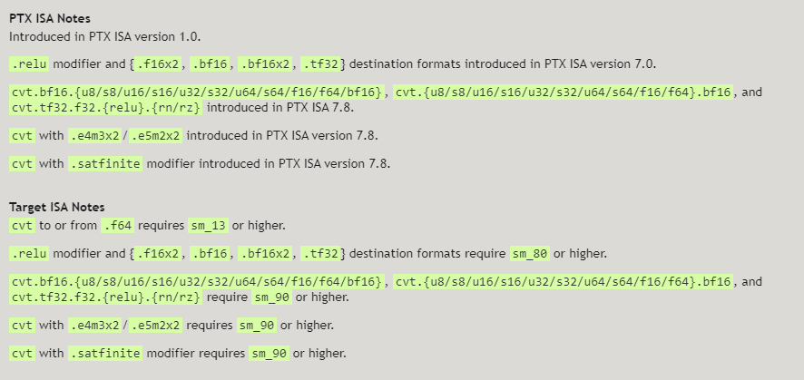


#### 9.7.8.19. Data Movement and Conversion Instructions: cvt.pack
将两个整型值从一种类型转换到另一种类型并打包

````
cvt.pack.sat.convertType.abType  d, a, b;
    .convertType  = { .u16, .s16 }
    .abType       = { .s32 }

cvt.pack.sat.convertType.abType.cType  d, a, b, c;
    .convertType  = { .u2, .s2, .u4, .s4, .u8, .s8 } 
    .abType       = { .s32 }
    .cType        = { .b32 }
    
// 等效C代码
ta = a < MIN(convertType) ? MIN(convertType) : a;
ta = a > MAX(convertType) ? MAX(convertType) : a;
tb = b < MIN(convertType) ? MIN(convertType) : b;
tb = b > MAX(convertType) ? MAX(convertType) : b;

size = sizeInBits(convertType);
td = tb ;
for (i = size; i <= 2 * size - 1; i++) {
    td[i] = ta[i - size];
}

if (isU16(convertType) || isS16(convertType)) {
    d = td;
} else {
    for (i = 0; i < 2 * size; i++) {
        d[i] = td[i];
    }
    for (i = 2 * size; i <= 31; i++) {
        d[i] = c[i - 2 * size];
    }
}

// example
cvt.pack.sat.s16.s32      %r1, %r2, %r3;           // 32-bit to 16-bit conversion
cvt.pack.sat.u8.s32.b32   %r4, %r5, %r6, 0;        // 32-bit to 8-bit conversion
cvt.pack.sat.u8.s32.b32   %r7, %r8, %r9, %r4;      // %r7 = { %r5, %r6, %r8, %r9 }
cvt.pack.sat.u4.s32.b32   %r10, %r12, %r13, %r14;  // 32-bit to 4-bit conversion
cvt.pack.sat.s2.s32.b32   %r15, %r16, %r17, %r18;  // 32-bits to 2-bit conversion
````

指令描述：
1. 转换的源操作数`a`和`b`都是s32的数据
2. 当a和b转换之后的数据不足以完全pack赛满d的时候，a\b会被优先pack到d的低bit位
3. 当存在操作数c的时候，如果还有没有被pack满的bit位，则会将c的低bit位塞入到d没被塞满的bit位中
4. `.sat`标注符限制了转换的源操作数落在min(convertType, max(convertType, a))的区间，防止溢出发生

注意事项：
1. PTX 6.5引入
2. 需要`sm_72`以上的架构
3. 子类型`.u4/.s4/.u2/.s2`需要`sm_75`以上的架构

#### 9.7.8.20. Data Movement and Conversion Instructions: mapa
map出目标CTA中的共享变量地址

````
mapa{.space}.type          d, a, b;

// Maps shared memory address in register a into CTA b.
mapa.shared::cluster.type  d, a, b; 

// Maps shared memory variable into CTA b.
maps.shared::cluster.type  d, sh, b; 

// Maps shared memory variable into CTA b.
maps.shared::cluster.type  d, sh + imm, b; 

// Maps generic address in register a into CTA b.
mapa.type                  d, a, b; 

.space = { .shared::cluster }
.type  = { .u32, .u64 }

// example
mapa.shared::cluster.u64 d1, %reg1, cta;
mapa.shared::cluster.u32 d2, sh, 3;
mapa.u64                 d3, %reg2, cta;
````

指令描述：
1. 获取操作数b指定的CTA中的地址，该地址对应于操作数a指定的地址。
2. `.type`指定的是操作数a和b的数据类型
3. 当内存空间被标注位`.shared::cluster`的时候，源操作数是一个共享内存变量或者是一个包含共享内存地址的寄存器，而d包含的是一个共享内存地址。而当`.space`没有被指明是，a和d都是包含指向共享内存的generic address的寄存器
4. b是一个32-bit整型数据，表明目标CTA的id

注意事项：
1. PTX 7.8被引入
2. 需要`sm_90`以上架构

#### 9.7.8.21. Data Movement and Conversion Instructions: getctarank
生成对应地址的CTA rank(也就是查询这段地址是属于第几个CTA)

````
getctarank{.space}.type d, a;

// Get cta rank from source shared memory address in register a.
getctarank.shared::cluster.type d, a;

// Get cta rank from shared memory variable.
getctarank.shared::cluster.type d, var;

// Get cta rank from shared memory variable+offset.
getctarank.shared::cluster.type d, var + imm;

// Get cta rank from generic address of shared memory variable in register a.
getctarank.type d, a;

.space = { .shared::cluster }
.type  = { .u32, .u64 }

// example
getctarank.shared::cluster.u32 d1, addr;
getctarank.shared::cluster.u64 d2, sh + 4;
getctarank.u64                 d3, src;
````

指令描述：
1. 查询`a`这段地址是属于第几个CTA并放入`d`中
2. `.type`时表示`a`的数据类型
3. `.shared::cluster`表示的意思与上一条指令介绍相同
4. `d`的数据类型是32-bit整型

#### 9.7.8.22. Data Movement and Conversion Instructions: Asynchronous copy
异步拷贝，顾名思义。这是一条很重要的指令，在优化i\o的时候，时绕不开的。

对于异步拷贝的同步等待，有如下两种方式：
1. 使用`cp.async-groups`:
   1. 发起异步拷贝操作
   2. 提交拷贝操作到一个`cp.async-group`中
   3. 等待`cp.async-group`完成拷贝
   4. 一旦`cp.async-group`完成拷贝，其中的依赖于异步拷贝操作的写操作则变得可见(我理解为变为可执行状态而非等待状态)
2. 使用`mbarrier objects`:
   1. 发起异步拷贝操作
   2. 创建一个`mbarrier object`去跟踪异步拷贝操作
   3. 等待`mbarrier object`完成异步拷贝跟踪，通过使用`mbarrier.test_wait`
   4. 一旦`mbgarrier.test_wait`返回`True`，则接下来的写操作变得可见可执行(也就是说是个状态查询，不一定完成，并非强制等待)

一个线程执行一系列的异步拷贝操作可以被批处理放入一个group中，也就是`cp.async-group`

一个提交操作是被`cp.async-group`创建出来的用于提交该线程之前发起的一系列异步拷贝操作，但执行线程不感知提交操作，由`cp.async-group`管理

`cp.async-group`中的异步拷贝操作没有执行顺序，但是提交顺序是按顺序的。

必须等待异步拷贝完成才能之心后续的读写写操作，否则修改源数据和读取目标数据都会造成不可预测的结果。


##### 9.7.8.22.1. Data Movement and Conversion Instructions: cp.async
发起一次异步拷贝操作

````
cp.async.ca.shared{::cta}.global{.level::cache_hint}{.level::prefetch_size}
                         [dst], [src], cp-size{, src-size}{, cache-policy} ;
cp.async.cg.shared{::cta}.global{.level::cache_hint}{.level::prefetch_size}
                         [dst], [src], 16{, src-size}{, cache-policy} ;
cp.async.ca.shared{::cta}.global{.level::cache_hint}{.level::prefetch_size}
                         [dst], [src], cp-size{, ignore-src}{, cache-policy} ;
cp.async.cg.shared{::cta}.global{.level::cache_hint}{.level::prefetch_size}
                         [dst], [src], 16{, ignore-src}{, cache-policy} ;

.level::cache_hint =     { .L2::cache_hint }
.level::prefetch_size =  { .L2::64B, .L2::128B, .L2::256B }
cp-size =                { 4, 8, 16 }

// example
cp.async.ca.shared.global  [shrd],    [gbl + 4], 4;
cp.async.ca.shared::cta.global  [%r0 + 8], [%r1],     8;
cp.async.cg.shared.global  [%r2],     [%r3],     16;

cp.async.cg.shared.global.L2::64B   [%r2],      [%r3],     16;
cp.async.cg.shared.global.L2::128B  [%r0 + 16], [%r1],      8;
cp.async.cg.shared.global.L2::256B  [%r2 + 32], [%r3],     16;

createpolicy.fractional.L2::evict_last.L2::evict_unchanged.b64 cache-policy, 0.25;
cp.async.ca.shared.global.L2::cache_hint [%r2], [%r1], 4, cache-policy;

cp.async.ca.shared.global                   [shrd], [gbl], 4, p;
cp.async.cg.shared.global.L2::chache_hint   [%r0], [%r2], 16, q, cache-policy;
````

指令描述：
1. `cp.async`的源操作数指向global内存空间，而目标操作数指向shared内存空间
2. 操作数`cp-size`是一个整型常量，表明拷贝的字节数，且只能是4\8\16
3. 该指令允使用一个32-bit整型数`src-size`，表达拷贝的大小，该大小不能大于`cp-size`，不足`cp-size`的部分则会被0填充，超过`cp-size`则行为未定义
4. `ignore-src`被标注时，src data会被无视，全0会被拷贝到dst data中，如果没有标注，则默认是False的。
5. 执行线程可以通过使用`cp.async.wait_all`或者`cp.async.wait_group`或者mbarrier相关指令去等待同步，**除此之外没有别的指令能够保证异步拷贝的完成**
6. 异步拷贝的执行没有顺序保证
7. `.cg`描述符表示仅在global level cache L2缓存数据而非L1 cache，并且缓存操作只会被视为性能暗示，即并不一定会被执行
8. `cp.async`会被是为weak memory操作
9. `.level::prefetch_size`是预取到缓存的内存暗示，表示可以顺便做一下prefetch操作，大小仍然是`64B\128B\256B`
10. `.level::prefetch_size`只能用途`.global`内存空间的generic address
11. `.level::cache_hint`这些不多赘述了，用法和`.ld`其实是一样的

注意事项：
1. PTX 7.0引入
2. `.level::cache_hint`和`.level::prefetch_size`在PTX 7.4引入
3. `ignore-src`在PTX 7.5引入
4. `::cta`在PTX 7.8引入，需要`sm_30`以上的架构
5. 该指令需要`sm_80`以上的架构

##### 9.7.8.22.2. Data Movement and Conversion Instructions: cp.async.commit_group
向`cp.async-group`提交之前已经发起但还未提交的异步拷贝指令

````
cp.async.commit_group ;

// Example 1:
cp.async.ca.shared.global [shrd], [gbl], 4;
cp.async.commit_group ; // Marks the end of a cp.async group

// Example 2:
cp.async.ca.shared.global [shrd1],   [gbl1],   8;
cp.async.cg.shared.global [shrd1+8], [gbl1+8], 8;
cp.async.commit_group ; // Marks the end of cp.async group 1

cp.async.ca.shared.global [shrd2],    [gbl2],    16;
cp.async.cg.shared.global [shrd2+16], [gbl2+16], 16;
cp.async.commit_group ; // Marks the end of cp.async group 2
````

指令描述：
1. 该指令会给**每一个线程**创建一个`cp.async-group`用于提交之前发起单位提交的所有异步拷贝指令，如果没有未提交的异步拷贝指令，则创建一个空的`cp.async-group`
2. 执行线程可以用过调用`cp.async.wait_group`来等待所有异步拷贝操作完成
3. group中的异步拷贝指令是乱序的

注意事项：
1. 该指令在PTX 7.0被引入，需要`sm_80`以上的架构

##### 9.7.8.22.3. Data Movement and Conversion Instructions: cp.async.wait_group / cp.async.wait_all
等待前面提交的异步拷贝操作完成

````
cp.async.wait_group N;
cp.async.wait_all ;

// Example of .wait_all:
cp.async.ca.shared.global [shrd1], [gbl1], 4;
cp.async.cg.shared.global [shrd2], [gbl2], 16;
cp.async.wait_all;  // waits for all prior cp.async to complete

// Example of .wait_group :
cp.async.ca.shared.global [shrd3], [gbl3], 8;
cp.async.commit_group;  // End of group 1

cp.async.cg.shared.global [shrd4], [gbl4], 16;
cp.async.commit_group;  // End of group 2

cp.async.cg.shared.global [shrd5], [gbl5], 16;
cp.async.commit_group;  // End of group 3

cp.async.wait_group 1;  // waits for group 1 and group 2 to complete
````

指令描述：
1. `cp.async.wait_group N`中的N表示等待到还剩N个group还在pending而所有前面的group都已经完成(参见上面的exmple)。换言之，当N==0的时候，则表示等待全部的拷贝指令完成
2. `cp.async.wait_all`顾名思义就是等待全部完成

注意事项：
1. PTX 7.0被引入，需要`sm_80`以上的架构

### 9.7.9. Texture Instructions
PTX在texture和sampler descriptors上支持如下的一些操作：
1. texture和sampler descriptors的静态初始化
2. 模块作用域和每个入口作用域中关于texture和sampler descriptor的定义
3. 查询texture和sampler中的字段
（有点不是特别理解的憋脚翻译。。）

#### 9.7.9.1. Texturing Modes
使用texture和sampler的时候，PTX有两种操作模式。
1. `unified mode`，这种模式下访问texture和sampler的信息军来自一个单一的`.texref`句柄。该模式的好处在于：每个kernel允许由128个sampler,他们与每个内核可有的128个texture一一对应
2. `independent mode`，这种模式下texture和sampler有各自独立的句柄，允许在使用是被分开或组合。该模式的好处在于：texture和sampler可以混合匹配，无需一一对应，但每个kernel中最多就只有16个sampler

texturing mode通过`.target`选项来选择`texmode_unified`和`texmode_independent`两种。每一个PTX模块只能生命一种texturing mode，默认使用`unified mode`

````
// example
.target texmode_independent
.global .samplerref tsamp1 = { addr_mode_0 = clamp_to_border, 
                               filter_mode = nearest
                             };
...
.entry compute_power
  ( .param .texref tex1 )
{
  txq.width.b32  r6, [tex1]; // get tex1's width
  txq.height.b32 r5, [tex1]; // get tex1's height
  tex.2d.v4.f32.f32  {r1,r2,r3,r4}, [tex1, tsamp1, {f1,f2}];
  mul.u32 r5, r5, r6;
  add.f32 r1, r1, r2;
  add.f32 r3, r3, r4;
  add.f32 r1, r1, r3;
  cvt.f32.u32 r5, r5;
  div.f32 r1, r1, r5;
}
````

更多描述见后面的texture相关指令。

#### 9.7.9.2. Mipmaps
一个`Mipmaps`是一个texture序列，其中的每一个texture都是来自同一个图像逐渐降低分辨率的表示。
简而言之：就是CV当中所说的"图像金字塔"，每个图层的height\width都是上一个图层的1/2
比如：原始图像是256x256的大小，那么逐层的texture就是128x128,64x64,32x32,16x16,....,1x1

通过一下公式计算mipmap金字塔的层数，也就是LOD(level of details):
`numLods = 1 + floor(log2(max(w,h,d)))`
注意这里降采样的时候，size是向下取整

`tex`指令支持三种模式去标注对应的LOD:
1. `base`: 始终选取level 0,也就是原始图像尺寸
2. `level`: 选取对应的level
3. `gradient`: 通过两个浮点适量参数去计算对应的2d-texture的LOD，如{dx/dx, dt/dx}和{dx/dy, dt/dy}，感觉就是归一化计算层级？

#### 9.7.9.3. Texture Instructions: tex
texture内存查找

````
tex.geom.v4.dtype.ctype  d, [a, c] {, e} {, f};
tex.geom.v4.dtype.ctype  d[|p], [a, b, c] {, e} {, f};  // explicit sampler

tex.geom.v2.f16x2.ctype  d[|p], [a, c] {, e} {, f};
tex.geom.v2.f16x2.ctype  d[|p], [a, b, c] {, e} {, f};  // explicit sampler

// mipmaps
tex.base.geom.v4.dtype.ctype   d[|p], [a, {b,} c] {, e} {, f};
tex.level.geom.v4.dtype.ctype  d[|p], [a, {b,} c], lod {, e} {, f};
tex.grad.geom.v4.dtype.ctype   d[|p], [a, {b,} c], dPdx, dPdy {, e} {, f};

tex.base.geom.v2.f16x2.ctype   d[|p], [a, {b,} c] {, e} {, f};
tex.level.geom.v2.f16x2.ctype  d[|p], [a, {b,} c], lod {, e} {, f};
tex.grad.geom.v2.f16x2.ctype   d[|p], [a, {b,} c], dPdx, dPdy {, e} {, f};

.geom  = { .1d, .2d, .3d, .a1d, .a2d, .cube, .acube, .2dms, .a2dms };
.dtype = { .u32, .s32, .f16,  .f32 };
.ctype = {       .s32, .f32 };          // .cube, .acube require .f32
                                        // .2dms, .a2dms require .s32
                                     
// example
// Example of unified mode texturing
// - f4 is required to pad four-element tuple and is ignored
tex.3d.v4.s32.s32  {r1,r2,r3,r4}, [tex_a,{f1,f2,f3,f4}];

// Example of independent mode texturing
tex.1d.v4.s32.f32  {r1,r2,r3,r4}, [tex_a,smpl_x,{f1}];

// Example of 1D texture array, independent texturing mode
tex.a1d.v4.s32.s32 {r1,r2,r3,r4}, [tex_a,smpl_x,{idx,s1}];           

// Example of 2D texture array, unified texturing mode
// - f3 is required to pad four-element tuple and is ignored 
tex.a2d.v4.s32.f32 {r1,r2,r3,r4}, [tex_a,{idx,f1,f2,f3}];

// Example of cubemap array, unified textureing mode
tex.acube.v4.f32.f32 {r0,r1,r2,r3}, [tex_cuarray,{idx,f1,f2,f3}];

// Example of multi-sample texture, unified texturing mode
tex.2dms.v4.s32.s32 {r0,r1,r2,r3}, [tex_ms,{sample,r6,r7,r8}];

// Example of multi-sample texture, independent texturing mode
tex.2dms.v4.s32.s32 {r0,r1,r2,r3}, [tex_ms, smpl_x,{sample,r6,r7,r8}];

// Example of multi-sample texture array, unified texturing mode
tex.a2dms.v4.s32.s32 {r0,r1,r2,r3}, [tex_ams,{idx,sample,r6,r7}];

// Example of texture returning .f16 data
tex.1d.v4.f16.f32  {h1,h2,h3,h4}, [tex_a,smpl_x,{f1}];

// Example of texture returning .f16x2 data
tex.1d.v2.f16x2.f32  {h1,h2}, [tex_a,smpl_x,{f1}];

// Example of 3d texture array access with tex.grad,unified texturing mode
tex.grad.3d.v4.f32.f32 {%f4,%f5,%f6,%f7},[tex_3d,{%f0,%f0,%f0,%f0}],     
                {fl0,fl1,fl2,fl3},{fl0,fl1,fl2,fl3};

// Example of cube texture array access with tex.grad,unified texturing mode
tex.grad.cube.v4.f32.f32{%f4,%f5,%f6,%f7},[tex_cube,{%f0,%f0,%f0,%f0}],     
                {fl0,fl1,fl2,fl3},{fl0,fl1,fl2,fl3};

// Example of 1d texture lookup with offset, unified texturing mode
tex.1d.v4.s32.f32  {r1,r2,r3,r4}, [tex_a, {f1}], {r5};

// Example of 2d texture array lookup with offset, unified texturing mode
tex.a2d.v4.s32.f32  {r1,r2,r3,r4}, [tex_a,{idx,f1,f2}], {f5,f6};

// Example of 2d mipmap texture lookup with offset, unified texturing mode
tex.level.2d.v4.s32.f32  {r1,r2,r3,r4}, [tex_a,{f1,f2}],    
                         flvl, {r7, r8};

// Example of 2d depth texture lookup with compare, unified texturing mode
tex.1d.v4.f32.f32  {f1,f2,f3,f4}, [tex_a, {f1}], f0;

// Example of depth 2d texture array lookup with offset, compare      
tex.a2d.v4.s32.f32  {f0,f1,f2,f3}, [tex_a,{idx,f4,f5}], {r5,r6}, f6;

// Example of destination predicate use
tex.3d.v4.s32.s32 {r1,r2,r3,r4}|p, [tex_a,{f1,f2,f3,f4}];
````

指令描述：
1. `tex.{1d,2d,3d}`指令。纹理查找指令，使用了纹理坐标矢量。
   1. 指令读取纹理`a`的坐标`c`到目标操作数`d`中，`b`是可选的采样器，目标操作数中有可选的预测操作数`p`，如果`p`为True，则表示纹理数据是驻留在内存中的，False则不是。纹理数据在指定坐标的内存驻留依赖于内核启动之前使用驱动程序API调用的执行环境设置。
   2. 1d\2d\3d的纹理坐标用法，和OpenCL image1d\2d\3d是一样的，3d情况下坐标是一个4-ele vector，其中第四个坐标会被忽略
   3. 操作数`e`是可选的，是一个`.s32`的矢量，表明坐标系的偏移(offset)，这个偏移就是坐标系寻址时候的一个基础偏移，矢量元素个数和坐标向量元素个数相同
   4. 操作数`f`是可选的，表示`depth textures`，表明持有深度每个像素数据的纹理。操作数`f`是`.f32`的标量值，用于指定深度纹理的深度比较值。从纹理中获取的每个元素都与`f`操作数中给定的值进行比较。如果比较通过，结果为1.0;否则结果为0.0。这些每个元素的比较结果用于filtering。当使用深度比较操作数时，纹理坐标向量`c`中的元素具有`.f32`类型。
   5. 深度比较操作在3d纹理中不支持
   6. 对于`fp16x2`的目标类型，指令返回一个2元矢量。而其余的所有类型，指令返回一个4元矢量。坐标可以是s32的整形或者是f32的浮点
   7. 通常会纹理基地址与16字节边界对齐，并且坐标向量给出的地址必须与访问大小的倍数对齐。如果地址没有正确对齐，则产生的行为是未定义的。也就是说，访问可以通过悄悄地舍弃低阶地址位来实现正确的舍入，或者指令可能出错。

2. `tex.{a1d,a2d}`指令。纹理数组选择，然后是纹理查找。
   1. 该指令首先从纹理数组`a`中，根据所给的坐标矩阵`c`的第一个元素作为index，选择一块纹理。然后从该纹理中，以坐标矢量`c`中剩下的元素为读取坐标读取数据到目标操作数`d`中。
   2. 操作数`c`有如下两种表示方式：
      1. 对于1d texture array，`c`的类型是`.v2.b32`。其中第一个元素被解析为一个`.u32`的index，第二个则是1d的纹理坐标，数据类型为`.ctype`
      2. 对于2d texture array，`c`的类型是`.v4.b32`。其中第一个元素被解析为一个`.u32`的index，第二三个元素则是2d的纹理坐标，数据类型为`.ctype`，第四个元素被无视
   3. `b`是可选的采样器
   4. `e`、`f`、`p`操作符对应的意义，同上。
3. `tex.cube`指令。立方体纹理查找。**(在通用高性能计算中，这部分基本不会涉及，所以先跳过了)**
4. `tex.acube`指令。立方体纹理数组选择，然后是立方体纹理查找。
5. `tex.2dms`指令。多重采样的纹理查找。
6. `tex.a2dms`指令。多重采样的纹理数组选择，然后进行纹理查询。

**纹理部分的指令没有太过展开，一些用法直接参考上文中的example**

注意事项：
直接上图吧，不赘述了
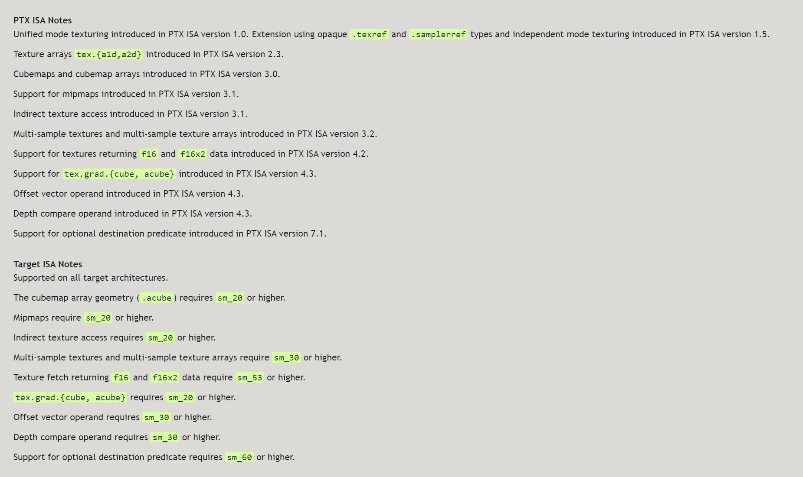

#### 9.7.9.4. Texture Instructions: tld4
原文：Perform a texture fetch of the 4-texel bilerp footprint.
没看懂`bilerp`这个意思。。。。暂时放弃，感觉应该是bilinear filter?

#### 9.7.9.5. Texture Instructions: txq
查询纹理和采样器的属性

````
txq.tquery.b32         d, [a];       // texture attributes
txq.level.tlquery.b32  d, [a], lod;  // texture attributes
txq.squery.b32         d, [a];       // sampler attributes

.tquery  = { .width, .height, .depth,
             .channel_data_type, .channel_order,
             .normalized_coords, .array_size,
             .num_mipmap_levels, .num_samples};

.tlquery = { .width, .height, .depth };

.squery  = { .force_unnormalized_coords, .filter_mode,
             .addr_mode_0, addr_mode_1, addr_mode_2 };
             
// example
txq.width.b32       %r1, [tex_A];
txq.filter_mode.b32 %r1, [tex_A];   // unified mode
txq.addr_mode_0.b32 %r1, [smpl_B];  // independent mode
txq.level.width.b32 %r1, [tex_A], %r_lod;
````

指令描述：
源操作数`a`是一个`.texref`或者`.samplerref`的变量，或者是以一个`.u64`的寄存器。
可以查询的内容如下表所示：
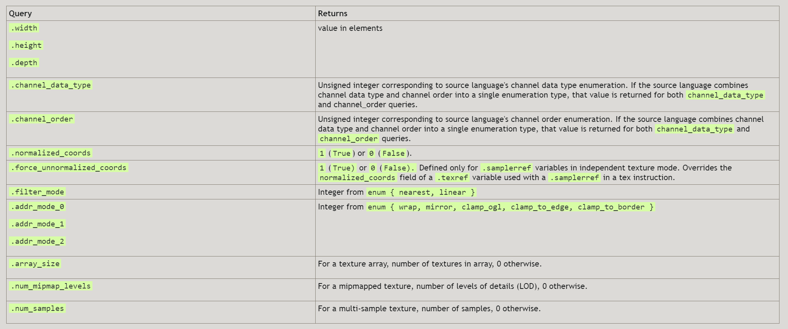

其中
1. 查询texture相关属性的时候，源操作数使用`.texref`，在Unified mode下面，采样器属性也是使用`.texref`来查询，在independent mode下面，采样器属性使用`.samplerref`来查询
2. `txq.level`指令需要额外的一个32bit的整数`lod`，来标注LOD，来查询对应LOD的属性

Indirect texture access
从PTX 3.1开始，非直接纹理访问在`sm_20`以上架构，在unified mode中被支持。在非直接访问模式下，操作数`a`是一个`.u64`的寄存器，该寄存器持有`.texref`的地址。

注意事项：
1. PTX 4.3以上均支持
2. `sm_30`架构以上均支持

#### 9.7.9.6. Texture Instructions: istypep
查询该操作数是否为标注的类型

````
istypep.type   p, a;  // result is .pred, return True or False

.type = { .texref, .samplerref, .surfref };

// exmaple
istypep.texref istex, tptr;
istypep.samplerref issampler, sptr;
istypep.surfref issurface, surfptr;
````

指令描述不多赘述。

注意事项：
1. PTX 4.0以上支持
2. `sm_30`以上支持

### 9.7.10. Surface Instructions
surface的用法其实了OpenCL中的imageg更像，在编码层面，是可读可写的，而CUDA texture是只读的。
简单的例子可以参考[这里](https://docs.nvidia.com/cuda/cuda-c-programming-guide/index.html#surface-object-api)

#### 9.7.10.1. Surface Instructions: suld
从surface memory读取数据

````
suld.b.geom{.cop}.vec.dtype.clamp  d, [a, b];  // unformatted

.geom  = { .1d, .2d, .3d, .a1d, .a2d };
.cop   = { .ca, .cg, .cs, .cv }; // cache operation
.vec   = { none, .v2, .v4 };
.dtype = { .b8 , .b16, .b32, .b64 };
.clamp = { .trap, .clamp, .zero };

// example
suld.b.1d.v4.b32.trap  {s1,s2,s3,s4}, [surf_B, {x}];
suld.b.3d.v2.b64.trap  {r1,r2}, [surf_A, {x,y,z,w}];
suld.b.a1d.v2.b32      {r0,r1}, [surf_C, {idx,x}];
suld.b.a2d.b32         r0, [surf_D, {idx,x,y,z}]; // z ignored
````

指令描述：
1. 从example看已经比较清晰了，相对于texture，suface的一些用法在PTX层面也更像OpenCL image，几大元素就是Obj + coordination + sampler(mode)
2. `.clamp`模式包括：
   1. `.trap`如果访问越界则直接抛出错误？(causes an execution trap)
   2. `.clamp`读取最邻近的surface位置
   3. `.zero`超出边界的地方直接读取为0
3. 非直接访问与纹理内存的非直接访问一样

注意事项：
1. PTX 3.1以上全部支持
2. `sm_20`以上架构全部支持


#### 9.7.10.2. Surface Instructions: sust
向surface内存存储数据

````
sust.b.{1d,2d,3d}{.cop}.vec.ctype.clamp  [a, b], c;  // unformatted
sust.p.{1d,2d,3d}.vec.b32.clamp          [a, b], c;  // formatted

sust.b.{a1d,a2d}{.cop}.vec.ctype.clamp   [a, b], c;  // unformatted

.cop   = { .wb, .cg, .cs, .wt };  // cache operation
.vec   = { none, .v2, .v4 };
.ctype = { .b8 , .b16, .b32, .b64 };
.clamp = { .trap, .clamp, .zero };

// example
sust.p.1d.v4.b32.trap  [surf_B, {x}], {f1,f2,f3,f4};  
sust.b.3d.v2.b64.trap  [surf_A, {x,y,z,w}], {r1,r2};
sust.b.a1d.v2.b64      [surf_C, {idx,x}], {r1,r2};
sust.b.a2d.b32         [surf_D, {idx,x,y,z}], r0;  // z ignored
````

指令说明：
1. 主要说明指令中`.b`和`.p`的区别：
   1. `.b`表示非格式化的二进制数据存储，个人理解是可以做更灵活的存储如`.b64`的数据存储
   2. `.p`表示格式化的32-bit数据的存储存储的数据从左到右分别对应`R`、`G`、`B`、`A`四个通道，如果格式并非RGBA，超出的部分则会被忽略。


注意事项：
1. PTX 3.1以上支持全部特性
2. `sm_20`以上架构支持全部特性

#### 9.7.10.3. Surface Instructions: sured
Reduce surface memory

````
sured.b.op.geom.ctype.clamp  [a,b],c; // byte addressing
sured.p.op.geom.ctype.clamp  [a,b],c; // sample addressing

.op    = { .add, .min, .max, .and, .or };
.geom  = { .1d, .2d, .3d };
.ctype = { .u32, .u64, .s32, .b32 };  // for sured.b
.ctype = { .b32 };                    // for sured.p
.clamp = { .trap, .clamp, .zero };

// example
sured.b.add.2d.u32.trap  [surf_A, {x,y}], r1;
sured.p.min.1d.b32.trap  [surf_B, {x}], r1;
````

指令描述：
1. `sured.b`指令作用于非格式化的归约，其中，`add`操作可用于`.u32`、`.u64`、`.s32`数据类型，`min`和`max`可用于`.u32`和`.s32`，`and`和`or`可用于`.b32`类型
2. `sured.p`指令作用于格式化的32-bit数据规约，指令作用类型仅限于`.b32`，数据会被解析为`.u32`或`.s32`，这取决于surface format包含的是UINT还是SINT

注意事项：
1. PTX 3.1以上支持全部特性
2. `sm_20`以上支持全部特性

#### 9.7.10.4. Surface Instructions: suq
查询surface的属性

````
suq.query.b32   d, [a];

.query = { .width, .height, .depth, 
           .channel_data_type, .channel_order, 
           .array_size, .memory_layout };
           
// example
suq.width.b32       %r1, [surf_A];
````

指令描述：
指令的源操作数`a`可以是一个`.surfref`的变量或者`.u64`的寄存器
对应可查询的属性如下所示：S


注意事项：
1. PTX 4.2以上支持全部特性
2. `sm_20`以上支持全部特性

### 9.7.11. Control Flow Instructions
接下来是PTX中的控制流相关指令

#### 9.7.11.1. Control Flow Instructions: {}
指令组，也就是指令执行的scope，工作域

````
{ instructionList }

// example
{ add.s32  a,b,c; mov.s32  d,a; }
````

指令描述：
(机器翻译)花括号创建了一组指令，主要用于定义函数体。花括号还提供了一种确定变量作用域的机制:在作用域中声明的任何变量在作用域之外都不可用。

注意事项：
1. 所有PTX版本均支持
2. 所有架构均支持

#### 9.7.11.2. Control Flow Instructions: @
判断执行

````
@{!}p    instruction;

// example
setp.eq.f32  p,y,0;     // is y zero?
@!p div.f32      ratio,x,y  // avoid division by zero

@q  bra L23;                // conditional branch
````

指令描述：
条件为True的线程执行指令，False不执行

注意事项：
1. 所有PTX版本均支持
2. 所有架构均支持

#### 9.7.11.3. Control Flow Instructions: bra
跳转到目标分支并执行

````
@p   bra{.uni}  tgt;           // tgt is a label
     bra{.uni}  tgt;           // unconditional branch
     
// 等效C代码
if (p) {
    pc = tgt;
}

// example
bra.uni  L_exit;    // uniform unconditional jump
@q  bra      L23;   // conditional branch
````

指令描述：
在目标处继续执行。根据条件判断是否跳转。分支目标必须是一个标签。
`bra.uni`保证是非发散的(non-divergent)，即即当前在warp中执行此指令的所有活动线程的判断条件和目标跳转分支是一样的。

注意事项：
1. 所有PTX版本均支持
2. 所有架构均支持

#### 9.7.11.4. Control Flow Instructions: brx.idx
根据index进行目标分支跳转

````
@p    brx.idx{.uni} index, tlist;
      brx.idx{.uni} index, tlist;
      
// 等效C代码
if (p) {
    if (index < length(tlist)) {
      pc = tlist[index];
    } else {
      pc = undefined;
    }
}

// example
.function foo () {
    .reg .u32 %r0;
    ...
    L1:
    ...
    L2:
    ...
    L3:
    ...
    ts: .branchtargets L1, L2, L3;
    @p brx.idx %r0, ts;
    ...
}
````

指令描述：
index是一个`.u32`的寄存器，`tlist`操作数必须带有`.branchtargets`标签，且必须在使用之前，在函数内部被定义。
别的都和`bra`指令一样，可以理解为是switch

注意事项：
1. PTX 6.0以上支持
2. `sm_30`以上架构支持

#### 9.7.11.5. Control Flow Instructions: call
调用函数

````
// direct call to named function, func is a symbol
call{.uni} (ret-param), func, (param-list);
call{.uni} func, (param-list);
call{.uni} func;

// indirect call via pointer, with full list of call targets
call{.uni} (ret-param), fptr, (param-list), flist;
call{.uni} fptr, (param-list), flist;
call{.uni} fptr, flist;

// indirect call via pointer, with no knowledge of call targets
call{.uni} (ret-param), fptr, (param-list), fproto;
call{.uni} fptr, (param-list), fproto;
call{.uni} fptr, fproto;

// example
// examples of direct call
    call     init;    // call function 'init'
    call.uni g, (a);  // call function 'g' with parameter 'a'
@p  call     (d), h, (a, b);  // return value into register d

// call-via-pointer using jump table
.func (.reg .u32 rv) foo (.reg .u32 a, .reg .u32 b) ...
.func (.reg .u32 rv) bar (.reg .u32 a, .reg .u32 b) ...
.func (.reg .u32 rv) baz (.reg .u32 a, .reg .u32 b) ...

.global .u32 jmptbl[5] = { foo, bar, baz };
      ...
@p    ld.global.u32  %r0, [jmptbl+4];
@p    ld.global.u32  %r0, [jmptbl+8];
      call  (retval), %r0, (x, y), jmptbl;

// call-via-pointer using .calltargets directive
.func (.reg .u32 rv) foo (.reg .u32 a, .reg .u32 b) ...
.func (.reg .u32 rv) bar (.reg .u32 a, .reg .u32 b) ...
.func (.reg .u32 rv) baz (.reg .u32 a, .reg .u32 b) ...
      ...
@p    mov.u32  %r0, foo;
@q    mov.u32  %r0, baz;
Ftgt: .calltargets foo, bar, baz;
      call  (retval), %r0, (x, y), Ftgt;

// call-via-pointer using .callprototype directive
.func dispatch (.reg .u32 fptr, .reg .u32 idx)
{
...
Fproto: .callprototype _ (.param .u32 _, .param .u32 _);
      call  %fptr, (x, y), Fproto;
...
````

指令描述：
1. `call`指令会存储下一条指令的地址，所以执行完成之后会返回函数调用点接着执行吓一跳指令。
2. `call`指令默认加沙是线程发散的，除非`.uni`后缀被标注
3. 对于直接调用，调用的`func`必须是有效的函数名。
4. 对于间接调用，`fptr`函数指针必须是一个被寄存器持有的地址。输入参数是可选的，参数必须的寄存器、立即常数或者在`.param`空间的变量，参数是传值的。
5. 间接调用需要额外的操作数，`flist`或`fproto`，前者需要给出一个完成的潜在调用目标的列表，这样优化后端就可以更优化，后者的情况是，完整的潜在调用目标是未知的，只给出了通用的函数原型，并且调用必须遵守ABI的调用约定。
6. `flist`可以是包含多个函数名的函数指针数组，也可以是带有`.calltargets`的标签。两种情况下`flist`里面都是持有函数指针的寄存器，调用操作数根据`flist`所指示的函数的类型签名进行类型检查。
7. fproto操作数是`.callprototype`的标签，调用操作数根据原型进行类型检查，代码生成将遵循ABI调用约定。如果调用的函数与原型不匹配，则行为未定义。
8. 调用表可以在模块作用域或局部作用域，在常量或全局状态空间中声明。`.calltargets`和`.callprototype`指令必须在函数体中声明。所有函数必须在调用表初始化器或`.calltargets`指令中引用之前声明。

注意事项：
1. PTX 2.1以上全部支持
2. `sm_20`以上架构全部支持

#### 9.7.11.6. Control Flow Instructions: ret
从调用函数返回值到指令中

````
ret{.uni};

// example
    ret;
@p  ret;
````

指令描述：
1. 将执行返回到调用者的环境。有发散的情况下返回会挂起线程，直到所有线程都准备好返回给调用者。这允许多个不同的ret指令。
2. 除非`.uni`被标注，否则默认发散

注意事项：
1. 所有PTX版本均支持
2. 所有架构均支持

#### 9.7.11.7. Control Flow Instructions: exit
终止一个线程

````
exit;

// example
    exit;
@p  exit;
````

指令描述：
当线程退出时，将检查等待所有线程的barrier，以查看退出的线程是否是唯一尚未进入`barrier.cta`或`barrier.cluster`。如果退出的线程占用了barrier，则释放barrier。

注意事项：
1. 所有PTX版本均支持
2. 所有架构均支持


### 9.7.12. Parallel Synchronization and Communication Instructions
并行同步和通信的相关指令

#### 9.7.12.1. Parallel Synchronization and Communication Instructions: bar, barrier
栅栏同步指令

````
barrier{.cta}.sync{.aligned}      a{, b};
barrier{.cta}.arrive{.aligned}    a, b;

barrier{.cta}.red.popc{.aligned}.u32  d, a{, b}, {!}c;
barrier{.cta}.red.op{.aligned}.pred   p, a{, b}, {!}c;

bar{.cta}.sync      a{, b};
bar{.cta}.arrive    a, b;

bar{.cta}.red.popc.u32  d, a{, b}, {!}c;
bar{.cta}.red.op.pred   p, a{, b}, {!}c;

.op = { .and, .or };

// example
// Use bar.sync to arrive at a pre-computed barrier number and
// wait for all threads in CTA to also arrive: 
    st.shared [r0],r1;  // write my result to shared memory
    bar.cta.sync  1;    // arrive, wait for others to arrive
    ld.shared r2,[r3];  // use shared results from other threads

// Use bar.sync to arrive at a pre-computed barrier number and 
// wait for fixed number of cooperating threads to arrive:
    #define CNT1 (8*12) // Number of cooperating threads

    st.shared [r0],r1;     // write my result to shared memory
    bar.cta.sync  1, CNT1; // arrive, wait for others to arrive
    ld.shared r2,[r3];     // use shared results from other threads

// Use bar.red.and to compare results across the entire CTA: 
    setp.eq.u32 p,r1,r2;         // p is True if r1==r2
    bar.cta.red.and.pred r3,1,p; // r3=AND(p) forall threads in CTA

// Use bar.red.popc to compute the size of a group of threads 
// that have a specific condition True: 
    setp.eq.u32 p,r1,r2;         // p is True if r1==r2
    bar.cta.red.popc.u32 r3,1,p; // r3=SUM(p) forall threads in CTA

/* Producer/consumer model. The producer deposits a value in
 * shared memory, signals that it is complete but does not wait
 * using bar.arrive, and begins fetching more data from memory. 
 * Once the data returns from memory, the producer must wait 
 * until the consumer signals that it has read the value from
 * the shared memory location. In the meantime, a consumer 
 * thread waits until the data is stored by the producer, reads 
 * it, and then signals that it is done (without waiting).
 */
    // Producer code places produced value in shared memory.
    st.shared   [r0],r1;
    bar.arrive  0,64;
    ld.global   r1,[r2];
    bar.sync    1,64;
    ...

    // Consumer code, reads value from shared memory
    bar.sync   0,64;
    ld.shared  r1,[r0];
    bar.arrive 1,64;
    ...

    // Examples of barrier.cta.sync
    st.shared         [r0],r1;
    barrier.cta.sync  0;
    ld.shared         r1, [r0];
````

指令描述：
1. CTA中同步通信栅栏，每个CTA实例中有16个栅栏，编号为`0....15`
2. `barrier{.cta}`指令可以被CTA中的线程使用。操作数`a`、`b`和`d`的类型为`.u32`，操作数`p`和`c`是条件寄存器。
3. 操作数`a`表示选择的是哪个barrier，操作数`b`则是表明这个barrier同步多少个线程，如果`b`没有标注，则默认所有CTA中的线程都在barrier中，当`b`标注是，其值必须是warp size的整数倍，对于`barrier{.cta}.arrive`指令，线程数不能为0
4. `barrier{.cta}.red`和`barrier{.cta}.sync`指令会等待barrier中所有其他warp未退出的线程完成。`barrier{.cta}.arrive`则不会等待其他参与的warps
5. 当barrier完成时，等待的线程将立即重新启动，并且重新初始化barrier，以便可以立即重用它
6. `barrier{.cta}.arrive`只保证之前的内存访问被执行，但不保证执行完成，而另外两个的话会保证完成
7. `barrier{.cta}.red`指令会额外进行多线程的归约操作，`c`则对应每个线程的判断符。
8. `barrier{.cta}.red`对应的reduce操作有，`.popc`会返回barrier中线程判断符为True的个数，`.and`和`.or`则是所有的线程判断符取与和或
9. `barrier{.cta}指令有可选的`.aligned`标识符，如果被标注，则表示CTA中所有的线程都将执行`barrier{.cta}`操作
10. 不同的warp会执行`barrier{.cta}`的不同部分，这些barrier都使用同样的barrier name和线程数。
11. 要避免一个warp执行比预期更多的`barrier{.cta}`指令，如：arrive之后又跟了同一个barrier的别的操作
12. 同一个barrier上，`red`不应该和`sync`或`arrive`指令混合使用
13. `bar{.cta}.sync`等效于`barrier{.cta}.sync.aligned`, `bar{.cta.arrive}`等效于`barrier{.cta}.arrive.aligned`，`bar{.cta}.red`等效于`barrier{.cta}.red.aligned`

注意事项：
1. `.cta`标注符在PTX 7.8引入，其余的特性均在PTX 6.0以上支持
2. `sm_30`以上架构支持所有特性

#### 9.7.12.2. Parallel Synchronization and Communication Instructions: bar.warp.sync
warp中的线程同步

````
bar.warp.sync      membermask;

// example
  st.shared.u32 [r0],r1;         // write my result to shared memory
  bar.warp.sync  0xffffffff;     // arrive, wait for others to arrive
  ld.shared.u32 r2,[r3];         // read results written by other threads
````

指令描述：
1. 该指令会同步`membermask`中标注的线程id，没有在mask中标注的线程，同步结果是未定义的

注意事项：
1. PTX 6.0以上支持
2. `sm_30`以上支持

#### 9.7.12.3. Parallel Synchronization and Communication Instructions: barrier.cluster
cluster中的线程同步

````
barrier.cluster.arrive{.aligned};
barrier.cluster.wait{.aligned};

// example
// use of arrive followed by wait
ld.shared::cluster.u32 r0, [addr];
barrier.cluster.arrive.aligned;
...
barrier.cluster.wait.aligned;
st.shared::cluster.u32 [addr], r1;
````

指令表述：
1. 基本和`barrier{.cta}`的用法定义类似，只不过作用范围到了cluster中

注意事项：
1. PTX 7.8以上支持
2. `sm_90`以上支持

#### 9.7.12.4. Parallel Synchronization and Communication Instructions: membar/fence
强制内存操作的顺序

````
fence{.sem}.scope;
fence.proxy.proxykind;
membar.level;
membar.proxy.proxykind;

.sem       = { .sc, .acq_rel };
.scope     = { .cta, .cluster, .gpu, .sys };
.level     = { .cta, .gl, .sys };
.proxykind = { .alias };

// example
membar.gl;
membar.cta;
membar.sys;
fence.sc;
fence.sc.cluster;
fence.proxy.alias;
membar.proxy.alias;
````

指令描述：
1. `membar`指令保证了该线程先前的内存访问指令在标注的`level`中已经执行，且保证执行顺序在`membar`指令之后的内存操作前面。level标注主要用于对执行顺序敏感的线程集合。
2. `fence`指令用于建立内存访问之间的顺序，这个为了保证缓存一致性level标注主要用于对执行顺序敏感的线程集合。
3. `fecn.acq_rel`是一个轻量化的fence，对于大多数的内存同步操作已经足够用了。与多个内存操作组合的例子，可以参考前文内存一致性中的`acquire`和`release`字段，如果`.sem`标注符确实，则默认为`.acq_rel`
4. `fence.sc`是一个更慢一些的fence，以牺牲性能为代价，其可以恢复顺序一致性(sequential consistency)
5. fence实例总是通过在运行时确定的每个作用域形成一个总顺序来同步。这个总顺序可以被程序中的其他同步进一步约束。
6. 在`sm_70`以上的架构，`membar`和`fence.sc`是等价的，`membar`对应的level`cta`、`gl`和`sys`对应于`fence`的`cta`、`gpu`和`sys`
7. `membar.proxy`和`fence.proxy`指令建立了通过不不同代理触发的访存事务的顺序，代理的类型使用`.proxykind`来指示，`.alias`作为proxykind表示指向相同内存未知的虚拟别名地址。
8. `sm_70`以上架构，`membar.proxy`和`fence.proxy`是等价的

注意事项：
1. `.proxy`在PTX 7.5以上支持，`.cluster`在PTX 7.8以上，其余特性PTX 6.0以上即可
2. `membar.proxy`需要`sm_60`以上，`fence.proxy`需要`sm_70`以上，`.cluster`需要`sm_90`以上，其用的`sm_20`以上即可

#### 9.7.12.5. Parallel Synchronization and Communication Instructions: atom
基于线程之间通信的原子归约操作

````
atom{.sem}{.scope}{.space}.op{.level::cache_hint}.type d, [a], b{, cache-policy};
atom{.sem}{.scope}{.space}.op.type d, [a], b, c;

atom{.sem}{.scope}{.space}.cas.b16 d, [a], b, c;

atom{.sem}{.scope}{.space}.add.noftz{.level::cache_hint}.f16     d, [a], b{, cache-policy};
atom{.sem}{.scope}{.space}.add.noftz{.level::cache_hint}.f16x2   d, [a], b{, cache-policy};

atom{.sem}{.scope}{.space}.add.noftz{.level::cache_hint}.bf16    d, [a], b{, cache-policy};
atom{.sem}{.scope}{.space}.add.noftz{.level::cache_hint}.bf16x2  d, [a], b{, cache-policy};

.space =              { .global, .shared{::cta, ::cluster} };
.sem =                { .relaxed, .acquire, .release, .acq_rel };
.scope =              { .cta, .cluster, .gpu, .sys };

.op =                 { .and, .or, .xor,
                        .cas, .exch,
                        .add, .inc, .dec,
                        .min, .max };
.level::cache_hint =  { .L2::cache_hint };
.type =               { .b32, .b64, .u32, .u64, .s32, .s64, .f32, .f64 };

// 伪代码
atomic {
    d = *a;
    *a = (operation == cas) ? operation(*a, b, c)
                            : operation(*a, b);
}
where
    inc(r, s)  = (r >= s) ? 0 : r+1;
    dec(r, s)  = (r==0 || r > s)  ? s : r-1;
    exch(r, s) =  s;
    cas(r,s,t) = (r == s) ? t : r;
    
// example
atom.global.add.s32  d,[a],1;
atom.shared::cta.max.u32  d,[x+4],0;
@p  atom.global.cas.b32  d,[p],my_val,my_new_val;
atom.global.sys.add.u32 d, [a], 1;
atom.global.acquire.sys.inc.u32 ans, [gbl], %r0;
atom.add.noftz.f16x2 d, [a], b;
atom.add.noftz.f16   hd, [ha], hb;
atom.global.cas.b16  hd, [ha], hb, hc;
atom.add.noftz.bf16   hd, [a], hb;
atom.add.noftz.bf16x2 bd, [b], bb;
atom.add.shared::cluster.noftz.f16   hd, [ha], hb;

atom.global.cluster.relaxed.add.u32 d, [a], 1;

createpolicy.fractional.L2::evict_last.b64 cache-policy, 0.25;
atom.global.add.L2::cache_hint.s32  d, [a], 1, cache-policy;
````

指令描述：
1. 通过原子操作读取`a`处的原视值到目标寄存器`d`中，然后对`a`中的原视值和`b`进行归约操作，存储归约结果到`a`并改写原始值
2. 原子操作只能用于`.global`和`.shared`内存空间中的generic address，如果`.shared`内存空间中没有更多的子标注符，默认是`::cta`
3. 如果`.sem`标注符确实，则默认`.relaxed`
4. `.scope`标注符表示可以被原子操作的内存同步影响的所有线程的集合，如果确实，则默认`.gpu`
5. 当两个原子操作作用域相交的时候，两个原子操作也会原子地执行。有点绕，我理解大致就是可以视为一整个原子操作，内部的多个操作都是保证了严格的原子性。
6. 当原子操作在访问`.fp16x2`和`.bf16x2`的时候。不保证只通过一次32-bit访存事务来访问，换句话说，有可能会分成两次16-bit访存来完成
7. 在`sm_6x`的或更早的架构上，在`.shared`内存空间上的原子操作，其原子性是不保证的，需要程序员自己添加barrier等操作来保证。一句话，这种时候能不用就不用
8. 位运算支持`.and`、`.or`、`.xor`、`.cas`(compare and swap)和`.exch`(exchange)
9. 整形运算包括`.add`、`.min`、`.max`、`.inc`、`.dec`，其中`.inc`和`.dec`操作返回值区间位[0,b]，具体操作见前边伪代码
10. `atom.add.f32`使用nearest even的舍入模式。当前该指令的实现，在global memory上会将非正常值刷新为带符号位的0,而在shared memory上则不会刷新
11. `atom.add.f16`, `atom.add.f16x2`, `atom.add.bf16`以及`atom.add.bf16x2`需要`.noftz`的标注符，他会保存input和result的非正常值，且不会将其刷新位0
12. cache-hint相关标注符与前文ld\st指令的一样

注意事项：
1. `atom.add.noftz.bf16`，`atom.add.noftz.bf16x2`，`.cluster`相关指令均在PTX 7.8引入，`.level::cache_hint`在PTX 7.4引入，其余的PTX 6.3以上均支持
2. `atom.add.noftz.f16`，`atom.cas.b16`需要`sm_70`以上，`.level::cache_hint`需要`sm_80`， bf16和cluster相关的指令需要`sm_90`以上支持，其余的`sm_60`以上均支持

#### 9.7.12.6. Parallel Synchronization and Communication Instructions: red
global、shared memory上的归约操作

````
red{.sem}{.scope}{.space}.op{.level::cache_hint}.type          [a], b{, cache-policy};
red{.sem}{.scope}{.space}.add.noftz{.level::cache_hint}.f16    [a], b{, cache-policy};
red{.sem}{.scope}{.space}.add.noftz{.level::cache_hint}.f16x2  [a], b{, cache-policy};
red{.sem}{.scope}{.space}.add.noftz{.level::cache_hint}.bf16 
                                                      [a], b {, cache-policy};
red{.sem}{.scope}{.space}.add.noftz{.level::cache_hint}.bf16x2
                                                      [a], b {, cache-policy};

.space =              { .global, .shared{::cta, ::cluster} };
.sem =                {.relaxed, .release};
.scope =              {.cta, .cluster, .gpu, .sys};

.op =                 { .and, .or, .xor,
                        .add, .inc, .dec,
                        .min, .max };
.level::cache_hint =  { .L2::cache_hint };
.type =               { .b32, .b64, .u32, .u64, .s32, .s64, .f32, .f64 };

// 伪代码
*a = operation(*a, b);

where
    inc(r, s) = (r >= s) ? 0 : r+1;
    dec(r, s) = (r==0 || r > s)  ? s : r-1;
    
// example
red.global.add.s32  [a],1;
red.shared::cluster.max.u32  [x+4],0;
@p  red.global.and.b32  [p],my_val;
red.global.sys.add.u32 [a], 1;
red.global.acquire.sys.add.u32 [gbl], 1;
red.add.noftz.f16x2 [a], b;
red.add.noftz.bf16   [a], hb;
red.add.noftz.bf16x2 [b], bb;
red.global.cluster.relaxed.add.u32 [a], 1;
red.shared::cta.min.u32  [x+4],0;

createpolicy.fractional.L2::evict_last.b64 cache-policy, 0.25;
red.global.and.L2::cache_hint.b32 [a], 1, cache-policy;
````

指令描述：
这部分的操作和前文的`barrier.red`指令基本是一致的，不赘述了

注意事项：
1. 各个子标注符的支持情况和`atom`指令一致

#### 9.7.12.7. Parallel Synchronization and Communication Instructions: vote (deprecated)
被弃用了就先省略了

#### 9.7.12.8. Parallel Synchronization and Communication Instructions: vote.sync
线程组内进行投票？vote该怎么正确理解？

````
vote.sync.mode.pred  d, {!}a, membermask;
vote.sync.ballot.b32 d, {!}a, membermask;  // 'ballot' form, returns bitmask

.mode = { .all, .any, .uni };

// example
vote.sync.all.pred    p,q,0xffffffff;
vote.sync.ballot.b32  r1,p,0xffffffff;  // get 'ballot' across warp
````

指令描述：
1. `vote.sync`指令会使执行线程等待`membermask`中所有未退出的线程执行`vote.sync`，在恢复执行之前，使用相同的限定符和`membermask`来执行`vote.sync`
2. 操作数`membermask`是一个32-bit的数，每个Bit位对应每个线程的lane id，操作数`a`是一个判断寄存器
3. 在`mode`情况下，该指令会执行原判断操作数在所有`membermask`未退出线程中间进行归约操作。目标操作数的判断值在`membermask`中所有线程是一样的(目标值广播)
4. 归约模式有：
   1. `.all`: 如果`membermask`中所有未退出的线程判断符均为True，则返回True。Negate the source predicate to compute `.none`，原文这句话没太理解。
   2. `.any`: 如果`membermask`中部分线程是True，则返回True。 Negate the source predicate to compute `.not_all`
   3. `.uni`: 如果`membermask`中所有未退出的线程有相同的判断符，则为True。 Negating the source predicate also computes `.uni`
5. 在`ballot`情况下，目标操作数`d`是一个`.b32`的寄存器。在这个模式下，`vote.sync.ballot.b32`就算是直接将`membermask`中的线程对应的判断符拷贝到`d`对应的bit位中，没有在`membermask`中的线程，对应的`d`中bit位默认位0

注意事项：
1. PTX 6.0以上支持
2. `sm_30`以上架构

#### 9.7.12.9. Parallel Synchronization and Communication Instructions: match.sync
在warp中广播并比较一个值

````
match.any.sync.type  d, a, membermask;
match.all.sync.type  d[|p], a, membermask;

.type = { .b32, .b64 };

// example
match.any.sync.b32    d, a, 0xffffffff;
match.all.sync.b64    d|p, a, mask;
````

指令描述：
1. `match.sync`指令会在`membermask`的所有未退出的线程中，广播并比较操作数`a`的值，然后设置目标操作数`d`。可选的操作数`p`是基于选择的模式而定
2. 操作数`a`和`d`都是`.b32`类型
3. 对应的模式有：
   1. `.all`: 如果`membermask`中所有未退出的线程都有相同的`a`值，那么`d`设置为未退出线程对应的mask而可选的`p`会被设置为True，否则`d`为0，`p`为False。
   2. `.any`:  如果`membermask`中所有未退出的线程都有相同的`a`值，那么`d`设置为未退出线程对应的mask。
4. 如果执行线程不在`membermask`中，则`match.sync`的行为未定义

注意事项：
1. PTX 6.0以上支持
2. `sm_70`以上支持

#### 9.7.12.10. Parallel Synchronization and Communication Instructions: activemask
查询一个warp中活跃的线程(active threads)

````
activemask.b32 d;

// example
activemask.b32  %r1;
````

指令描述：
1. 目标操作数`d`是一个32-bit的寄存器，里面的bit位对应lane id
2. 活动线程将对应的bit位结果mask标注为1，退出、不活动或判断关闭(predicated-off)的线程将对应的bit位结果mask标注为1。

注意事项：
1. PTX 6.2以上支持
2. `sm_30`以上架构支持

#### 9.7.12.11. Parallel Synchronization and Communication Instructions: redux.sync
在一个warp中，对每个判断活跃的线程中进行归约操作

````
redux.sync.op.type dst, src, membermask;
.op   = {.add, .min, .max}
.type = {.u32, .s32}

redux.sync.op.b32 dst, src, membermask;
.op   = {.and, .or, .xor}

// example
.reg .b32 dst, src, init, mask;
redux.sync.add.s32 dst, src, 0xff;
redux.sync.xor.b32 dst, src, mask;
````

指令描述：
1. `redux.sync`指令会对`membermask`中所有未退出的线程进行对应的归约操作`.op`，源操作数位32-bit寄存器，结果会被写入32-bit的目标寄存器。
2. `.add`操作结果会被阶段到32-bit
3. 注意该指令是应用于一个warp内，而非整个CTA

注意事项：
1. PTX 7.0以上支持
2. `sm_80`以上架构支持

#### 9.7.12.12. Parallel Synchronization and Communication Instructions: griddepcontrol
依赖的线程网格(dependent grids)的控制执行

````
griddepcontrol.action;

.action   = { .launch_dependents, .wait }

// example
griddepcontrol.launch_dependents;
griddepcontrol.wait;
````

指令描述：
1. `griddepcontrol`指令允许依赖的线程网格和runtime阶段预设的线程网格，来控制执行，有如下的两种方式：
   1. `.lauch_dependents`标识符，（原文一大段话硬是没太看懂，先不管了，后面再来填坑吧）。。
   2. `.wait`标识符等待当前所有预设的线程网格完成执行，并且所有的内存操作都被执行完成并且对当前网格可见。
2. 如果预设的线程网格使用了`griddepcontrol.launch_dependents`，那么依赖的网格必须使用`griddepcontrol.wait`来确保正确的函数执行。

注意事项：
1. PTX 7.8以上支持
2. `sm_90`以上架构支持

#### 9.7.12.13. Parallel Synchronization and Communication Instructions: mbarrier
`mbarrier`是一个在shared memory中创建的屏障，其支持
1. 同步一个CTA中的任意线程子集
2. 等待被`cp.async`初始化的异步操作完成，并且使他们的结果对其余线程可见

一个`mbarrier`对象是一个内存中的黑盒对象可以通过如下两个指令来初始化和释放：
1. `mbarrier.init`
2. `mbarrier.inval`

其中`mbarrier`对象支持的操作有：
1. `mbarrier.arrive`
2. `mbarrier.arrive_drop`
3. `mbarrier.test_wait`
4. `mbarrier.try_wait`
5. `mbarrier.pending_count`
6. `cp.async.mbarrier.arrive`

`mbarrier.init`之前所有的操作都是未定义行为，和`bar{.cta}`、`barrier{.cta}`指令每个CTA只能访问最大限制数目的barrier不同，`mbarrier`对象是通过最大可用shared memory size来定义和限制的。

`mbarrier`中的操作能让线程在arrival和waiting for completation之间做一些有用的工作。

##### 9.7.12.13.1. Size and alignment of mbarrier object
一个黑盒的`mbarrier`对象会持续最终如下的信息：
1. 当前mbarrier对象所处的阶段
2. 当前mbarrier对象所处阶段中，pending arrival的数量
3. 下一个mbarrier对象阶段中，expected arrival的数量

一个mbarrier对象处理过程是一个串行的阶段，每个阶段通过线程执行一系列期望的arrive-on操作来定义，pending arrival和expected arrival的数量在[1, 2^20 - 1]这个区间

##### 9.7.12.13.4. Phase of the mbarrier object
一个mbarrier对象的阶段是指，该对象有多少次被用于同步线程和执行`cp.sync`操作。在每个阶段中，线程在程序中执行顺序未：
1. arrive-on操作取完成当前的阶段
2. test_wait\try_wait操作取检查当前阶段是否完成

一个mbarrier对象会在完成当前阶段时被重新初始化，并立即被下一个阶段所使用。当前阶段未完成且所有之前的阶段均已完成。

对于每个阶段的mbarrier对象，至少有一个test_wait或者try_wait操作必须被执行，该指令会向`waitComplete`返回一个`True`，在后续阶段执行arrive-on操作之前。

##### 9.7.12.13.5. Arrive-on operation on mbarrier object
在一个mbarrier对象上，一个带有可选数量参数的arrive-on操作，包含如下两步：
1. `mbarrier signalling`: 在执行线程缩在的mbarrier对象上，发射执行线程的到达信号或者异步拷贝操作的完成信号。因此，待处理的到达计数按count递减。如果未指定count参数，则默认为1。
2. `mbarrier completing the current phase`: 如果待处理的数量变为0，则mbarrier对象完成了当前阶段并转向下一个阶段，到达技术也被重新初始化为期望的数。

##### 9.7.12.13.6. Parallel Synchronization and Communication Instructions: mbarrier.init
初始化一个`mbarrier`对象

````
mbarrier.init{.shared{::cta}}.b64 [addr], count;

// example
.shared .b64 shMem, shMem2;
.reg    .b64 addr;
.reg    .b32 %r1;

cvta.shared.u64          addr, shMem2;
mbarrier.init.b64        [addr],   %r1;
bar.cta.sync             0;
// ... other mbarrier operations on addr

mbarrier.init.shared::cta.b64 [shMem], 12;
bar.sync                 0;
// ... other mbarrier operations on shMem
````

指令描述：
1. `mbarrier.init`指令，在给定的地址操作数`addr`上初始化一个`mbarrier`对象，并且伴随一个`.u32`的操作数`count`，其范围必须在[1, 2^20 - 1]的区间内。
2. 初始化`mbarrier`对象包含如下步骤：
   1. 初始化当前阶段为0
   2. 初始化预期的到达数为`count`
   3. 初始化未到达数位`count`
3. 如果没有标注内存空间，则使用generic address，如果`addr`地址并没有落在`.shared::cta`内存范围内，则行为未定义。
4. 寻址操作参考6.4.1章节，对齐尺寸参考9.7.12.13.1章节

注意事项：
1. PTX 7.0以上支持， `::cta`在7.8以上支持
2. `sm_80`以上架构支持

##### 9.7.12.13.7. Parallel Synchronization and Communication Instructions: mbarrier.inval
使`mbarrier`目标无效

````
mbarrier.inval{.shared{::cta}}.b64 [addr];

// example
.shared .b64 shmem;
.reg    .b64 addr;
.reg    .b32 %r1;
.reg    .pred t0;

// Example 1 :
bar.sync                      0;
@t0 mbarrier.init.b64     [addr], %r1;
// ... other mbarrier operations on addr
bar.sync                      0;
@t0 mbarrier.inval.b64    [addr];


// Example 2 :
bar.cta.sync                  0;
mbarrier.init.shared.b64           [shmem], 12;
// ... other mbarrier operations on shmem
bar.cta.sync                  0;
@t0 mbarrier.inval.shared.b64      [shmem];

// shmem can be reused here for unrelated use :
bar.cta.sync                  0;
st.shared.b64                      [shmem], ...;

// shmem can be re-initialized as mbarrier object :
bar.cta.sync                  0;
@t0 mbarrier.init.shared.b64       [shmem], 24;
// ... other mbarrier operations on shmem
bar.cta.sync                  0;
@t0 mbarrier.inval.shared::cta.b64 [shmem];
````

指令描述：
1. `mbarrier.inval`指令，使位于`addr`中的mbarrier对象无效
2. 在mbarrier对象所在内存地址被用在其他地方之前，必须先将其释放
3. 除了`mbarrier.init`之外，操作一块被废除的mbarrier都是未定义行为
4. 寻指空间、寻址操作、地址对齐尺寸与`mbarrier.init`指令要求一致

注意事项：
1. PTX 7.0以上支持， `::cta`在7.8以上支持
2. `sm_80`架构以上支持

##### 9.7.12.13.8. Parallel Synchronization and Communication Instructions: mbarrier.arrive
在mbarrier对象上执行`arrive-on`操作

````
mbarrier.arrive{.shared{::cta}}.b64 state, [addr]{, count};
mbarrier.arrive.noComplete{.shared{::cta}}.b64 state, [addr], count;

// example
.reg .b32 cnt;
.reg .b64 %r<3>, addr;
.shared .b64 shMem, shMem2;

cvta.shared.u64          addr, shMem2;

mbarrier.arrive.shared.b64      %r0, [shMem];
mbarrier.arrive.shared::cta.b64 %r0, [shMem2];
mbarrier.arrive.noComplete.b64  %r1, [addr], 2;
mbarrier.arrive.b64             %r2, [addr], cnt;
````

指令描述：
1. 线程会在mbarrier对象的指定地址`addr`处执行一个arrive-on操作
2. 如果没有明确的状态空间则generic addressing会被使用
3. 如果`addr`标注的地址没有落在`.shared::cta`地址空间中，则行为未定义
4. 寻指空间、寻址操作、地址对齐尺寸与`mbarrier.init`指令要求一致

注意事项：
1. 需要`sm_80`以上架构
2. `count`参数不带`.noComplete`的使用，需要`sm_90`以上架构
3. 下划线`_`表示目的操作数在PTX 7.1被引入
4. `.shared::cta`用法在PTX 7.8被引入

##### 9.7.12.13.9 arallel Synchronization and Communication Instructions: mbarrier.arrive_drop
减少mbarrier对象的期望计数并执行arrive-on操作。

```
mbarrier.arrive_drop{.shared{::cta}}.b64 state, [addr]{, count};
mbarrier.arrive_drop.noComplete{.shared{::cta}}.b64 state, [addr], count;

.reg .b32 cnt;
.reg .b64 %r1;
.shared .b64 shMem;

// Example 1
@p mbarrier.arrive_drop.shared.b64 _, [shMem];
@p exit;
@p2 mbarrier.arrive_drop.noComplete.shared.b64 _, [shMem], %a;
@p2 exit;
..
@!p mbarrier.arrive.shared.b64   %r1, [shMem];
@!p mbarrier.test_wait.shared.b64  q, [shMem], %r1;

// Example 2
mbarrier.arrive_drop.shared::cta.b64     _, [addr], cnt;
```

指令描述：
1. 当线程执行 `mbarrier.arrive_drop` 在指定地址操作数 `addr` 的 `mbarrier` 对象位置时，会执行以下步骤：
   1. 将 `mbarrier` 对象的预期到达计数减少指定的 32 位整数操作数 `count` 的值。如果未指定 `count`，则默认为 1。
   2. 在 `mbarrier` 对象上执行 arrive-on 操作。操作数 `count` 指定 arrive-on 操作的 `count` 参数。
2. 如果未指定状态空间，则使用通用寻址（Generic Addressing）
3. 如果指定的地址 addr 不在 .shared::cta 状态空间内，则行为未定义
4. 支持的寻址模式遵循"Addresses as Operands"中的描述
5. 地址对齐要求遵循"Size and alignment of mbarrier object"中的描述
6. 带有 `.noComplete` 限定符的 mbarrier.arrive_drop 不得完成 `mbarrier`，否则行为未定义
7. `count` 操作数的值必须在"Contents of the mbarrier object"中指定的范围内

注意事项:
1. 对于 `sm_8x` 架构，当指定 `count` 参数时，必须使用 `.noComplete` 修饰符.
2. 想要退出或选择不参与 arrive-on 操作的线程可以使用 `mbarrier.arrive_drop` 将自己从 `mbarrier` 中移除
3. 在 PTX ISA 7.0 版本引入
4. `.shared` 上的 `::cta` 子限定符支持在 PTX ISA 7.8 版本引入
5. 不带 `.noComplete` 修饰符的 count 参数支持在 PTX ISA 7.8 版本引入

##### 9.7.12.13.10. Parallel Synchronization and Communication Instructions: cp.async.mbarrier.arrive
使mbarrier对象追踪当前线程发起的所有先前`cp.async`操作

```
cp.async.mbarrier.arrive{.noinc}{.shared{::cta}}.b64 [addr];

// Example 1: no .noinc
mbarrier.init.shared.b64 [shMem], threadCount;
....
cp.async.ca.shared.global [shard1], [gbl1], 4;
cp.async.cg.shared.global [shard2], [gbl2], 16;
....
// Absence of .noinc accounts for arrive-on from completion of prior cp.async operations.
// So mbarrier.init must only account for arrive-on from mbarrier.arrive.
cp.async.mbarrier.arrive.shared.b64 [shMem];
....
mbarrier.arrive.shared.b64 state, [shMem];

waitLoop:
mbarrier.test_wait.shared.b64 p, [shMem], state;
@!p bra waitLoop;


// Example 2: with .noinc

// Tracks arrive-on from mbarrier.arrive and cp.async.mbarrier.arrive.

// All threads participating in the mbarrier perform cp.async
mov.b32 copyOperationCnt, threadCount;

// 3 arrive-on operations will be triggered per-thread
mul.lo.u32 copyArrivalCnt, copyOperationCnt, 3;

add.u32 totalCount, threadCount, copyArrivalCnt;

mbarrier.init.shared.b64 [shMem], totalCount;
....
cp.async.ca.shared.global [shard1], [gbl1], 4;
cp.async.cg.shared.global [shard2], [gbl2], 16;
...
// Presence of .noinc requires mbarrier initalization to have accounted for arrive-on from cp.async
cp.async.mbarrier.arrive.noinc.shared.b64 [shMem]; // 1st instance
....
cp.async.ca.shared.global [shard3], [gbl3], 4;
cp.async.ca.shared.global [shard4], [gbl4], 16;
cp.async.mbarrier.arrive.noinc.shared::cta.b64 [shMem]; // 2nd instance
....
cp.async.ca.shared.global [shard5], [gbl5], 4;
cp.async.cg.shared.global [shard6], [gbl6], 16;
cp.async.mbarrier.arrive.noinc.shared.b64 [shMem]; // 3rd and last instance
....
mbarrier.arrive.shared.b64 state, [shMem];

waitLoop:
mbarrier.test_wait.shared.b64 p, [shMem], state;
@!p bra waitLoop;

```
指令描述：
1. 系统将在当前线程发起的所有先前`cp.async`操作完成时，对mbarrier对象触发arrive-on操作，该操作与`cp.async.mbarrier.arrive`指令执行异步分离
2. mbarrier对象位置由操作数`addr`指定。
3. 默认无`.noinc`修饰符，异步arrive-on操作执行卡在那，mbarrier对象的pending计数先递增1，是的当前阶段pending计数变为0
4. 递增后的pending技术不能超过mbarrier对象的限制，否则行为未定义；
5. 使用`.noinc`修饰符，会跳过pending计数的递增，需要在mbarrier对象初始化时预先考虑异步arrive-on操作的计数递减；
6. 未指定状态空间默认使用Generic Addressing，如果`addr`超出了`.shared::cta`状态空间的地址窗口，则行为未定义。
7. 操作数`addr`的寻址模式和对齐要求遵循mbarrier对象的标准规范。

注意事项：
1. 基础指令在PTX 7.0引入；
2. `.shared::cta`子限定符新增于PTX 7.8；
3. 目标架构需要`sm_80`以上。

##### 9.7.12.13.11. Parallel Synchronization and Communication Instructions: mbarrier.test_wait/mbarrier.try_wait
检测mbarrier对象是否已完成当前或直接前一阶段的同步。

```

mbarrier.test_wait{.shared{::cta}}.b64        waitComplete, [addr], state;
mbarrier.test_wait.parity{.shared{::cta}}.b64 waitComplete, [addr], phaseParity;

mbarrier.try_wait{.shared{::cta}}.b64         waitComplete, [addr], state {, suspendTimeHint};
mbarrier.try_wait.parity{.shared{::cta}}.b64  waitComplete, [addr], phaseParity {, suspendTimeHint};

// Example 1a, thread synchronization with test_wait:

.reg .b64 %r1;
.shared .b64 shMem;

mbarrier.init.shared.b64 [shMem], N;  // N threads participating in the mbarrier.
...
mbarrier.arrive.shared.b64  %r1, [shMem]; // N threads executing mbarrier.arrive

// computation not requiring mbarrier synchronization...

waitLoop:
mbarrier.test_wait.shared.b64    complete, [shMem], %r1;
@!complete nanosleep.u32 20;
@!complete bra waitLoop;

// Example 1b, thread synchronization with try_wait :

.reg .b64 %r1;
.shared .b64 shMem;

mbarrier.init.shared.b64 [shMem], N;  // N threads participating in the mbarrier.
...
mbarrier.arrive.shared.b64  %r1, [shMem]; // N threads executing mbarrier.arrive

// computation not requiring mbarrier synchronization...

waitLoop:
mbarrier.try_wait.shared.b64    complete, [shMem], %r1;
@!complete bra waitLoop;


// Example 2, thread synchronization using phase parity :

.reg .b32 i, parArg;
.reg .b64 %r1;
.shared .b64 shMem;

mov.b32 i, 0;
mbarrier.init.shared.b64 [shMem], N;  // N threads participating in the mbarrier.
...
loopStart :                           // One phase per loop iteration
    ...
    mbarrier.arrive.shared.b64  %r1, [shMem]; // N threads
    ...
    and.b32 parArg, i, 1;
    waitLoop:
    mbarrier.test_wait.parity.shared.b64  complete, [shMem], parArg;
    @!complete nanosleep.u32 20;
    @!complete bra waitLoop;
    ...
    add.u32 i, i, 1;
    setp.lt.u32 p, i, IterMax;
@p bra loopStart;


// Example 3, Asynchronous copy completion waiting :

.reg .b64 state;
.shared .b64 shMem2;
.shared .b64 shard1, shard2;
.global .b64 gbl1, gbl2;

mbarrier.init.shared.b64 [shMem2], threadCount;
...
cp.async.ca.shared.global [shard1], [gbl1], 4;
cp.async.cg.shared.global [shard2], [gbl2], 16;

// Absence of .noinc accounts for arrive-on from prior cp.async operation
cp.async.mbarrier.arrive.shared.b64 [shMem2];
...
mbarrier.arrive.shared.b64 state, [shMem2];

waitLoop:
mbarrier.test_wait.shared::cta.b64 p, [shMem2], state;
@!p bra waitLoop;
```

指令描述：
1. 操作类型分为`test_wait`非阻塞检测和`try_wait`潜在阻塞检测，其中非阻塞检测会立即返回检测结果，不暂停当前线程。潜在阻塞检测则时若干同步未完成，线程可能被挂起，挂起时间上限由系统或`suspendTimeHint`控制。
2. 检测条件，`state`参数，由同一mbarrier对象的`mbarrier.arrive`指令在当前\前一阶段返回值指定。
3. 检测条件，'phaseParity'参数，通过奇偶阶段(0表示偶阶段，1表示奇阶段)表示需检测的阶段。
4. 仅支持检测：当前未完成阶段(waitComplete=FALSE)和直接前一阶段(waitComplete=TRUE);
5. 已完成阶段内，所有参与线程在`mbarrier.arrive`前发起的内存访问均对当前线程可见；所有`cp.async.mbarrier.arrive`前发起的异步内存操作已完成并可见；
6. 检测后发起的内存操作，对于其他参与线程在`mbarrier.arrive`前执行的访问，不可见。
7. 地址空间约束同上一小节。

注意事项：
1. `test_wait`基础指令引入于PTX 7.0，`.parity`修饰符新增于PTX 7.1;
2. `try_wait`及`.shared::cta`子限定符支持新增于PTX 7.8;
3. `test_wait`需‌`sm_80`及以上‌，`try_wait`需`sm_90`及以上‌。

##### 9.7.12.13.13. Parallel Synchronization and Communication Instructions: mbarrier.pending_count
从mbarrier的‌不透明状态值‌中查询待处理的到达计数。

```
mbarrier.pending_count.b64 count, state;

// example
.reg .b32 %r1;
.reg .b64 state;
.shared .b64 shMem;

mbarrier.arrive.noComplete.b64 state, [shMem], 1;
mbarrier.pending_count.b64 %r1, state;
```

指令描述：
1. 通过`mbarrier.pending_count`指令，可从64位寄存器`state`中提取mbarrier对象的待处理计数(pending coun);
2. `state`必须为`mbarrier.arrive.noComplete`或`mbarrier.arrive_drop.noComplete`指令的结果，否则行为未定义;
3. 目标寄存器`count`为32位无符号整数，表示生成`state`的`arrive-on`操作执行前mbarrier对象的待处理计数值。

注意事项：
1. 指令在PTX 7.0 引入；
2. 需要`sm_80`以上架构。

### 9.7.13. Warp Level Matrix Multiply-Accumulate Instructions
PS: 终于翻译到了PTX甚至是CUDA最核心的矩阵乘计算指令了，可以说看懂了这个，主要的内联ptx的gemm算子核心逻辑就能弄懂了。
不过介于mma指令由很多不同的配置和玩法，所以接下来的翻译可能需要配搭配一些绘图能够帮助更好的理解。

