# PTX-ISA
CUDA PTX-ISA Document 中文翻译版

参考官方文档[Parallel Thread Execution ISA](https://docs.nvidia.com/cuda/parallel-thread-execution/index.html)进行的翻译学习

其中PTX版本为`7.8`

记录一下学习过程，部分内容会经过提炼加上一些自己的理解。

# 第1章 Intruduction
## 1.1 Scalable Data-Parallel Computing using GPUS
PTX定义了一套抽象设备层面的ISA用于通用的并行编程指令。让开发人员可以忽略掉具体的目标设备指令集差异，进行通用的开发。

[ps: 和LLVM IR的设计定位相似]

## 1.2 Goals of PTX
 - 提供了一套覆盖多各种GPU架构的稳定ISA。
 - 可以提供近似native的性能（个人理解基本约等于汇编指令，写的逻辑基本就是机器执行逻辑）。
 - 为C/C++和其他编译器提供与目标设备架构无关的ISA。
 - 为应用和中间件开发人员提供了易用的ISA。
 - 为优化代码的生成器和转换器提供了通用ISA。
 - 简化库、性能内核和体系结构测试的手工编码。
 - 提供了可扩展的编程模型，涵盖多种架构的GPU。

## 1.3 PTX ISA Version 7.8
__`7.8`版本有如下新特性__：

1. 新增支持`sm_90`和`sm_89_`架构的支持；
2. 扩展`bar`和`barrier`指令以支持可选的范围限定符`.cta`；
3. 扩展空间限定符`.shared`支持可选的子限定符`::cta`;
4. 新增`movmatrix`指令，支持warp内寄存器进行矩阵转置；
5. 新增`stmatrix`指令，支持将一个或多个矩阵存入共享内存中；
6. 扩展`.f64`浮点类型`mma`操作，支持形状`.m16n8k4`、`.m16n8k8`和`.m16n8k16`。
7. 扩展`bf16`数据类型的`add`,`sub`, `mul`, `set`, `setp`, `cvt`, `tanh`, `ex2`, `atom`, `red`指令
8. 新增可选浮点格式`.e4m3`和`.e5m2`；（应该是用与8bit浮点）
9. 扩展`cvt`指令以支持`.e4m3`和`.e5m2`浮点格式的转换；
10. 新增`griddepcontrol`指令，作为交流空间以控制存在依赖的线程网格的执行；
11. 新增`mbarrier`指令，可允许在一个新的阶段完成`try_wait`检查操作；
12. 新增对新线程组`cluster`的支持，cluster是由多个CTA(Cooperative Thread Array)组成；
13. 为`cluster`新增`fence`,`membar`, `ld`, `st`, `atom`, `red` 指令；
14. 为`cluster`额外所需的共享空间状态添加支持；
15. 为`.shared`添加加`::cluster`子限定符，表明cluster-level可见的共享内存，并为其提供相应的`isspacep`, `cvta`, `ld`, `st`, `atom`,`red`指令；
16. 新增`mapa`指令，用于将共享内存中的地址映射到相应的地址，地址位于cluster中不同的cta中。
17. 新增`getctarank`指令，以查询包含所给地址的CTA的位置；
18. 新增`barrier.cluster`同步指令；
19. 扩展内存一致性模型以覆盖cluster域；
20. 新增cluster相关的特殊寄存器，包括：`%is_explicit_cluster`,
`%clusterid`, `%nclusterid`, `%cluster_ctaid`, `%cluster_nctaid`, `%cluster_ctarank`,
`%cluster_nctarank`;
21. 新增了cluster维度相关指令，包括：`.reqnctapercluster`, `.explicitcluster`,
`.maxclusterrank`。

# 第2章 Programming Model
## 2.1 A Highly Multithreaded Coprocessor
GPU是可以并行执行打量线程的设备，可协助CPU分担大数据量的计算工作。
## 2.2 Thread Hierarchy
执行GPU内核函数的线程被划分为**线程网格(Grid)**，而Grid又可以再向下划分为Cluster和CTA。
### 2.2.1 Cooperative Thread Arrays
在PTX的概念中，CTA是一组可以相互通信的线程所组成的线程块，对应CUDA中的Thread Block。

在CTA中同样有warp的概念，warp是CTA的最小执行线程集合，这个概念就不多赘述了。

如下图所示：
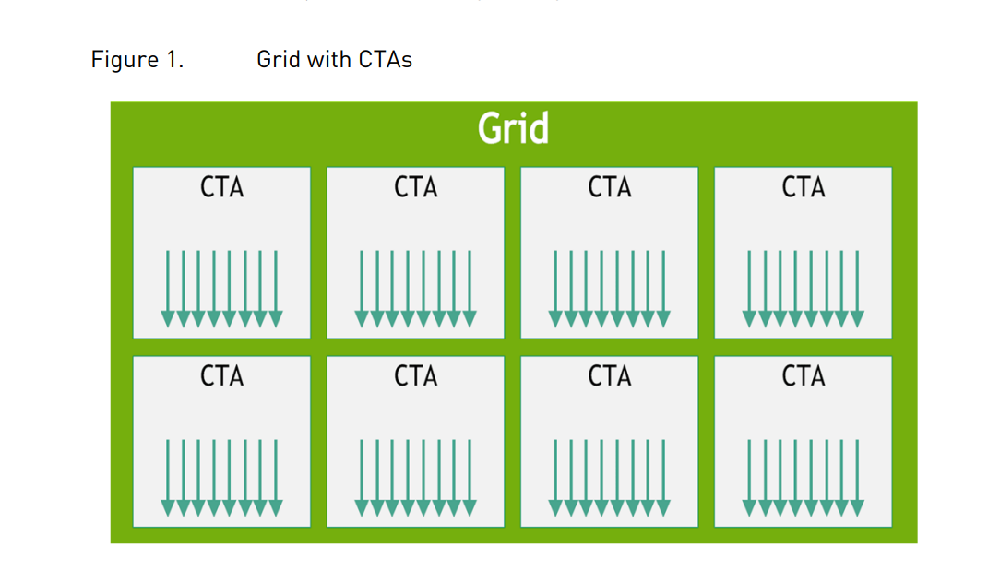
### 2.2.2 Cluster of Coopperative Thread Arrarys
Cluster是由多个CTA组成，设置Cluster大小是可选的，默认是1x1x1的大小。

其中也有特定的符号可以查询CTA的id等。存放在特殊寄存器中。

需要注意的是目前只在`sm_90`或以上的硬件架构中才支持这一概念。

如下图所示：
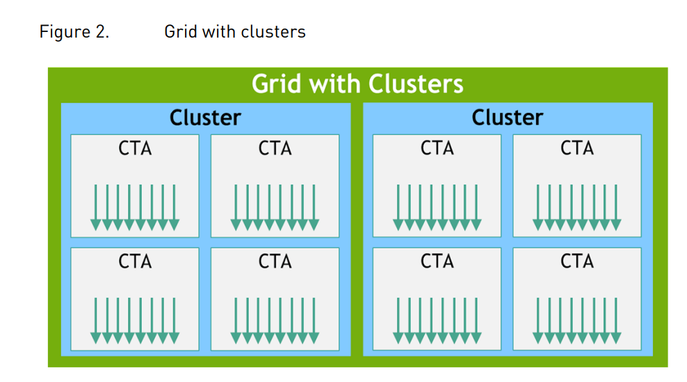

### 2.2.3 Grid of Cluster
Grid是最高的线程等级，包含了多个Cluster。

其中也有特定的符号可以查询Cluster的id等。存放在特殊寄存器中。
## 2.3 Memory Hierarchy
以`sm_90`架构为例，因为引入了Cluster的概念，其中的内存分类如下图所示：

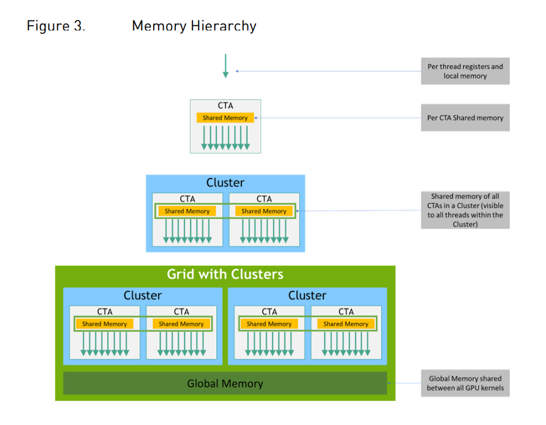

主要分为以下几种：
 - global memory，可读可写，线程共享；
 - constant memory，只读，cached，线程共享；
 - texture，只读，cached；
 - surface，可读可写，cached；
 - shared memory，CTA中线程共享；
 - local memory，线程独占；

# 第3章 PTX Machine Model
## 3.1 A Set of SIMT Multiprocessors 
GPU硬件模型如下图所示：
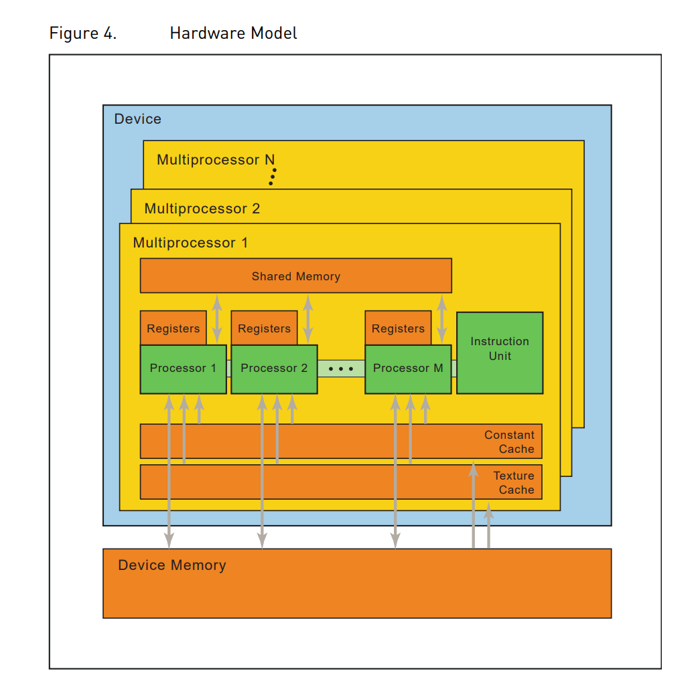

## 3.2 Independent Thread Scheduling
在`Volta`架构之前，一个warp内的32个线程因为共用一个程序计数器，通过active mask来区别active thread。

但是从`Volta`架构开始，支持了warp内的线程独立调度，每个线程都有自己独立的程序计数器，也就是当出现一个warp内的线程分化的时候，允许不同的线程做不同的事情，不再阻塞。

开发者在编写`Volta`及以上架构的PTX代码时，需要特别留意因为独立线程调度操作引起的**向下兼容性问题**。

## 3.3 On-chip Shared Memory
根据Figure4中的信息显示，每个Multiprocessor可以利用的片上内存主要分为以下四种：

1. 每个processor都有一组32-bit的本地寄存器；
2. 每个processor共享的`shared memory`，其拥有并行数据缓存；
3. 每个processor可通过共享的只读cache，加速读取设备的指定常量存储区域`constant memory`，内存有限；
4. 每个processor可通过共享的只读cache，加速读取设备指定的存储区域`texutre`，支持多种寻址模式和数据滤波器；

需要注意的是，`local memory`和`global memory`没有专用cache加速。 

# 第4章 Syntax
PTX源程序模块带有汇编语法风格的指令操作符和操作数。通过ptxas后端编译优化器对PTX源模块进行优化、编译并生成对应的二进制对象文件。

## 4.1 Source Format
源模块是以ASCII文本形式，以`\n`进行换行。

所有空格将被忽略，除非在语言中被用于分格标记。

接受C风格的预处理标记，通过`#`标记，如：`#include, #define, #if, #ifdef, #else, #endif, #line, #file`

PTX区分大小写，关键字用小写。

每个PTX模块必须以指定PTX语言版本的`.version`指令开始，
接着是一个`.target`指令，指定假设的目标体系结构。

## 4.2 Comments
PTX的注释服从C\C++风格，使用/* 注释内容 */或`//`均可。

## 4.3 Statements
PTX中的陈述语句既包含预处理(directive)也包含指令(instruction)，以可选的指令标记开头并以分号结尾。

例子：
```
        .reg .b32 r1, r2;
        .global .f32 array[N];

start:  mov.b32 r1, %tid.x;
        shl.b32 r1, r1, 2; // shift thread id by 2 bits
        ld.global.b32 r2, array[r1]; // thread[tid] gets array[tid]
        add.f32 r2, r2, 0.5; // add 1/2
```
【PS】文档原话：“A PTX statement is either a directive or an instruction”。这里directive和instruction的区别理解了半天，最后可以理解为，directive近似预处理的东西或者说特殊字符处理，起到编译器指示作用。而instruction是指令，可以理解为发生在机器上的“动词”。

### 4.3.1 Directive Statements
PTX中支持的编译器指示如下表所示：

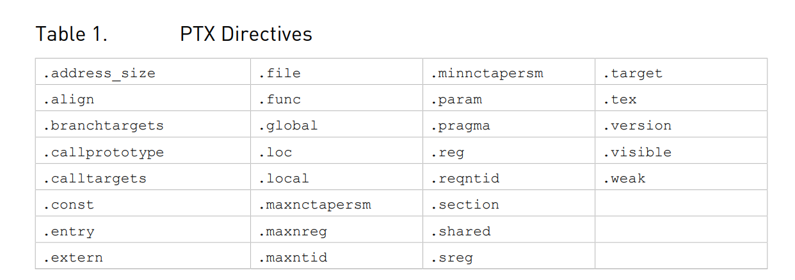

【PS】可以看到如`.reg`、`pragma`等常用的编译指示关键字。

### 4.3.2 Instruction Statements
指令由一个指令操作码和由逗号分隔的零个或多个操作数组成，并以分号结束。操作数可以是寄存器变量，常量表达式、地址表达式或指令标签名称。

指令有一个可选的判断条件作控制流的跳转。判断条件在可选的指令标记后面，在操作码前面，并被写成`@p`，其中`p`是一个条件寄存器。判断条件可以取非，写成`@!p`。

指令标记之后的字段，首先是目标操作数，后续是源操作数。

指令关键字如下表所示：

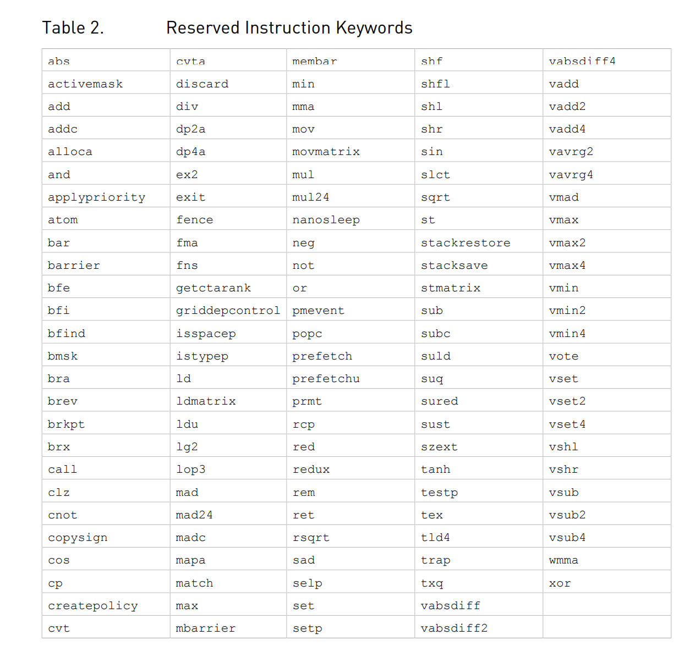

## 4.4 Identifiers
用户定义的标识符，服从C++的规则，字母或者下划线开头，或者以`$`开头。

PTX没有指定标识符的最大长度，并表示所有实现至少支持1024个字符。

PTX支持以`%`为前缀的变量，用于避免命名冲突，如：用户定义的变量和编译器生成的变量名。

PTX以`%`为前缀预定义了一个常量和一小部分特殊寄存器，如下表所示：

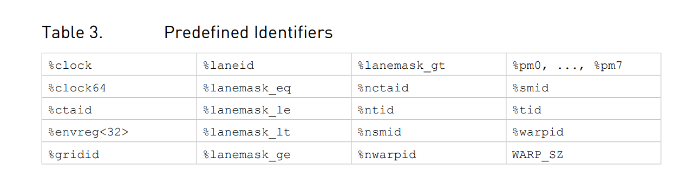

其中`WARP_SZ`表明了目标设备的warp大小，默认值都是32。

## 4.5 Constants
PTX支持整型和浮点常量和常量表达式。这些常数可用于数据初始化和作为指令的操作数。对于整型、浮点和位大小类型检查规则是相同的。

对于判断类型的数据和指令，允许使用整型常量，即`0`为`False`和`!0`为`True`。

### 4.5.1 Integer Constants
整型常量的大小为64位，有符号或无符号，即每个整数常量的类型为`.s64`或`.u64`。

而在指令或数据初始化中使用时，每个整整型常量会根据使用时的数据或指令类型转换为适当的大小。


整型常量可以写作十六进制、十进制、八进制、二进制，写法同C语言一直，最后加`U`表示unsigned:

```
十六进制：    0[xX]{hexdigit}+(U)
十进制：      {nonzero-digit}{digit}+(U)
八进制：      0{octal digit}+(U)
二进制：      0[bB]{bit}+(U)
```

### 4.5.2 Floating-Point Constants
浮点常量表示为64位双精度值，所有浮点常量表达式都使用64位双精度算术求值。

需要注意的是如果用十六进制表示，是表示32位单精度浮点。并且可能不会被用在常量表达式中。

浮点数的值的第一种表示，可以用一个可选的小数点和带符号的指数进行表达(应该是指：1.34e-2)。但和C\C++不同的是，在PTX里面不能通过后缀来区分浮点数的的类型，比如：1.0f。

浮点数的值的第二种表示，可以使用十六进制进行表示，如下：

```
0[fF]{hexdigit}{8} // single-precision floating point
0[dD]{hexdigit}{16} // double-precision floating point
```

举个例子：
```
mov.f32 $f3, 0F3f800000; // 1.0, 表示：$f3 = 1.0;
```

### 4.5.3 Predicate Constants
整型常量也可以作为判断数据，`0`表示`False`，`!0`表示`True`。

### 4.5.4 Constant Expressions
在PTX中，常量表达式是使用C中的操作符形成的，并使用与C中类似的规则求值，但通过限制类型和大小、删除大多数强制转换和定义完整语义来简化，以消除C中表达式求值依赖于实现的情况。(减去编译器推导数据类型等的负担)

常量表达不支持从整型到浮点数的类型转换。

常量表达式中的优先级顺序**从上到下**如小表所示，第一行执行优先级最高，同一行的优先级相同，对于多个一元操作求值的话是**从右向左**的顺序，而二元操作是**从左向右**：

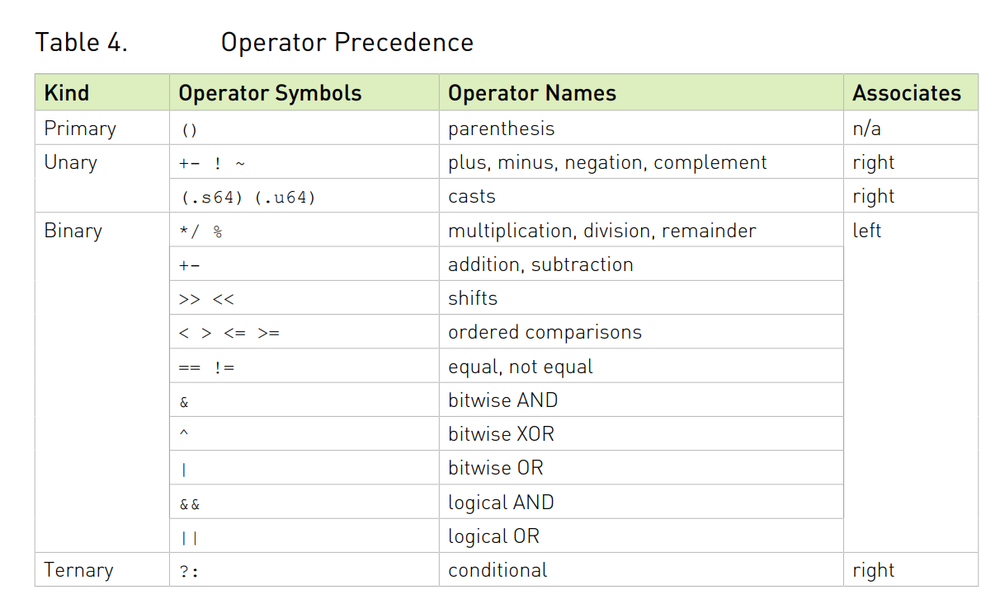

### 4.5.5 Integer Constant Expression Evaluation
整型常量表达式，在编译时有一套规则进行推导。这些规则基于C中的规则，但它们已被简化为只适用于64位整数，并且在所有情况下都**完全定义了行为**。（可以理解为不会有二义性的表达式）

- 默认整型常数是`signed`除非需要转换为`unsigned`防止溢出，或者手动添加`U`后缀如：
```
42, 0x1234, 0123 are signed.
0xfabc123400000000, 42U, 0x1234U are unsigned
```  
- 一元加减符保留输入操作数的类型，如： 
```
+123, -1, -(-42) are signed.
-1U, -0xfabc123400000000 are unsigned.
```
- 一元操作中的取非`!`操作会产生带符号的`0`或`1`。
- 位操作中的取反操作`~`默认将源操作数是为`unsigned`，结果也为`unsigned`。
- 一些二元操作需要规范化源操作数，如果其中有一个是`unsigned`，那么需要将两个源操作数都转换为`unsigned`进行计算。**这种被称为常用算数转换**。
- 加减乘除执行计算之后，结果与源操作数的数据类型保持一致，即，有一个为`unsigned`则结果也为`unsigned`，反之则为`signed`。
- 取余`%`的操作会将操作数解释为`unsigned`，与C不同，C允许负除数。但属于**实现定义行为**
- 移位操作的第二个源操作数解释为`unsigned`，结果数据类型与第一个源操作数一致。如果是`signed`右移则为算术右移，`unsigned`为逻辑右移。
- 位与`&`，位或`|`，位异或`^`操作也服从常用数据转换规则。
- 与`&&`，或`||`，等于`==`，不等`!=`操作产生`signed`结果，值为`0`或`1`。
- 大小比较运算符(`<`、`>`、`<=`、`>=`)对于源操作数符服从常用转换规则，产生`signed`结果，值为`0`或`1`。
- 可使用`(.s64)`或`(.u64)`将表达式转换为`signed`或`unsigned`。
- 对于三元判断符`?:`，第一个源操作数必须是整型，但第二个和第三个可以是整型或者浮点型，其结果类型与选择的操作数类型一致。


### 4.5.6  Summary of Constant Expression Evaluation
下表总结了常量表达式的推导规则：

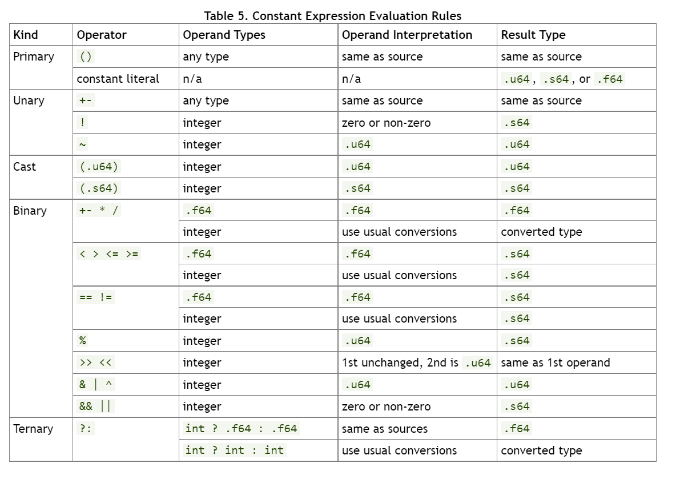

## 第5章 State Spaces, Types, and Variables
虽然特殊的资源在不同架构的GPU上可能是不同的，但资源种类是通用的，这些资源通过状态空间和数据类型在PTX中被抽象出来。

### 5.1 State Spaces
状态空间是具有特定特征的存储区域。所有变量都驻留在某个状态空间中。状态空间的特征包括其大小、可寻址性、访问速度、访问权限和线程之间的共享级别。

不同的状态空间如下表所示：

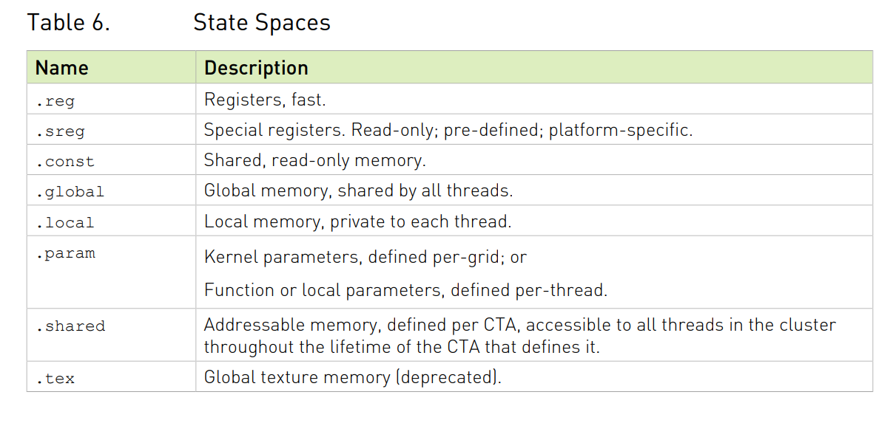

不同状态空间的性质如下表所示：

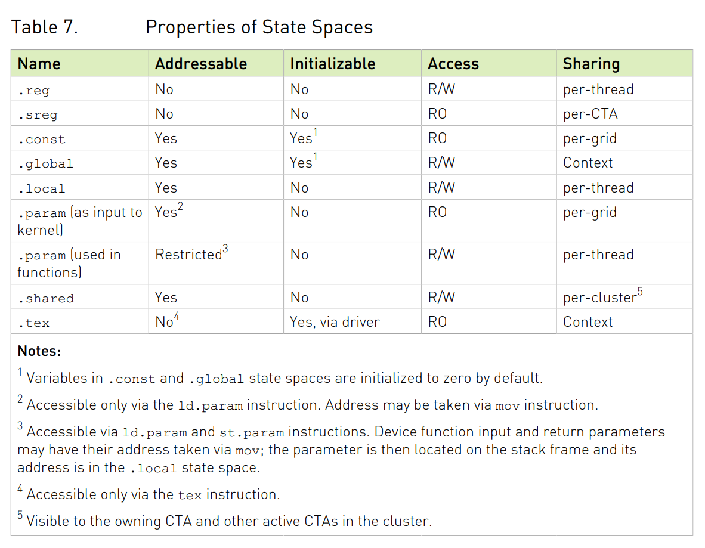

#### 5.1.1 Register State Space
`.reg`寄存器读写速度很快，但是数量有限制，并且不同架构的寄存器数量不一样。当寄存器使用超标时，会溢出到内存中，影响读写速度。

寄存器可以是有类型的，也可以是无类型的，但是寄存器大小是被严格限制的，除了1-bit的判断符(bool)寄存器以外，还有宽度为8-bit\16-bit\32-bit\64-bit的标量寄存器，以及16-bit\32-bit\64-bit\128-bit的矢量寄存器。

8-bit寄存器最常见用途是和`ld`、`st`和`cvt`指令一起使用，或作为向量组的元素。

寄存器与其他状态空间的区别在于，它们不是完全可寻址的，也就是说，不可能引用寄存器的地址。(可以理解为仅在作用域内有效，即寄存器是栈上存储)

寄存器对于多字的读写可能会需要做边界对齐。

#### 5.1.2 Special Register State Space
`.sreg`特殊寄存器是预定义的平台特殊寄存器，如grid、cluster等相关参数，所有的特殊寄存器都是预定义的。

#### 5.1.3 Constant State Space
`.const`常量状态空间是由host端初始化的只读内存，通常使用`ld.const`进行访问，目前常量内存的限制为64KB。

另外还有一个640KB的常量内存，被划分为10个64KB的区域，驱动程序可以在这些区域上进行初始化数据分配，并通过指针的形式作为kernel参数传入。

但是，因为这十个常量内存区域**并不连续**，所以驱动程序在分配的时候应该保证每一块常量内存不得超过64KB，不得越界。

静态大小的常量变量有一个可选的变量初始化器。默认情况下，没有显式初始化式的常数变量被初始化为零。驱动程序分配的常量缓冲区由host初始化，并将指向这块常量内存的指针作为kernel参数传入。

##### 5.1.3.1.  Banked Constant State Space (deprecated)
被弃用的就不赘述了。

#### 5.1.4.  Global State Space
`.global`全局状态空间是能够被kernel中所有线程都访问到的内存空间，使用`ld.global`、`st.global`和`atom.global`指令访问全局内存。

没有显示初始化的全局变量默认初始化为`0`。

#### 5.1.5.  Local State Space
`.local`本地状态空间是每个线程私有的内存空间。通常是带缓存的标准内存。其有大小限制，因为必须按每一个线程进行分配。

使用`ld.local`、`st.local`进行本地变量的访问。

在编译的ABI的时候，我们必须将`.local`声明在函数作用域内，并且内存申请在栈上。

在不支持堆栈的实现中，所有本地内存变量都存储在固定地址中，不支持递归函数调用，并且`.local`变量可能在模块(module)作用域声明。

在PTX 3.0及一下，module-scope `.local`将默认被禁用。

#### 5.1.6.  Parameter State Space
#### 


